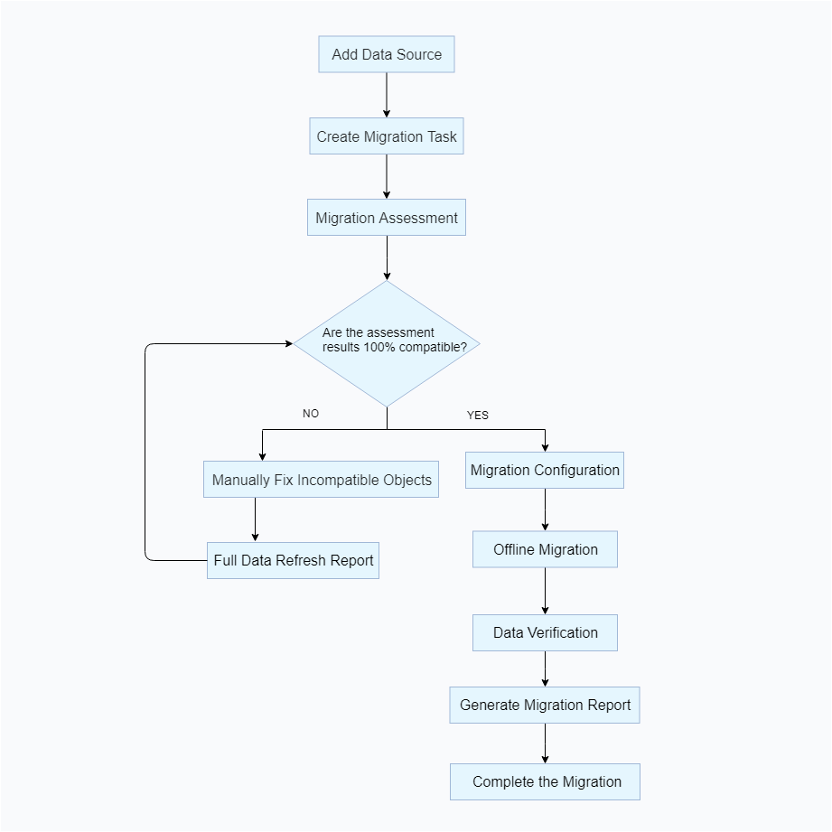

YMP is a database migration product provided by YashanDB. It supports assessment before migration, data migration, and data validation between heterogeneous RDBMS and YashanDB. YMP offers visualization services, allowing users to complete the entire process from assessment to migration through a simple interface, achieving low barriers, low costs, and high efficiency in heterogeneous database migration.

The main process for executing a full migration is as follows:

1. **data source configuration**: YMP supports operations such as adding, modifying, and deleting data sources. Configuring the data source is a prerequisite for creating a data migration task.
2. **create migration task**: Migration tasks can be created as needed.
3. **compatibility assessment**: Compatibility assessment of heterogeneous databases is conducted through object dimensions. During the assessment, some DDL automatic rewriting will take place.
4. **data migration**: Migration of metadata and data is performed.
5. **consistency check**: After the data migration, data consistency in the tables is verified.

The target end parameter configuration allows users to select source configuration parameters and migrate them to the target end, with the ability to modify and adjust parameters.

Parameter configuration in YMP is also triggered as a phase of the migration task, and it must be created in **create migration task** to be included in the above migration process.