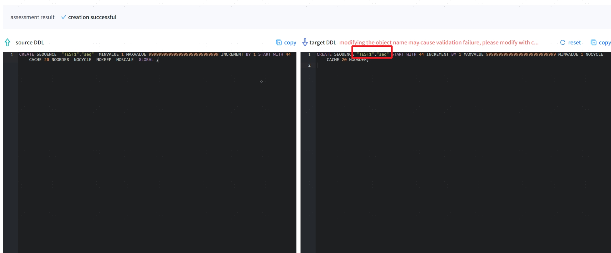
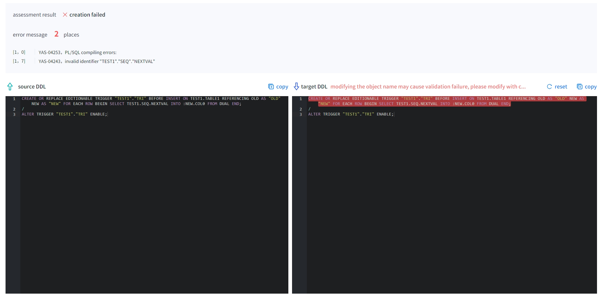
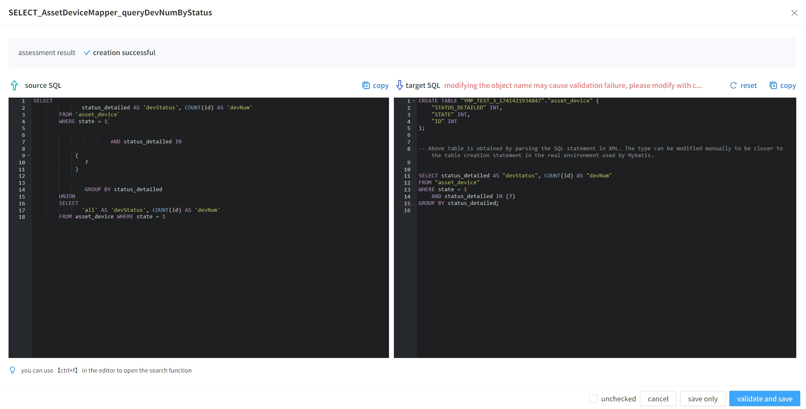
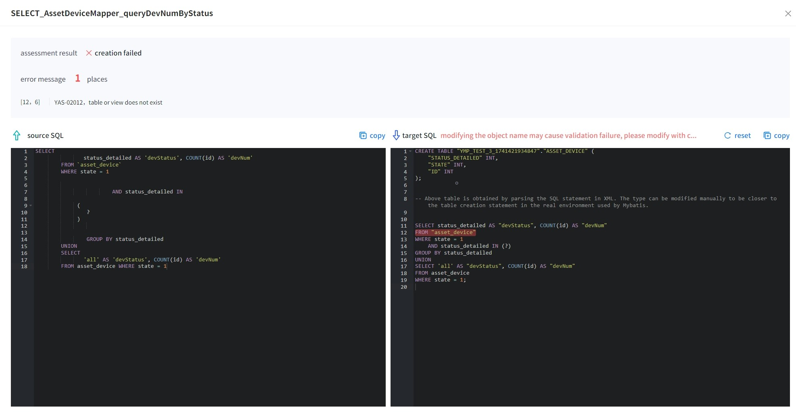
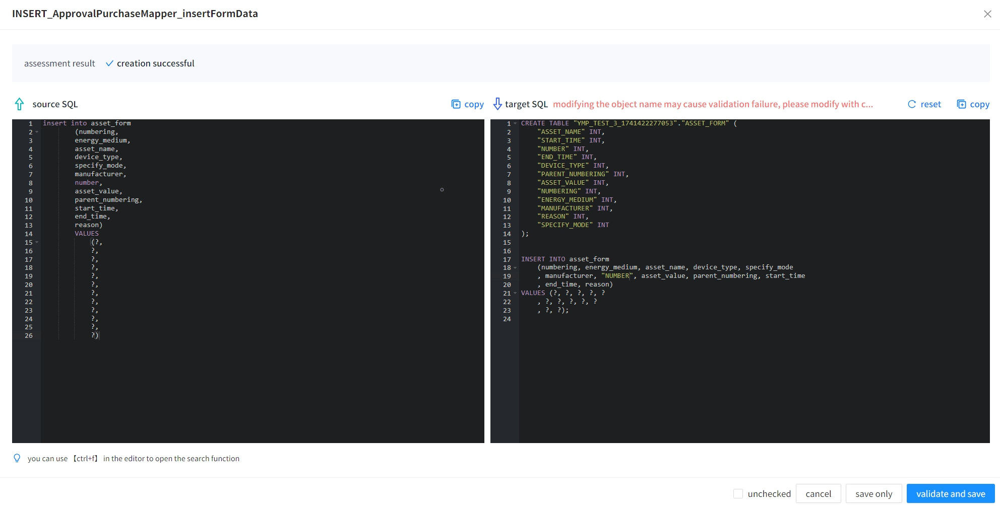
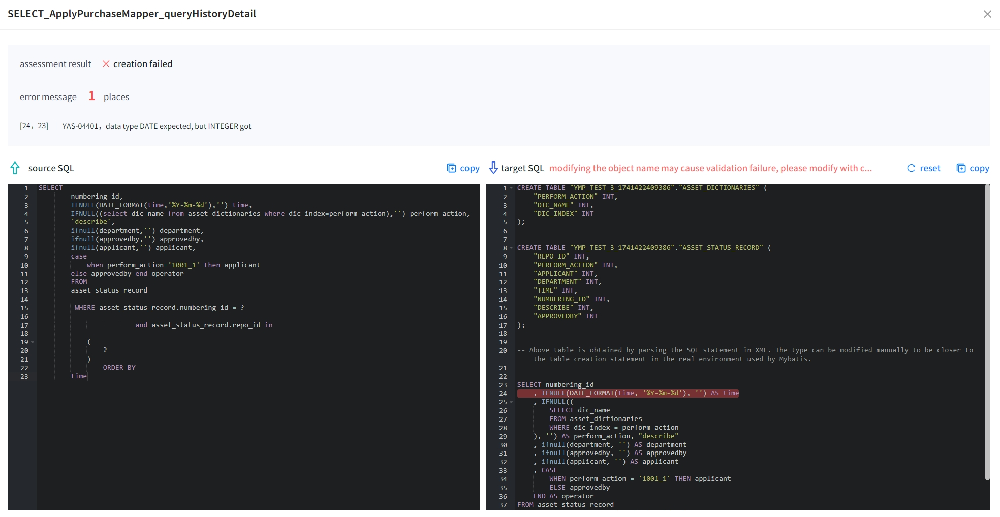
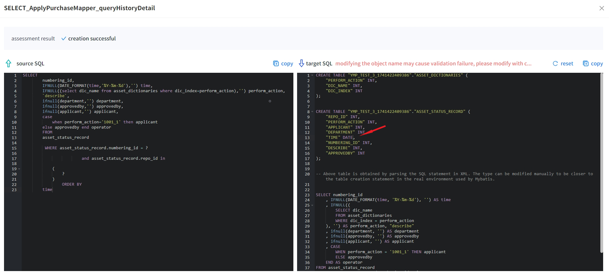
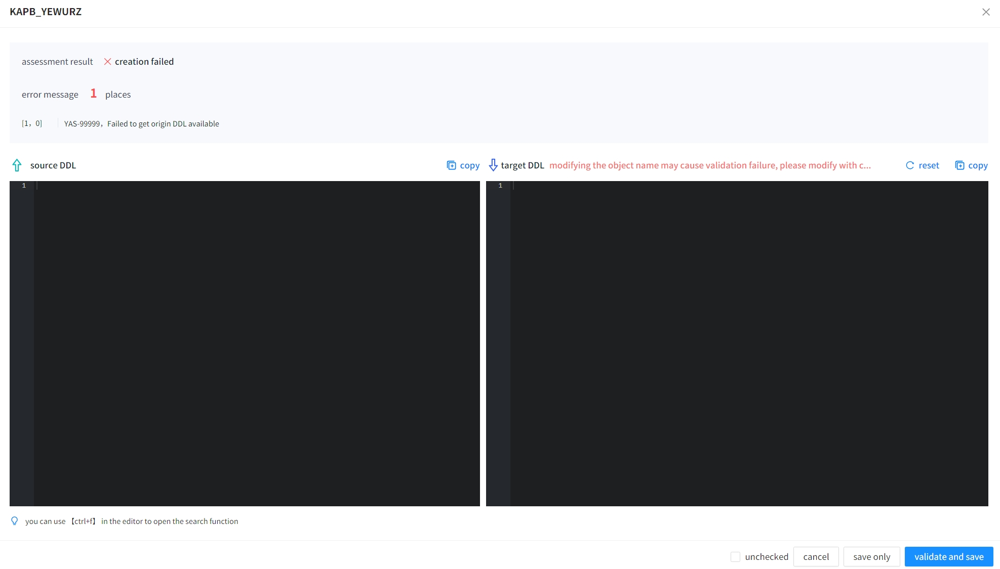
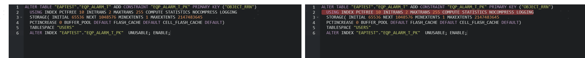
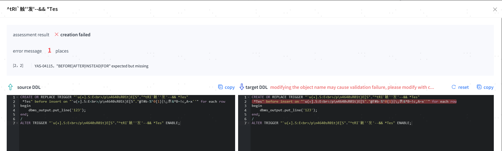

##### 1. Some objects are not within the assessment scope during evaluation

Materialized Views: Still in the creation process, waiting for the view to be written or manually executed (`ALTER SYSTEM FLUSH BUFFER_CACHE;` is not recommended, as it takes too long).  
Indexes: LOB type indexes are automatically generated for LOB type columns and are not included in the assessment scope.

##### 2. The constraint error message during evaluation is: "YAS-02206 specified index does not exist or cannot be used to enforce the constraint"

Check whether the index exists. If the index exists, then check whether the columns used by the constraint are consistent with the index. If the numbers do not match, adjustments need to be made to either the index or the constraint columns according to business needs to make them consistent.

##### 3. Faults and Solutions during the Evaluation Phase
|Cause of Fault |Manifestation |Solution |
|---------------|-------------|------------------------|
| YMP process abnormal interruption   | Tool interface cannot be opened     | Restart YMP → Re-evaluate           |
| Source database process abnormal interruption  | Tool reports timeout | Task failed → Re-evaluate            |
| Internal/External database process abnormal interruption  | Tool interface completely unusable   | Restart database → Restart YMP → Re-evaluate     |
| Internal/External database data failure cannot restart | All data lost in the interface    | Redeploy and install YMP → Create new task to start evaluation |

##### 4. If the index status is UNUSABLE and the primary key status is ENABLE, attempting to create the index before creating the primary key will result in an unsuccessful primary key creation, leading to incompatibility.

The main reason for this issue is that the index is marked as UNUSABLE, but the primary key status remains ENABLE, and the primary key depends on that index, hence creation fails.  
Maintaining the index status as UNUSABLE will prevent any insert, delete, or update operations on the primary key column in the table.  
Solution: Find the index that the primary key depends on, change its status to USABLE, and refresh the report completely.  
If it is confirmed that the index needs to remain UNUSABLE, it can be modified back to UNUSABLE after the migration is completed.

##### 5. YMP does not support any syntax or case conversion for PLSQL. For MySQL/DM, if there are lowercase object names in PLSQL without double quotes, the evaluation will fail with an error indicating that the object cannot be found.




In this case, users need to manually add double quotes around lowercase object names in PLSQL.

##### 6. The index carrying LOCAL (PARTITION xxx TABLESPACE "xxx") loses all information in LOCAL after conversion during evaluation.

This is due to database limitations. When performing data migration, it is easy to be affected by data, leading to an inconsistency between the number of partitions and the number defined in the index DDL, resulting in migration failures and thus removing all LOCAL information during conversion.

<span id="problem11" name="problem11" class="yaslink"></span>

##### 7. In the evaluation results of Mybatis Mapper XML files, SQL references using refid do not automatically perform parameter replacement, as shown in the figure below.
Due to Mybatis's parsing ability limitations, there are replacements of the $ symbol with # before parsing SQL. For incoming parameters, automatic mapping does not occur, and users can manually modify the target SQL to achieve evaluation compatibility.

For example:



<span id="problem12" name="problem12" class="yaslink"></span>

##### 8. In the evaluation results of Mybatis Mapper XML files, compatibility issues arise due to SQL issues (incorrect SQL, English commas, etc.). After modifying DDL and validating or fully refreshing the report, a prompt appears: "YAS-02012, table or view does not exist".


The SQL itself has issues (incorrect SQL, English commas, etc.). Before evaluation, it cannot parse the corresponding table name. During refresh or validation, it will not change the target SQL. Users can add a create table statement before the SQL statement to keep it as consistent as possible with the actual environment for validation or refreshing the evaluation report.

##### 9. In the evaluation results of Mybatis Mapper XML files, even if there is an automatically generated create table statement, the evaluation still prompts "YAS-02012, table or view does not exist".


Automatically generated schemas or tables are based on examples parsed from SQL and do not guarantee consistency with the actual tables used in the XML application. If errors indicating that the table does not exist appear in the evaluation results, users can manually modify the create table statement in the target SQL to keep it as consistent as possible with the real environment for validation or refresh evaluation report.

For example:


##### 10. In the evaluation results of Mybatis Mapper XML files, incompatible prompts involve fields and SQL statements where Functions or types mismatch, such as: "YAS-00014 illegal conversion from DATE to INTEGER", "YAS-00007 no mul method for DATE INTEGER", "YAS-04401 data type INTEGER expected, but DATE got", etc.


The reason is similar to issue 9, and users can manually modify the field types in the create table statement in the target SQL to keep it as consistent as possible with the actual environment for validation or refreshing the evaluation report.

Reference:


##### 11. YMP deployed under JDK8 on ARM machines has slow evaluation progress when using Oracle as a source for assessment, and response time is also slow when testing the connection with Data Source.

After ruling out network and firewall issues, if it is determined that the connection is slow solely during YMP usage, the possible reason is that the JDK version in the YMP deployment environment is too low, causing compatibility issues with Oracle drivers.  
Solution: Upgrade the JDK in the environment to version 11, restart YMP, and re-evaluate.
If the problem persists, please contact technical support for troubleshooting.

##### 12. During the execution of XML type tasks, errors related to SCHEMA not existing may occur, such as: "YAS-02010, user 'userName' does not exist".

XML type tasks cannot pre-parse all related SCHEMAs they use, thus creating non-existent SCHEMAs when executed. If multiple tasks share the same SCHEMA, they may be affected by other tasks.   
When tasks are deleted, re-evaluated, or fully refreshed, SCHEMAs may be removed, meaning that executing multiple tasks could potentially delete SCHEMAs that other XML tasks are using. If this problem occurs, please re-evaluate.

##### 13. When performing source assessment metadata compatibility using Oracle 9i and Oracle 10g, objects that contain special characters ' in their names are assessed as incompatible, with error messages such as: Unable to obtain DDL information, reason is: ORA-31600: invalid input value LONGNAME for parameter NAME in function SET\_FILTER.


The DBMS_METADATA.GET_DDL() advanced package function in Oracle 9i and Oracle 10g requires an escape replacement for special character ' from 1 ' to 4 '. After replacement, it may exceed the length limit of the object name in the function, resulting in an error.
Solution: Obtain DDL through other means and fill it into the target DDL for further evaluation.

##### 14. When assessing metadata compatibility, failure to obtain table DDL may result in an error message containing: ORA-22922: nonexistent LOB value.
YMP queries the DDL of objects based on batch size (assessment.ddlCount, default 20) and concurrency (assessment.maxThreadCount, default 20). When a large number of GET_DDL function results are returned at once, internal LOB buffer overflow may occur leading to ORA-22922 errors.
Avoidance solution: Manually adjust the concurrency assessment.maxThreadCount and batch size assessment.ddlCount to reduce pressure on the source database. Parameter details can be found in the relevant [Parameter Explanation](../Refrence/Parameter Explanation).

##### 15. When evaluating object compatibility, YMP task reports an error: "GC overhead limit exceeded". GC overhead limit exceeded is an OutOfMemoryError thrown by the Java Virtual Machine (JVM) indicating that garbage collection (GC) took too much time (over 98%) but recovered very little memory (less than 2%).  
This error message during evaluation indicates that there are many DDL string objects still being split and parsed, and the garbage collector cannot effectively free memory.  
Avoidance solutions:

- Allocate more memory to YMP: Modify conf/application.properties configuration, ym_memory=4G, and increase if machine resources allow.
- Reduce the concurrency of the evaluated objects: Modify conf/application.properties evaluation related configurations: 
   - assessment.ddlCount=20 Reduce this value appropriately to decrease memory usage of the task during runtime.
   - assessment.maxThreadCount=20 Reduce this value appropriately to decrease memory usage caused by concurrent tasks (note that this may affect evaluation performance).

##### 16. After ignoring all incompatible objects in YMP during evaluation, the compatibility rate still does not reach 100%.
During evaluation, PLSQL object types are created concurrently. Some objects may create entries in the database even if they are incompatible, and the evaluation results will show these types of objects as incompatible due to their deletion operations.  
During the time between the successful creation and deletion of these types of objects, if other dependent objects are evaluated and created without syntax issues, they may appear compatible, resulting in native compatibility or automatic compatibility evaluation results.  
When all incompatible objects are ignored and a full refresh report is done, dependent objects may become incompatible due to changes in dependency relationships, preventing the compatibility rate from reaching 100%.  
Solution: Ignore incompatible objects again and perform a full refresh report.

##### 17. When evaluating type types using the 23.4 version external library of YashanDB in YMP, an error occurs: "YAS-02013 name is already used by an existing object".
This error during evaluation may be caused by the YashanDB database in version 23.4 having the recycle bin functionality enabled by default during deployment.  
When a type object is dependent on a table, deleting the table will place it in the recycle bin instead of permanently deleting it, causing the type object deletion to fail and thus reporting this error.  
Avoidance solution: 
- Execute the SQL statement "ALTER SYSTEM SET RECYCLEBIN_ENABLED = OFF" in the evaluation database, and then re-evaluate.

##### 18. When performing metadata compatibility assessments using Oracle 11g and lower versions, the retrieved DDL may be incorrect, as shown in the figure below, leading to compatibility issues.


This issue occurs due to the problem with the GET_DDL() function in Oracle 11g, where the output DDL does not match correctly, which has been fixed in higher versions.  
Solution: You can use the manual modification functionality provided by YMP to change the target DDL statement to the correct statement for normal compatibility evaluation.

##### 18. When performing metadata compatibility assessments using Oracle 9i, if the object name of the trigger contains spaces, as shown in the figure below, leading to compatibility issues.


This issue occurs due to the problem with the GET_DDL() function in Oracle 9i, where the output DDL does not match correctly, which has been fixed in higher versions.  
Solution: You can use the manual modification functionality provided by YMP to change the target DDL statement to the correct statement for normal compatibility evaluation.

##### 20. During source assessment with Oracle 10g, encountering an error when there are advanced data types in the table (including synonyms, system UDTs such as XMLTYPE) that results in an error when executed on the target: YAS-04229, invalid datatype.
This problem may be due to the behavior of Oracle 10g when using advanced functions in table fields. The created GET_DDL will show advanced types linked to the connecting user instead of fixed SYS types (this has been fixed in later versions).  
For example, using the YMP user to connect and create a table:
```sql
CREATE TABLE "XML001"."TEST_XML"("ID"  "XMLTYPE");
```

When evaluated, GET_DDL displays:
```sql
CREATE TABLE "XML001"."TEST_XML"("ID"  "YMP".XMLTYPE");
```

Instead of showing the fixed SYS type:
```sql
CREATE TABLE "XML001"."TEST_XML"("ID"  "SYS".XMLTYPE");
```
Solution: You can use the manual modification functionality provided by YMP to change the OWNER of the type in the target DDL statement to SYS for normal compatibility evaluation.

##### 21. For migration tasks where the target is YashanDB v23.4.6.100 or a later version, how to resolve the prompt "YAS-04323 arguments count must be ……" in the evaluation result of the Mybatis Mapper XML file, even when the table creation statement is automatically generated?

Problem reason: In migration tasks where the target is YashanDB v23.4.6.100 or later versions, if the source data table does not contain the "VALUE" column (this is the only keyword identified so far) but the column is referenced in the SQL statement, YMP will falsely report the error code YAS-04323 when parsing the SQL to automatically generate the table creation statement (the expected error code in normal scenarios is "YAS-04243 invalid identifier XXX"). The error message does not include the column name, which prevents YMP from further parsing the error message and automatically splicing the definition statement of the target column fields.

Solution: Users can manually modify the table creation statement in the target SQL to include the "VALUE" field, and try to keep it consistent with the real environment after modification. Then, they can verify the compatibility or refresh the evaluation report.
