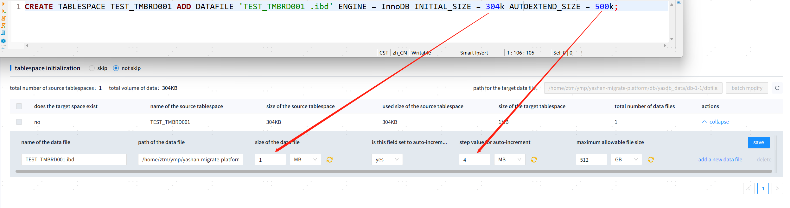
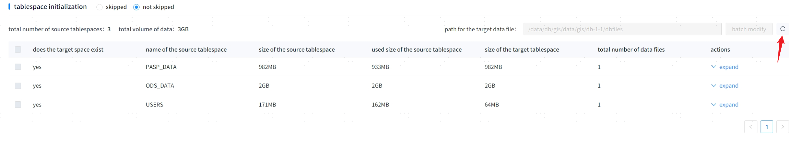
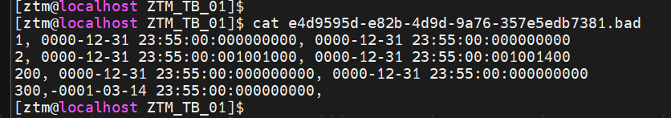

##### 1. The error message encountered during migration is: "YAS-00008 type convert error: literal does not match format string"

The target database needs to be set with `alter system set DATE_FORMAT='yyyy-mm-dd hh24:mi:ss' scope=spfile`, and the target database must be restarted.

##### 2. The error message encountered during migration is: "YAS-02011 no free blocks in large pool"

Option 1: Modify the configuration item `import.degree_of_parallelism` located in conf/application.properties, the default value is 16 concurrent connections, which needs to be reduced based on the usage of the target database, and restart YMP.  
Option 2: Increase the LARGE_POOL_SIZE of the target database to 64M, the default is 16M, execute `ALTER SYSTEM SET LARGE_POOL_SIZE = 64M SCOPE=spfile`, and restart the target database.

##### 3. When Oracle is the source, why does the maximum size specified when creating a tablespace Data File not match the value displayed on the YMP interface? For example, if the specified MAXSIZE when creating the tablespace Data File is 100K, but YMP displays 104K?

YMP queries the tablespace data file parameters through the view `DBA_DATA_FILES`, for example, maximum size: `SELECT TABLESPACE_NAME, MAXBYTES FROM DBA_DATA_FILES`. The values under this view in Oracle do not necessarily match the actual SQL statement executed, which is an Oracle specification issue.

##### 4. Common fault scenarios during the metadata migration phase and solutions

|Failure Cause |Manifestation |Solution |
|---------------|-----------------------------------|----------------------|
| YMP process abnormal interruption | YMP interface cannot be opened              | Restart YMP → Re-migrate                  |
| Source database process abnormal interruption | If in the tablespace initialization phase, YMP will timeout; no impact in other phases | Task failure → Re-migrate                  |
| Target database process abnormal interruption | YMP reports timeout                          | Task failure → Restore target database → Re-migrate |
| Internal/external library process abnormal interruption | YMP interface completely unavailable         | Restart database → Restart YMP → Re-migrate |
| Internal/external library data faults cannot restart | All data lost in the YMP interface            | Re-deploy YMP → Re-create migration task   |

##### 5. Under the overwrite strategy, if the migrated table is associated with foreign keys of other tables that already exist on the target side but are not in the migration scope, the metadata migration of this table will fail.

The root cause is that when overwriting the table, the associated foreign keys need to be deleted first. After the table migration is complete, the foreign key outside the migration range can be added back. If there is an error during the addition, it will be recorded as a failure in the details of this table. Possible reasons for failure include:

- Primary key changes, name changes or type mismatches, resulting in an error when creating the foreign key statement.
- The table where the foreign key resides has data, but the overwritten table no longer has data. When creating the foreign key, an error will be reported: "YAS-02033 foreign key constraint violated: parent key not found".

##### 6. Common fault scenarios during the data migration phase and solutions

|Failure Cause |Manifestation |Solution |
|---------------|---------------------|--------------------------------|
| YMP process abnormal interruption | YMP interface cannot be opened                | Restart YMP (will delete temporary CSV files) → Re-migrate unsuccessful tables |
| Source database process abnormal interruption | YMP reports timeout, migration task fails    | Task failure → Re-migrate unsuccessful tables |
| Target database process abnormal interruption | YMP reports timeout, migration task fails    | Task failure → Restore target database → Re-migrate unsuccessful tables |
| Internal/external process abnormal interruption | YMP interface completely unavailable         | Restore internal/external library → Refresh to see tasks still in data migration   |
| Internal/external library data faults cannot restart | All data lost in the YMP interface            | Re-deploy YMP → Re-create migration task    |

##### 7. When Oracle is the source, why does the maximum size displayed in the YMP interface for a non-auto-incremented Data File show an original value of 0, which is smaller than the Data File size?

YMP queries the tablespace data file parameters through the view `DBA_DATA_FILES`. When auto-increment is not selected, this view in Oracle shows MAXSIZE as 0, which is an Oracle specification issue.

##### 8. When creating a tablespace in a MySQL database, such as `CREATE TABLESPACE TEST\_TMBRD001 ADD DATAFILE 'TEST\_TMBRD001\_defaultFile14037.dbf' ENGINE = InnoDB INITIAL\_SIZE = 306k AUTOEXTEND\_SIZE = 500k;`, why do the parameters displayed in the tablespace migration column not match those at creation?

  

This is actually due to MySQL's internal adjustment of parameters for legality at the time of tablespace creation. The tool shows the true adjusted tablespace size by MySQL and calculates the appropriate table initialization parameters for YashanDB.

##### 9. What happens when empty strings like '' from MySQL and Dameng databases are migrated to YashanDB?

The tool converts empty strings from MySQL and Dameng databases to null when migrating to YashanDB, as their value is illegal in YashanDB (YashanDB automatically converts empty strings to null), while they are legal in MySQL.

##### 10. When migrating full zero values (like time values of 00:00:00) from MySQL date and time types to YashanDB, what happens?

The tool converts MySQL and Dameng database full zero values in the date and time types to null when migrating to YashanDB, as their value is illegal in YashanDB (invalid Gregorian date time), while they are legal in MySQL (this behavior is due to certain versions of MySQL that set SQL MODE, which automatically converts null to zero values upon insert).

> **Note**：
>
> If **you select the data migration compatibility null value option** (default unchecked), it will **intelligently remove non-null constraints in YashanDB based on data conflict situations to ensure data can be migrated normally**. You do not need to worry about losing deleted constraints, as these will be reflected in the **migration report**. However, it should be noted that the primary key is created during the metadata phase 2, at which point data migration is completed. Compatibility issues caused by conflicts between primary keys and data may result in primary key migration failure, and there will be corresponding error prompts for any primary keys that fail to migrate.

##### 11. Why do my `char` and `varchar` fields in MySQL and Dameng databases show `null` or `' '` after inserting several spaces upon migration?

```mysql
CREATE TABLE T(
   A CHAR(10),
   B VARCHAR(10)
);

INSERT INTO T(A,B) VALUES (‘ ’,‘ ’);
```

For common databases, fields like `char` will be padded with `' '` by default, while `varchar` fields will not. Thus, during migration, the tool adopts a strategy of removing the excess `' '` before inserting into YashanDB, which treats empty strings `''` as `null` (refer to point 5), whereas `varchar` performs no processing, resulting in `null` or `' '`.

##### 12. When MySQL is the source, why is there a significant difference between the table size displayed during data migration and the actual table size?

The tool determines the size of tables using shared table space in MySQL 5.7 and above by querying the view `information_schema.TABLES`. You can try to refresh the statistics using `ANALYZE TABLE test_table` (this operation may be resource-intensive, recommended during business low-peak periods). According to official MySQL documentation, the size queried from this view is subject to error, which gets larger with more data or with LOB columns.

##### 13. The error reported during migration is: "YAS-04857 column ID duplicated" - why?

This issue is due to an old version of yasldr; updating to the new version of yasldr can resolve it.

##### 14. During the second stage of metadata and data migration, the task cannot be terminated immediately, and in poor cases, the termination process may take about 10 minutes.

Wait for completion of the termination or restart the YMP background service (specific operation: navigate to the installation path of YMP and execute `sh ymp.sh restart` or `sh ymp.sh restartnodb`).

##### 15. In metadata migration with an overwrite strategy, if a foreign key's table does not migrate, the migration of the foreign key fails with the error: "YAS-02051 such a referential constraint already exists in the table."

You can determine the table and column of the foreign key from the CREATE FOREIGN KEY DDL:

- If the existing foreign key does not need to be rebuilt, simply ignore the error and retain the existing foreign key.
- If the foreign key needs to be rebuilt, manually delete the foreign key on the target side and re-migrate. You can query the foreign key name on the target side using: `SELECT CONSTRAINT_NAME FROM ALL_CONSTRAINTS WHERE OWNER = 'schema_name' AND TABLE_NAME = 'table_name' AND CONSTRAINT_TYPE IN ('FOREIGN KEY', 'R', 'F')`. The foreign key can be deleted using: `ALTER TABLE schema_name.table_name DROP CONSTRAINT constraint_name`.

##### 16. During the migration process, if metadata migration encounters the error message: "YAS-02010 user 'XXX' does not exist."

Before metadata migration, it will typically migrate involved users (the name in YashanDB is the same as SCHEMA) to ensure metadata migration does not report errors.  

The migration strategy is: if the target database user exists, it is retained; if it does not exist, it is created.  

During migration, if the object exception message reports YAS-02010, it is likely due to an exception when creating the user. The specific cause can be seen in the logs, and the following reasons have been encountered:

- When creating a user, an error is reported: "YAS-00103 no free block in dictionary cache."  

In this case, the target database needs to set `alter system set SHARE_POOL_SIZE= xxx scope=spfile`, and restart the target database. The value xxx should be set according to the number of users involved in the migration, a heuristic of increasing 1.5M of memory for each additional user is advised.  

256M can create about 165 users ~=1.55M.  

300M can create about 207 users ~=1.44M.  

1024M can create about 889 users ~=1.15M.  

2048M can create about 1851 users ~=1.1M.

##### 17. When the schema name or table name contains characters recognized by the configuration item **[ ExportCsvPathReplaceFrom ]**, due to limitations of the import tool, YMP will replace such symbols, which may lead to the same path appearing, causing migration failures with the error message: YAS-00313 failed to open file xxx.csv, errno 2, error message "No such file or directory".

The avoidance strategy is to re-migrate the failed table.

##### 18. When Dameng Database is used as the Data Source, if some tables remain in migration for a long time without completion, what should be done?

If tables that are anticipated to complete migration in the expected timeframe are still in migration and the corresponding I/O is 0, you can immediately terminate the data migration task and then retry.

##### 19. During assessment, if the original tablespace of an object is modified in bulk to a non-existent tablespace in the source database, the migration will fail with an error indicating it cannot find the tablespace. What should be done?

Currently, the tablespace information displayed in the migration configuration screen pertains to tablespace information involved in source database objects within the migration scope. For assessments where the new tablespace pointed to manually exceeds existing tablespaces in the source database, automatic migration is currently not supported. The target side should create it manually before migrating the object.

##### 20. When migrating a large number of objects, if the **[next step: Data Migration]** fails with the error: "YAS-04003 maximum number of open cursors is xxx," what should be done?

When installing YMP with the default built-in database, the configuration parameters for the built-in library are automatically adjusted: `ALTER SYSTEM SET OPEN_CURSORS=3000 SCOPE=SPFILE; ALTER SYSTEM SET CURSOR_POOL_SIZE=64M SCOPE=SPFILE`.  

For installations with custom built-in databases in YMP, you need to manually ensure that the customized built-in library configuration meets the requirements for migration business usage, which can refer to the default built-in database configuration. The value of OPEN_CURSORS=xxx should be adjusted according to the number of migration objects in the task; based on experience, around 3 cursor configurations are needed for migrating 1000 objects.

##### Direct memory insufficient, exporting slows down," how should this be handled?

The occurrence of this warning indicates that the direct memory pool has been depleted, which will slow down the export rate but will not cause the task to fail. The solution is to increase the `ymp_direct_memory` configuration item in `application.properties` and restart YMP. This item defaults to 2GB, which can ensure that a single JDBC-based data migration task has sufficient direct memory; however, when multiple JDBC-based data migration tasks are initiated simultaneously, insufficient direct memory may occur.

<span id="problem22" name="problem22" class="yaslink"></span>

##### 22. During migration, if YMP becomes very slow to respond and the logs or migration failure reasons indicate `java.lang.OutOfMemoryError: GC overhead limit exceeded`, what should be done?

The occurrence of this error means that the program has exhausted memory and cannot respond to normal business requests. This is often caused by users increasing the number of tables that can be concurrently migrated in the migration configuration page under [Advanced Configuration - Performance Configuration]. Memory usage during the data migration phase is as follows:
- If there are a lot of large lob columns (over 8K) in the tables, each table's memory usage will not exceed 1.6GB. In this case, if the [Advanced Configuration - Performance Configuration] value is set to 4, then the `ymp_memory` value should be configured to 7G or higher;
- If there are not a lot of large lob columns (over 8K) in the tables, each table's memory usage will not exceed 1GB. In this case, if the [Advanced Configuration - Performance Configuration] value is set to 4, then the `ymp_memory` value should also be configured to 4G or higher.

Solution:
- If there is ample available memory on the machine where YMP is located, you can increase the `ymp_memory` value in the configuration file and restart YMP to resolve this issue;
- If there is insufficient available memory on the machine where YMP is located, you can appropriately reduce the [Advanced Configuration - Performance Configuration] value to ensure successful migration;

##### 24. When migrating from DM, the query for tablespace initialization information fails with the error: "The tablespace xxx is offline." What should be done?

This message is a server-side prompt from the DM database, indicating that there is a tablespace in an offline state during the query. You can refresh and query again.
  

##### 25. If the data migration fails with the error message `BufferOverflowException`, what should be done?

The avoidance strategy is to set the configuration item `JDBC maximum length of all LOB fields exported inline` to 0, disabling the small lob inline import optimization.

##### 26. When a migration task fails with the message: metadata migration stage failed: failed to get connection from connection pool: oracle connection pool - Connection is not available, request timed out after xxx ms, what should be done?

This issue is caused by the metadata migration thread timing out while waiting to fetch a connection from the Oracle source connection pool. The avoidance strategies are:
- Increase the task configuration item `maximum connection wait time` to allow more time for obtaining a connection from the pool.
- Optionally increase the `maximum connection count for database queries` to increase the number of database connections in the connection pool, to reduce thread waiting.

<span id="problem27" name="problem27" class="yaslink"></span>

##### 27. When a migration task fails and the log shows an error `Yasldr exception YAS-02143 invalid username/password, login denied`, what could be the reason?

This problem may arise if the OPENSSL version in the YMP environment is less than 1.1.1, or if the OPENSSL versions between the YMP environment and the target environment are inconsistent.  

The solution is to check and upgrade the YMP environment to ensure that the deployed environment and the target database's deployed OPENSSL version are consistent and not lower than version 1.1.1.

##### 28. If a migration task fails and the log shows the error `file too short`, what could be the cause?

This issue may arise due to unpacking errors with the installation package, resulting in broken symbolic links for dependency files used during data migration. Please check the version of the `unzip` tool used on the machine.  

  

A known issue is that the `unzip` command is provided by the BusyBox toolbox, which has issues in version v.1.27.0.  

Solutions:
- Upgrade the BusyBox version; testing v1.36.1 is viable; upgrading to v1.36.1 or later is recommended.
- Avoid using the BusyBox-provided `unzip` tool and install the `unzip` tool manually for usage.  

Normal unpacked files are as follows:

  

##### 29. When migrating a TIME (2) WITH TIME ZONE type column from DM as the source with a unique constraint, the unique constraint migration fails with the error: "YAS-02030 unique constraint violated."

The fundamental reason is that YashanDB does not support time types with time zone attributes, which means that after migrating to YashanDB, the time data will still violate the unique constraint, ultimately leading to the failure of the constraint migration.  

Based on current database compatibility, it is recommended to directly ignore this unique constraint.

##### 30. During data migration, if the DDL for a table contains the TO\_DATE() function (often within the PARTITION clause), it reports an error: "YAS-00008 type convert error: literal does not match format string."

This issue occurs because Yasldr, which YMP's data migration depends on, does not support the TO_DATE keyword, causing failures when importing data for tables containing this keyword. You can manually adjust the DDL in YMP to circumvent this issue.

##### 31. During data migration with a small data volume in a single table, if there is a failure or the fault tolerance reaches its threshold, all progress shown may be marked as failed.

This phenomenon arises because YMP data migration counts progress at the smallest unit of a batch data file, meaning that if one file fails, regardless of whether there are successful rows, the successfully imported rows from this file will not be counted in progress.  

Due to the minimal impact, users can ignore progress information and focus on the specific reasons for failure.

##### 32. During metadata or data migration, objects may report an error: "YAS-02024 lock wait timeout, wait time 0 milliseconds."

This error occurs when the database cannot obtain table locks during the execution of DDL commands on the target database, leading to timeouts. It commonly occurs during the migration of constraints and indexes, especially in scenarios like disabling triggers/foreign keys or truncating tables before data migration.  

Known causes for table locks include large data volume table migrations, with the database having background sessions performing redo log flush activities for some time. When creating constraints or indexes during this period, this error may appear. YMP will check for this error and retry 100 times at 2-second intervals, but this does not guarantee success.  

To address the issue, users can consider:
- Adjusting the database parameter DDL_LOCK_TIMEOUT to a value of 60 seconds or higher to effectively extend the lock waiting time.
- After a waiting period, use the YMP-provided object retry migration functionality to migrate the object again. During this time, users can monitor database sessions and lock information to ensure no locks are present before retrying.

##### 33. What are the reasons for data migration between different character sets in Oracle and YashanDB that lead to garbled characters being migrated from the source to the target that may differ from the source?

If using DTS export mode for migration, the default character set is set by migration.character_set and migration.national_character_set. If the character sets of the source and these configurations are incompatible, it may lead to errors like: ORA-29275: partial multibyte character during the migration process. In this case, adjusting migration.character_set and migration.national_character_set to suitable character sets can allow for normal migration completion.  

If using JDBC export mode for migration, garbled characters are generally eliminated by JDBC, meaning that errors will not be reported during the migration.  

Possible inconsistencies due to unrecognized characters hinge on the specific circumstances:

- If garbled characters are within the character set support range of the source (but are just obscure or rare), using YMP's default UTF8 can maximize the retention and migration to the target side. If garbled characters appear on the target side, it may indicate the character set support on the target is too limited to recognize this special character from the source.  
   Solutions:
   - Adjust the target character set to ensure full recognition of source data, including rarely used special characters.
   - Use DTS mode, opting for an appropriate character set for migration.character_set and migration.national_character_set.
- If the character from the source is outside the character set support range (special characters), migrating using JDBC may not report errors, but inconsistencies arise due to JDBC's truncation process.  
   Solution: Use DTS mode, selecting an appropriate character set for migration.character_set and migration.national_character_set.

##### 34. When pre-checks reveal the error message: "OCI version check failed: xxx, please check OCI related dependencies," what could be the cause?

The problem arises during version checks using DTS, leading to an abnormal report. The migration pre-check fails, indicating that DTS export mode cannot be used for data migration.  

Common issues include:

- Missing OCI dependencies in the deployment environment or the version of dependencies being too low and incompatible with the OCI version (this can be confirmed via ldd).  
   To mitigate this, two approaches are possible:
   - Upgrade the dependencies in the environment.
   - For data migration, opt not to use DTS export mode and switch to JDBC export mode by modifying the task configuration to **[ Data Migration Export Tool ]** = jdbc for normal data migration.

##### 35. When using YashanDB as the source and encountering foreign key migration failures during metadata migration with the error: "YAS-02013 name is already used by an existing object," what could be the reason?

The issue lies in the fact that a foreign key constraint with the same name already exists under the same user. During metadata migration, the primary key constraints generally migrate before the foreign key constraints, and YashanDB obtains primary key constraints without key names, while the foreign key constraints have specified names. If the names of previously created primary key constraints become the same as later foreign key constraints, this error will occur.  

Solutions:

- Modify the DDL during the assessment to give the foreign key constraint a unique random name and re-migrate.
- You can replace the names in the DDL and execute it on the target database (e.g., using yasql or other client tools). After a successful execution, you can use **[ confirm repair ]** to refresh progress in the migration results screen.

##### 36. Certain data types like BIT, XML, JSON, etc., may cause errors during migration, hinting at "java.lang.RuntimeException: java.nio.BufferOverflowException."

The fundamental cause is that the default buffer allocated for each row is 2M, which may overflow.  

The solution is to modify migration parameters such as migration.rowBuffer and increase this parameter.

##### 37. When migrating from PG to YashanDB, the assessment converts oversized CHAR and BPCHAR types to CLOB, and does not support manually modifying the target side type to CHAR or others.

The issue originates from PG where CHAR and BPCHAR types over 8000 are automatically mapped to CLOB during assessment, with modifications to CHAR or VARCHAR not supported.  

Data that automatically fills with spaces exceeding the lengths for char and varchar will fail migration for:
- It is treated as TEXT for external migration, but changing it to inline YashanDB import results in errors like: no line break found in csv block buffer.
- Oversized data might also result in errors: string length is xxx, exceeding limit xxx.

##### 38. When migrating data from YashanDB to YashanDB, if the table contains columns marked as GENERATED ALWAYS, migration of that table will fail.

The issue stems from the fact that columns designated as GENERATED ALWAYS in YashanDB do not allow data to be inserted manually.  

The solution is to manually modify the target-side DDL after the assessment, changing the GENERATED ALWAYS clauses to GENERATED BY DEFAULT before proceeding with data migration.

##### 39. During data migration encountering table migration failures on YMP services installed on NFS mounted disks, errors may indicate cannot create directory 'xxx': Too many links; what should be done?

The issue arises because deleting files in NFS mounted paths where YMP service processes are still using them incurs a delay. Even if the internal logic retries as much as possible to delete them, temporary directories accumulating migratory data may hit LINUX file directory limits, causing migration to fail.  

The solution is to wait a while, clear all files and folders in the tmp directory, and then use the bulk migration retry functionality in the migration interface to continue.

<span id="problem40" name="problem40" class="yaslink"></span>

##### 40. If the Yashan database on the target side has a tri-separation of powers set up, user and role permissions cannot be assigned during data migration, leading to migration failures.

This is because YashanDB's tri-separation of powers means that the connected user lacks permission-granting capabilities (only the built-in security administrator [SECURITOR] can grant permissions). During the migration, permission-granting statements within user and role definitions will fail.  

YMP offers two solutions for migration:
- Disable the tri-separation of powers on the target side before migration and re-enable it afterward.
- Comment out the privilege statements in the DDL, and after migration, manually execute permission grants using the built-in security administrator (SECURITOR).

##### 41. During data migration from Oracle, an error message: "ORA-01555: snapshot too old: rollback segment number (snapshot too old)" is encountered.

The problem may arise from two possible reasons:

Reason 1: YMP uses SELECT * FROM queries to fetch source data, if the duration of the connection session is too long and the rollback segment space of the source database is insufficient, this can cause errors during data querying when the effective period of the rollback segment is exceeded.
Reason 2: If there are bad blocks present in the source database data, querying these will cause snapshot expiration errors.

Solutions:

For solution to Reason 1:
- Increase the resource allocation for the rollback segment of the source database.
- Adjust YMP's parameters for exporting data from the source database, fetching the table data in smaller batches to reduce the duration of each SELECT query and therefore avoid snapshot expiration. An effective configuration combination includes:
   1. Adjusting the number of records in each SELECT query:
   - For non-partition tables: increase **[ Non-Partitioned Large Table Split Count ]** to split large non-partition tables.
   - For partition tables: decrease **[ Partition Table Small Partition Merge Threshold ]** and **[ Partition Table Large Partition Split Threshold ]**.
   2. Adjusting the number of concurrent SELECT queries:
   - Decrease **[ Single Table Export Query Parallelism ]** to reduce concurrent query connections for the same table on the source side, which can improve query efficiency and reduce snapshot expiration.

For solution to Reason 2:
1. Check the source database for bad blocks; if they exist, they need to be repaired or replaced.
2. Identify filtering conditions for bad blocks and set these in **[Filtering Conditions]** to filter out bad data during migration.

##### 42. If a table in O2Y with TIMESTAMP WITH TIME ZONE or TIMESTAMP WITH LOCAL TIME ZONE data types fails to migrate, the error message includes `not a valid year`.


This issue may arise due to data in the Oracle table that exceeds the supported range in YashanDB. Oracle supports year values between -4713 and +9999, excluding 0. YashanDB supports year values between 1 and +9999. When data with year values outside this range is encountered, the migration process fails with the error message `not a valid year`.

  

