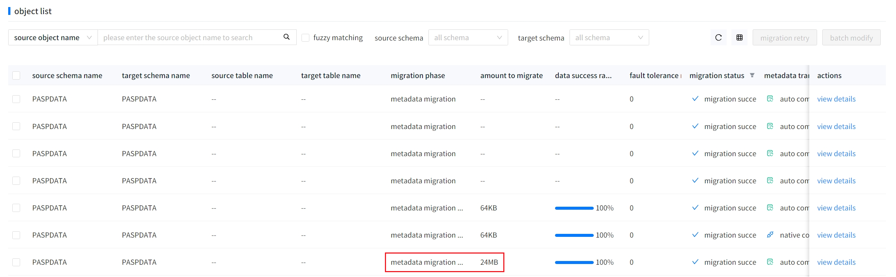

##### 1. Using the ordinary user of Dameng for data migration may show inaccurate migration volume, which deviates significantly from reality.

When migrating using the ordinary user of Dameng, the data volume query uses USER_SEGMENTS. The data volume retrieved from this view does not refresh in real-time. After data insertion, the table data volume queried by this view may still be 0, leading to potential errors in related metrics display.

##### 2. Using the ordinary user of Dameng, the version information displayed is inaccurate and shows UNKNOWN.

The Dameng version information needs to be queried from the V$VERSION view. Some versions of Dameng do not grant the ordinary user the query privilege for this view, causing YMP to intercept this situation and display it as UNKNOWN.

##### 3. Using the ordinary user of Dameng, YMP evaluation, downloading evaluation reports, migration, and verification performance decline compared to non-ordinary users.

Evaluation, downloading evaluation reports, migration, and verification all require querying the USER_SEGMENTS view, which has significantly poorer performance compared to DBA_SEGMENTS.

Reference: Under the same query conditions, DBA_SEGMENTS takes about 200ms, while USER_SEGMENTS takes about 13s.

##### 4. Using the ordinary user of Dameng, terminating migration tasks may occasionally require a long waiting time.

When terminating a migration task, the Dameng JDBC will execute SP_CANCEL_SESSION_OPERATION() to close established sessions. The ordinary user lacks the execution privilege for this function, and therefore cannot close ongoing queries. The task can only be terminated after the related queries finish executing. Some queries run slowly (such as those using the USER_SEGMENTS view), leading to a longer waiting time when terminating the migration task.