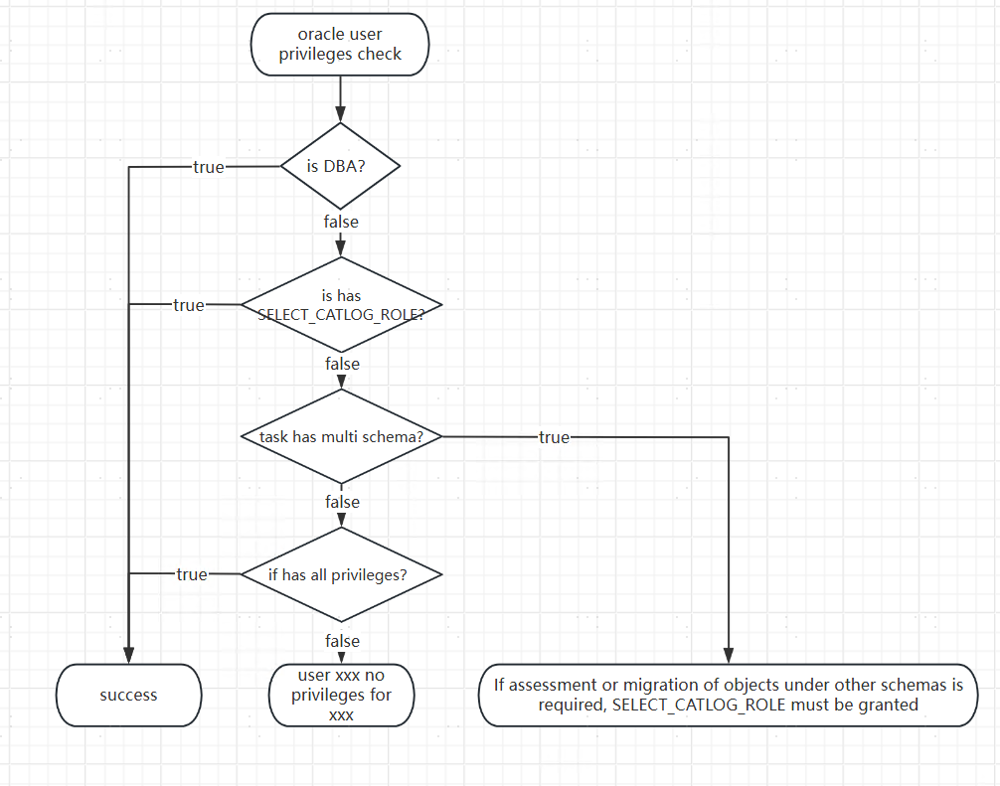

##### 1. When evaluating or migrating MySQL as the source, an error occurs while creating a Data Source or task: message from server: "Host 'xxx.xxx.xxx.xxx' is blocked because of many connection errors; unblock with 'mysqladmin flush-hosts'"

The reason for this issue is that MySQL has received multiple connection interruptions due to errors from the same IP. After resolving the issues, you can clear the disabled IP's buffer by executing the following statement: `flush hosts`.

You can also increase the MySQL database's `max_connect_errors` parameter to adjust the maximum threshold for error connections.

##### 2. During **[ next step: start Assessment Before Migration ]** or **[ next step: Data Migration ]**, an error occurs: "schema [name] is currently occupied by task [assessment/migration] on the current Assessment Database/target database ([ip]:[port])"

For example: schema SSS is occupied by the TEST migration task on the current assessment database (`192.168.8.8:1688`).  
The reason for this error message is due to the YMP duplicate checking rule: a schema can only be occupied once by an assessment or migration task on a given YashanDB database (identified by ip+port). The user needs to switch to another unaffected assessment or migration library and try again.

##### 3. During the evaluation and migration process, the YAS-02025 error occurs with the message: "no free space in virtual memory pool"

Log into the YashanDB that reports the error and execute `alter system set VM_BUFFER_SIZE=NG scope=spfile` (N based on actual configuration).

Restart YashanDB to apply the configuration. For the default built-in database, you can execute `sh ymp.sh restart` to restart YMP. Before restarting YashanDB, ensure that YMP does not have any ongoing assessment or migration tasks.

##### 4. During the evaluation and migration process, the YAS-00103 error occurs with the message: "no free block in memory pool sql main pool part 0"

Log into the YashanDB that reports the error and execute `alter system set SQL_POOL_SIZE=NG scope=SPFILE` (N based on actual configuration).

Restart YashanDB to apply the configuration. For the default built-in database, you can execute `sh ymp.sh restart` to restart YMP. Before restarting YashanDB, ensure that YMP does not have any ongoing assessment or migration tasks.

##### 5. During the upgrade process, the error message is: "tar (child): xxx: Cannot open: No such file or directory"

If the --db parameters is not specified, clean up the environment and specify the path for the update.

If a path is specified, check whether the installation package or folder exists at the corresponding path.

##### 6. When clicking **[ next step: start migration assessment ]** on the assessment configuration page, or when selecting a migration target and clicking **[ confirm range ]** without assessment, a popup error appears: "User: xx lacks xx Privilege" or "If you want to assess or migrate metadata under other users, please grant SELECT\_CATALOG\_ROLE Privilege."

When clicking **[ Next: Migration Assessment ]** or when selecting a migration target and clicking **[ confirm range ]**, YMP will perform a privilege check for the connecting user. If the relevant privilege is not present, it will report the missing privilege, and you need to grant the relevant privilege to that user. For the order of privilege checks for Oracle connecting users, please refer to the following:

##### 7. When DM is used as the source, assessment or migration encounters an error: "invalid page", "undo record version too old", or "Undo record version too old", with the validation error: "The retry count for the invalid page error in Dameng has reached the limit."

Changes in the DM database view information have caused failures in querying that view. This is a problem inherent to the DM database and can be avoided by retrying the task.

##### 8. During the use of YMP, an error occurs when connecting to the built-in library (external library): YasException: io fail: Read timed out.
YMP uses MyBatis-Plus to interact with the database and persist its business data. If a Read timed out error occurs, it is usually due to network connection issues or slow responses from the database server.

In the event of this issue, we can appropriately increase the database connection timeout and read timeout. Currently, YMP uses the HikariCP connection pool to connect to the built-in library. If there is a connection timeout issue, configurations can be modified in conf/application.properties to avoid the Read timed out problem.  
spring.datasource.hikari.connection-timeout=30000 (The timeout for acquiring connections from the connection pool, in ms, default 30000, increase as appropriate).  
spring.datasource.hikari.max-lifetime=1800000 (The maximum lifecycle of connections, which will be released when timed out, in ms, default 1800000, increase as appropriate).

At the same time, add the connectTimeout attribute to the URL for connecting to the built-in library (external library), which is in seconds, default 10s. Modify the spring.datasource.url configuration as follows:
spring.datasource.url=jdbc:yasdb://127.0.0.1:8091/yashan?connectTimeout=600

##### 9. After the installation and deployment are completed, the operation of the YMP interface is extremely slow. For example, even the most basic login interface takes a long time to respond.

Possible reason: Server address resolution is slow. When YMP connects to the built-in database via JDBC, the internal getLocalHost method takes an excessively long time to resolve the specific IP address.

Confirm steps: Log in to the server where YMP is deployed and execute the hostname -i command to test the return latency.

Possible solution: Add the mapping between the IP address and hostname of the login client to the /etc/hosts file on the YMP server.

