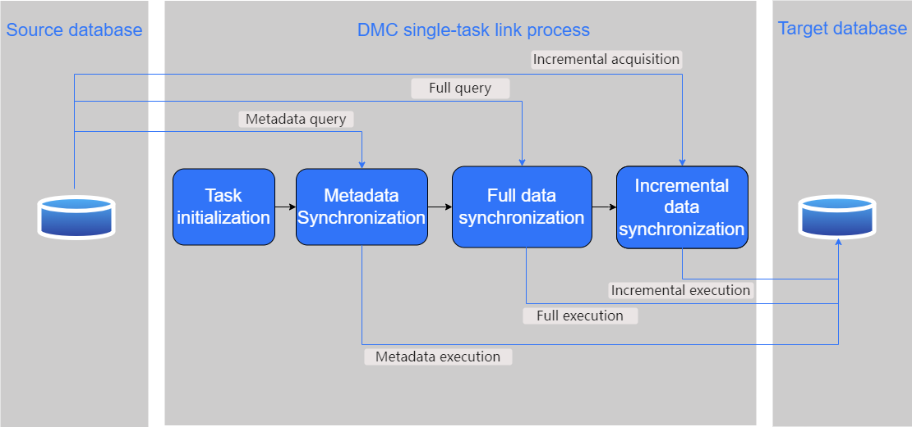

The Data Migration Component (DMC), provided by YMP, is the underlying component for incremental migration capabilities, offering users a complete incremental migration service. DMC supports various heterogeneous databases, middleware, and other products for bi-directional high-performance (hundreds of megabytes per second) online migration, real-time data synchronization, and disaster recovery operations in various complex scenarios with YashanDB. It also includes capabilities for DDL synchronization and data aggregation and cleansing, providing enterprises with comprehensive data governance services.

In this manual, DMC is also referred to as YDS (Yashan Data Sync).

## Core Features

- **"Migration + Synchronization" Integration**

  One-click triggers full migration. After the migration is complete, incremental data synchronization is automatically initiated, ensuring a seamless connection between the full snapshot data and incremental data.

- **Metadata and Full Data Synchronization**
  - **Highly Compatible Data Types**  Supports synchronization of various data types, including LOB types, with the most suitable mapping type on the target side for each data type.
  
  - **High-Performance Full Synchronization**  Supports concurrent queries within and between tables, and batch inserts on the target side, maximizing the performance of full synchronization.
  
- **Real-time Data Synchronization**

  - **Highly Adaptive Heterogeneity**  Supports data synchronization between various heterogeneous connectors.

  - **High Throughput, Low Latency**  Utilizes multiple concurrent algorithms to maximize system throughput, with synchronization delays capable of stably operating at the second level.

  - **Low Invasiveness of Deployment**  Can be deployed independently, without intruding on source or target servers and with no special requirements for connectors.

  - **"Exactly Once" Checkpoint Resume**  Supports resumption of paused or interrupted tasks with "exactly once" semantics.

  - **DDL Synchronization Support**  Supports DDL synchronization between heterogeneous connectors.

## Functionality Overview

The core principle of DMC is executing a single task, where a single process continuously extracts data from the source and writes it to the target. The following is a schematic diagram of this single task link:

- **Task Initialization**

When starting the migration task, initialization operations are performed for different migration functionalities in the above diagram, such as reading configuration parameters and establishing connections for the source and target databases. Only successfully initialized tasks will proceed to the subsequent metadata synchronization tasks.

- **Metadata Synchronization**

The metadata synchronization task is responsible for completing the full synchronization of DDL, including extracting DDL from the source (metadata query thread), converting DDL based on mapping configuration (conversion thread), and inserting DDL into the target (metadata execution thread).

- **Full Data Synchronization**

Full data synchronization uses multi-threading to concurrently query data from the source through partitioned queries within tables and concurrently inserts data into the target. This efficiently and accurately captures the snapshot of the source database at the moment the task starts into the target database (using flashback queries to ensure the consistency between full and incremental data).

- **Incremental Data Synchronization**

After the full synchronization phase is complete, DMC will start the incremental synchronization phase and continue to run. Incremental data synchronization includes incremental DDL and DML synchronization, using CDC (Change Data Capture) technology to obtain incremental data from the source and employing techniques such as restoring source transactions, DML merging computations, and checkpoint resumption to ensure efficient, accurate, and highly available synchronization to the target table.