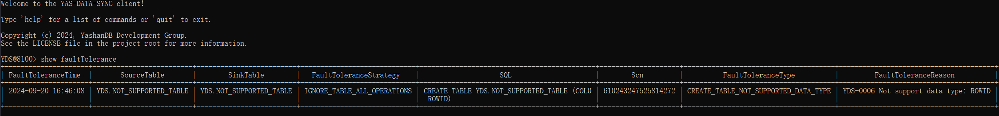

DMC provides a CLI interface to start, monitor, and manage migration tasks. For details on how to use the CLI interface and the supported commands, please refer to the [User Interface Introduction](../DMC Introduction/User Interfaces).

## Start Migration

After configuring and saving the task parameters, users can run the task in the client using the `run` command. By default, it will run the task configured in the conf/task_config.yml path. Users can also specify a configuration file in a specific directory by following `--config-path` during the `run`.

If you have set the options.conflictStrategy parameter to override or the options.truncate parameter to true, you will need to confirm again to avoid overwriting existing data.

Before the task truly begins execution, a pre-check will be conducted. The scope of the pre-check includes the following items:

1. Connectivity check between the source and target endpoints.
2. Existence check for Schemas and tables specified for synchronization tasks.
3. Check the environment and components needed for incremental synchronization.

```shell
YDS@8100> startup
Run server success.

YDS@8100> run
Existing objects on target database will be reconstructed under the override strategy.
Do you want to continue? [yes/no]:y
Submit task success! You can use "show status" command to view the status of a task.
```

Once the task starts running, the following interventions are supported:

- Use the `stop` command in the client to terminate the currently running task on the server.
  For incremental data synchronization, if the configured options.consistencyLevel parameter is data-consistent (default), you can follow the `stop` with `--normal` to perform a consistency interruption. This ensures that the transaction on the target side represents a historical version of a transaction when there are still ongoing operations on the source side. 

- Use the `remove` command to delete task information. Tasks can only be deleted when the current server task is stopped or in a failed state. You can also specify a configuration file in a specific directory by following `--config-path` during `remove`.

- Use the `resume` command to restore a task. By default, it will restore the task configured in the conf/task_config.yml path. You can also specify a configuration file in a specific directory by following `--config-path` during `resume`.

## Migration Monitoring

Use the `show status` command to monitor task status information and view the currently associated synchronization phase and any error outputs.

For descriptions of various metrics outputs visible in the DMC client, please refer to the [User Interface Introduction](../DMC Introduction/User Interfaces.html#showmetrics).

For descriptions of the various error prompts visible in the DMC client, please refer to the [Error Code Introduction](../DMC Introduction/Other Introductions).

### Metadata Synchronization Phase

If full fault tolerance is configured in the task parameter file, you can view fault tolerance information by executing `show metrics metadata --detail` in the client.


#### Synchronization Scope

The metadata synchronization phase will synchronize the Schemas and tables within the task configuration synchronization scope. The table synchronization scope includes:

- Name
- Column definitions: including column name, column type, default value.
- Primary key: includes only the names of the columns that are primary keys.

If full fault tolerance is enabled, if a table fails to be created, it will be fault-tolerated, allowing other tables to continue synchronization.

#### Metadata Validation

During the metadata synchronization phase, a metadata validation will be conducted to ensure that the metadata of the source and target tables meets synchronization requirements. The validation content includes:

- The number of ordinary columns (i.e., columns other than virtual columns) in the source and target tables must be equal.
- The column names in the source and target tables must be the same.
- The column types of corresponding columns in the source and target must be compatible with YashanDB.
- Validation of TIMESTAMP precision; if options.dataCompatibility.validateTimestampPrecision is set to false, no validation will be performed.


If validation fails, the task will throw a failure and generate an alert log. You can view the alert log, correct the metadata of the table to meet synchronization requirements, and rerun the task.

If full fault tolerance is enabled:

- Compatible cases will pass validation.
  - All types map to all character types.
  - Mutual conversions between numerical types (supporting from small to large).
  - Number, float, double types map to all numerical types but will lose precision, potentially leading to data inconsistency risks.
  - All types map to CLOB types.
  - All character types map to all numerical types.
- Incompatible cases will lead to fault tolerance for that table, while other tables continue with metadata validation and full data synchronization.
  - Different column counts will result in fault tolerance being applied.
  - Different column names will result in fault tolerance being applied.
  - Different virtual situations between source and target columns, such as one side being a virtual column and the other not, will result in fault tolerance being applied.
  - Incompatible data types will result in fault tolerance being applied.

### Full Synchronization Phase

If full fault tolerance is configured in the task parameter file, the migration task will perform the following fault tolerance operations:

- Inter-table fault tolerance: Synchronization failure of one table will not affect the normal synchronization of other tables.
- Intra-table fault tolerance: Intra-table fault tolerance can be set when inter-table fault tolerance is enabled. You can set a fault tolerance threshold (options.snapshotDmlFaultTolerance.errorLimit). If the number of erroneous rows exceeds the threshold during the table synchronization process, data synchronization will stop. If errorLimit is less than 0, there is no upper limit on fault-tolerated rows.

You can execute `show metrics snapshot --detail` in the client to view fault tolerance information. The field descriptions are as follows:

- objName represents the name of the target table that has fault tolerance.
- errorRows represents the number of rows with errors.
- status indicates the status of the table and can be one of five statuses:
  - NORMAL status indicates that the table is normal, with no error rows.
  - HAS_ERROR_ROWS_BUT_TASK_RUNNING status indicates that the table has error rows but has not yet reached the fault tolerance threshold; synchronization is still ongoing.
  - HAS_ERROR_ROWS_BUT_TASK_END status indicates that the table has error rows, and full data synchronization is complete.
  - EXCEED_FAULT_TOLERANCE_THRESHOLD status indicates that the number of error rows has exceeded the fault tolerance threshold, and full data synchronization has stopped for the table.
  - FAILED status indicates that full data synchronization of the table has failed due to unknown reasons.
- errorMsg shows the error messages, with a maximum of ten error messages retained (the first nine and the last one).
- latestErrorMsg represents the last error message.


### Incremental Synchronization Phase

If incremental DDL fault tolerance is configured in the task parameter file, you can view the currently fault-tolerated tables and related information by executing `show faultTolerance` on the client:



When a DDL such as `DROP TABLE YDS.NOT_SUPPORTED_TABLE` is captured, the table `YDS.NOT_SUPPORTED_TABLE` will no longer be fault-tolerated. DMC will attempt to delete this table on the target side and subsequently capture any DDLs and DMLs related to this table.

The synchronization scope for incremental DDL is shown in the table below:

|DDL Type                       |Synchronization Scope                      |Example                                             |
| ------------------------------------------ | ------------------------------------------------------- | ------------------------------------------------------------ |
| CREATE TABLE                               | Column names, column types, default values, primary key | CREATE TABLE YDS.TEST(ID INT DEFAULT 1 PRIMARY KEY)          |
| ALTER TABLE RENAME xxx TO                  | -                                                       | ALTER TABLE RENAME YDS.TEST TO TEST1                         |
| DROP TABLE                                 | -                                                       | DROP TABLE YDS.TEST                                          |
| TRUNCATE TABLE                             | -                                                       | TRUNCATE TABLE YDS.TEST                                      |
| ALTER TABLE ADD COLUMN                     | Column names, column types, default values, primary key | ALTER TABLE YDS.TEST ADD COLUMN COL0 INT DEFAULT 1 PRIMARY KEY |
| ALTER TABLE DROP COLUMN                    | -                                                       | ALTER TABLE YDS.TEST DROP COLUMN ID                          |
| ALTER TABLE RENAME COLUMN                  | -                                                       | ALTER TABLE YDS.TEST RENAME COLUMN ID TO ID1                 |
| ALTER TABLE MODIFY                         | Column types, default values, primary key               | ALTER TABLE YDS.TEST MODIFY (ID INT DEFAULT 1 PRIMARY KEY)   |
| ALTER TABLE ADD PRIMARY KEY                | -                                                       | ALTER TABLE YDS.TEST ADD PRIMARY KEY (ID)                    |
| ALTER TABLE ADD CONSTRAINT xxx PRIMARY KEY | -                                                       | ALTER TABLE YDS.TEST ADD CONSTRAINT PK PRIMARY KEY (ID)      |
| ALTER TABLE DROP PRIMARY KEY               | -                                                       | ALTER TABLE YDS.TEST DROP PRIMARY KEY                        |

> **Note**:
>
> To avoid insufficient archive space on the source end, please clear the breakpoint resumption information in a timely manner after the incremental synchronization is completed.

#### Manual Synchronization of Incremental DDL

When the task enters the incremental phase and encounters incremental DDLs, all DML synchronizations are completed before the DDL, followed by a task failure that prints the erroneous DDL statement. After monitoring this information, users may choose one of the following two operations:

**Option One: Skip One by One**

This means ignoring the error message and allowing the task to continue executing.

This method requires users to log in to the target side themselves to execute DDL statements compatible with the source side. Afterward, it is necessary to maintain metadata information on the DMC side. Users should contact the original factory staff for this method.

**Option Two: Recover One by One**

This means setting change information for each erroneous operation and then allowing the task to synchronize this change information again.

This method requires users to ensure that no DML has occurred from the last time DDL was executed on the current source table structure until the most recent DDL, or else the manual synchronization will fail.

The steps to operate are as follows:

1. After the task fails, add the following information to the task configuration file:

```yml
source:
  options:
    connectorParameter:
      manualDdl:
        useCurrentMetadata: false # Whether to use the current metadata of the source database
        changeType: CREATE_TABLE # Change type, CREATE_TABLE | ALTER_TABLE | DROP_TABLE | RENAME_TABLE
        schema: manual_ddl_schema # Library name for the manual DDL change
        name: manual_ddl_name # Table name for the manual DDL change
        originSchema: origin_schema # Original library name for the manual DDL change
        originName: origin_name # Original table name for the manual DDL change
```

Here, the change type indicates the state change of the table metadata from before the incremental DDL occurred to the current state. 

2. Use the following command in the DMC client to restore the previously reported erroneous incremental DDL synchronization content:

```shell
resume --manual-ddl
```

#### Auto Synchronization of Incremental DDL

If automatic incremental DDL synchronization is configured in the task parameter file, manual incremental synchronization of DDL-related functions will become ineffective once the task enters the incremental phase.

When the task enters the incremental phase and encounters incremental DDL, it will strictly adhere to the sequential order of executing DML and DDL.
