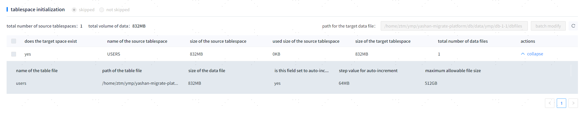

### Target Database Performance Optimization for Migration

YMP data migration retrieves data from the source database and transfers it to the target database. The performance of the data migration depends on the query performance of the source database and the execution performance of the target database. Database configuration optimizations can refer to the performance optimization manuals for the respective databases.

#### 1. Parameter Optimization for Target Database
The yasldr data import tool used during the data migration process continuously sends large amounts of data to the target database, resulting in high load on the server. To improve the processing performance of the target database, relevant parameters need to be configured reasonably before the import. The specific configurable parameters are as follows:

|Target YashanDB Configuration Parameter |Recommended Adjustment Description |  
|------------------------------|---------------------------------------------------------------------------------------------------------------------------------------------------------------------------------------------------------------------------------------------------------------------------------------------------------------------------------------------------------------------------| 
| DATA_BUFFER_SIZE                              | Specifies the size of the data buffer. A larger data buffer size improves import performance, with a default value of 64M and a range of [32M, 64T].                                                                                                                                                                                                                                                                                   |                                                  
| LARGE_POOL_SIZE                               | Adjust to the maximum allowable value within the parameters. If the import process encounters a "no free blocks in large pool" error, it indicates that this value is insufficient for import resource requirements. Solutions include:<br>1. Adjust the import table to reduce the total number of heap partition tables.<br>2. Lower the degree_of_parallelism parameter during import.<br>3. Re-import.                                                                                              |                                              
| WORK_AREA_STACK_SIZE                          | Number of reader threads = degree_of_parallelism / (decoder_thread_times + 1), rounded up.<br>Number of sender threads = degree_of_parallelism - number of reader threads.<br>SIZE = 512KB + 126KB * number of tables * number of sender threads.                                                                                                                                                          |        
| WORK_AREA_POOL_SIZE                           | MIN_SIZE = number of threads * number of tables * number of partitions * 256B + number of reader threads * number of sender threads * 1KB.                                                                                                                                                                                                                                                                                          |               
| VM_BUFFER_SIZE                                | Specifies the memory size used for SQL standard calculations. It is recommended to increase this parameter when the data involved in calculations such as sorting, materialization, and JOIN is large, which can enhance computational performance.                                                                                                                                                                          |               
| SHARE_POOL_SIZE                               | Specifies the memory size used for shared buffers. This area of memory is shared among the execution plan buffer, data dictionary buffer, lock buffer, cursor buffer, distributed buffer, and Stream Pool. After subtracting the sizes of the lock buffer and cursor buffer from the shared buffer size, the execution plan buffer, data dictionary buffer, and distributed buffer sizes are allocated as percentages. The initial size of the Stream Pool is 0, and space will be dynamically allocated from the Share Pool based on business needs. Its maximum high value is determined by the STREAM_POOL_SIZE parameter value. This parameter only supports online enlargement. If it is necessary to reduce this configuration, please modify the configuration file and restart the database. If there are many concurrent operations, it is recommended to increase this parameter.                                                                                          |                                                
| REDO_BUFFER_SIZE                              | Memory size for redo flushing, measured in bytes, with the default value recommended. This parameter is related to the redo file size; improper configuration may lead to database startup or creation errors. The range/format is [4M, 128M].                                                                                                                                                              |                
| MAX_PARALLEL_WORKERS                          | The number of workers in the worker pool for both standalone and distributed parallel processing, while consuming the corresponding session resource quota. For details, please refer to the MAX_SESSIONS parameter.<br/>In Distributed Deployment, the number of parallel threads will vary based on the complexity of the SQL statement. When the complexity is high and the number of stages required (the number of PX SENDs in the plan) exceeds the configured number of workers, an execution error will occur. In this case, it is necessary to adjust this parameter to increase the thread count and enhance parallel capability. The specific adjustment value can be estimated based on the number of stages generated by complex statements in the current environment.<br/>The range is not fixed but is influenced by the current MAX_SESSIONS value, so caution is required during setting. YMP recommends a value of 512.                                                                                                               |                
| DATA_TRANSFORMER_ENABLED                       | Whether to allow the background to automatically perform transformer actions. YMP recommends a value of FALSE.                                                                                                                                                                                                                                                                         |                
| ARCH_CLEAN_IGNORE_MODE                         | Specifies the ignore mode when cleaning archive files. "Ignore backup" means that regardless of whether the archive file has been backed up, it will be cleaned. "Ignore standby database" means that regardless of whether the archive file has been obtained by all standby databases, it will be cleaned. YMP recommends a value of BACKUP.                                                                                                                                                                                       |                
| ARCH_CLEAN_LOWER_THRESHOLD                     | Specifies the stopping condition for the automatic cleaning of archive functionality. Once this functionality is triggered, it will automatically delete the current database's archive log files until the total size of the existing archive log files and the next impending archive log files does not exceed this value. This value cannot be greater than ARCH_CLEAN_UPPER_THRESHOLD. When set to 0, it indicates that all cleanable archive log files will be cleaned. The range/format is [0, 32T], YMP recommends a value of 0.                                                                                                                                                                                             |                      
| COMPRESSION                                     | Specifies the compression method for the LSC storage engine. UNCOMPRESSED means no compression, LZ4 means using the LZ4 algorithm for compression, and ZSTD means using the ZSTD algorithm for compression. YMP recommends a value of LZ4.                                                                                                                                                                                                |                            
| SCOL_DATA_PRELOADERS                           | The number of background pre-read threads used by the LSC storage engine. YMP recommends a value of 6.                                                                                                                                                                                                                                                                                            |                
| COLUMNAR_VM_BUFFER_SIZE                        | Specifies the memory size used for columnar storage calculations. It is recommended to increase this parameter when sorting, materialization, JOIN, etc., involve large amounts of data, which can improve computational performance. When importing an LSC table in BULKLOAD mode and this configuration parameter is insufficient, it must be increased. To ensure that imports do not encounter memory shortage errors, it is recommended that each server import thread has a minimum of 300M memory. The number of server import threads is calculated as follows: MIN(DEGREE_OF_PARALLEL, CPU core number * 4). When importing in client mode, the number of server threads equals the size of the SENDERS parameter. If memory errors occur during multi-threaded imports, SESSION_BULKLOAD_MAX_MEM_PERCENT can be adjusted to prevent memory shortage errors due to contention between import threads.<br/>Configuring COLUMNAR_BUFFER_SIZE or COLUMNAR_DATA_BUFFER_PERCENT will render this configuration item ineffective. |                                          
| COLUMNAR_BUFFER_SIZE                          | When importing an LSC table in BULKLOAD mode, it is recommended to increase this parameter, with a default value of 2G and a range of [256M, 4T].                                                                                                                                                                                                                                           |                  
| COLUMNAR_DATA_BUFFER_PERCENT                   | Specifies the proportion of the data buffer used by the LSC storage engine in terms of COLUMNAR_BUFFER_SIZE size. When importing an LSC table in BULKLOAD mode, the larger this parameter is configured, the better the import performance, while a smaller value can enhance computational performance. The default value is 40, with a range of [1, 99].                                                                                                                                                                                         |                
| SCOL_DATA_BUFFER_SIZE                          | Specifies the size of the data buffer used by the LSC storage engine. A larger buffer size generally results in better overall database performance. If the capacity is too small, it will cause frequent data block swapping, and it is recommended that the data buffer configuration be at least 1G. Configuring COLUMNAR_BUFFER_SIZE or COLUMNAR_DATA_BUFFER_PERCENT will render this configuration item ineffective.                                                                                                                    |                                                 

Before performing the migration of large datasets (up to TB level), it is necessary to consider adjusting the tablespace and redo log size configurations:

#### 2. Tablespace Adjustment

Rational initial configurations and expansion configurations for tablespaces can reduce frequent adjustments to the tablespace size during data migration, thereby improving import performance. During the migration initialization phase, the tablespace configuration information of the target database can be observed:


1. For tablespaces that do not exist on the target side, reasonable initial values and expansion file sizes can be configured through the interface; tablespaces will be created prior to migration.
2. For tablespaces that exist on the target side, initial values and file counts can be adjusted using client tools. Refer to:
````sql
 ALTER TABLESPACE XXX (tablespace name) ADD DATAFILE 'yashan2 (tablespace file path)' SIZE 100G AUTOEXTEND ON NEXT 256M MAXSIZE 512G PARALLEL 4;
````

#### 3. REDO Space Adjustment

During the migration process, if data import gets stuck, check the REDO space usage.
1. Query the current redo information of the target database.
````sql
 select * from v$logfile;
````
Pay attention to the STATUS field. If there are only a few INACTIVE state LOGFILE files, consider increasing the number of LOGFILE files to prevent REDO from trailing.
2. Adjust the number of LOGFILE files as needed.
    a. Add redo groups:
    ````sql
    -- (You can use the full path like /home/yashandb/yasdb_data/dbfiles/redo5a instead of redo6) 
    ALTER DATABASE ADD LOGFILE 'redo6' size 200M;
    ````
    b. Remove redo groups:
    ````sql
    -- Remove redo group:
    ALTER DATABASE DROP LOGFILE '/home/yashan/yashandb/yasdb_data/dbfiles/redo5a';
    ````

When deleting LOGFILE, do not delete LOGFILE files that are currently in use. You can also manually switch the current LOGFILE using the SWITCH command:

````sql
 ALTER SYSTEM CHECKPOINT; 
 ALTER SYSTEM SWITCH LOGFILE;
````

### YMP Metadata Migration Optimization Configuration Parameters

According to different data migration methods in YMP, optimization reference is as follows:

#### 1. Data Migration Using JDBC Export and yasldr Import

|Advanced Configuration Item |Default Value |Parameter Description |  
|------------------------------|-----------------------------------------|-------------------------------------------------------------------------------------------------------------------------------| 
| Whether to set the table to NOLOGGING before data migration | false                                      | Indicates whether to set the table to nologging before data migration, with the default set to false.                                                            |                                            
| Whether to automatically optimize export parameters | false                                      | Controls the automatic adjustment of some export parameters, including the number of splits for large non-partition tables, partition tables, the threshold for splitting large non-partition tables (including row count and size), the maximum threshold for pagination splitting of large LOB tables, and the thresholds for merging and splitting export data amounts for small and large partition tables. This is available only when the export method is JDBC. |          
| Split count for non-partition large single table data | 5                                          | Controls the export splitting granularity for non-partition large tables, determining the minimum unit for parallel queries. For example, if set to 1000, the query SQL will be divided into 1000 conditional ranges for data query threads to queue for execution, with the degree of parallelism controlled by the non-partition large table's single table query parallel count.                              |         
| Single table export query parallel count       | 5                                          | Controls the parallel count of queries during table data export.                                                                                                                                                 |             
| Non-LOB table split threshold (row count)     | 10000000                                   | The row count that triggers the splitting of large tables during export.                                                                                                                                       |                                                 
| Non-LOB table split threshold (size)          | 5                                          | The size (G) that triggers the splitting of large tables during export.                                                                                                                                         |             
| LOB table split threshold (row count)         | 1000000                                    | The row count that triggers the splitting of large tables with LOB fields during export.                                                                                                                       |                                                 
| LOB table split threshold (size)              | 5                                          | The size (G) that triggers the splitting of large tables with LOB fields during export.                                                                                                                       |                                                 
| Maximum threshold for pagination splitting of large LOB tables | 5000000                                    | If the number of LOB rows is less than this threshold, pagination will use OFFSET + LIMIT splitting, which can effectively improve data migration performance.                                                      |                                                 
| Maximum number of lines in exported CSV files  | 5000000                                    | The maximum number of lines for each exported CSV file.                                                                                                                                                            |         
| Maximum data volume in exported CSV files     | 3072                                       | The maximum size (M) for each exported CSV file.                                                                                                                                                                   |             
| First file size for JDBC export               | 256                                        | A suitable value can shorten the time between starting to export data for a single table and beginning to import data, thus improving data migration performance (M).         |             
| Maximum length of all LOB fields exported inline in JDBC | 8192                                       | When the total length of all LOB fields in a row is less than the specified length, it will be optimized for inline import. For character types like CLOB, character lengths are counted, and for binary types like BLOB, byte lengths are counted.         |                                                 
| Maximum size of all LOB fields exported inline in JDBC | 768                                        | When the total size (M) of all LOB fields in a row is less than the specified length, it will be optimized for inline import. The maximum value is limited by the row size restriction of the import tool, not to exceed 1G.  |             
| Merge export amount threshold for small partition data in Partition tables  | 1024                                       | In the scenario of many partitions where the partition data is small, when the data amount (M) is less than this threshold, it will be merged into a single query, thus avoiding a large number of small files being generated.     |             
| Split export amount threshold for large partition data in Partition tables | 2048                                       | Under the scenario of large data volume in partition tables, continue to split queries and exports within the partition.                                                        |             
| yasldr import LoadOptions parameter configuration   | MODE=BATCH,SENDERS=7,CHARACTER_SET=UTF8 | Command-line parameters for yasldr, which can be adjusted according to the required supported yasldr parameters. The supported range can be found in the yasldr parameter descriptions in the YashanBD documentation. Parameters are separated by commas, e.g., CSV_CHUNK_SIZE=128, CSV_LINE_SIZE=126.  |             
| yasldr import LoadStatement parameter configuration | DEGREE_OF_PARALLELISM=16                | DML parameters for Load Data in yasldr, which can also be adjusted as needed for supported yasldr parameters. The supported range can be found in the yasldr parameter descriptions in the YashanBD documentation. Parameters are separated by commas, e.g., ERRORS=12, DEGREE_OF_PARALLELISM=16.  |                 
| Minimum threshold for partition count in partition tables using BASIC mode import | 5000                                       | When the number of partitions in the partition table exceeds this threshold, BASIC mode import will be used.                                                                   |             

> **Note**:
>
> **[ yasldr LoadOptions Configuration ]** is based on user configuration. Under JDBC export method, yasldr parameters for inline LOB will be automatically calculated reasonably, and users should avoid configuring CSV_LINE_SIZE, CSV_CHUNK_SIZE, and BATCH_SIZE settings as much as possible.

#### 2. Data Migration Using DTS Export and yasldr Import

|Advanced Configuration Item |Default Value |Parameter Description |  
|------------------------------|-----------------------------------------|-------------------------------------------------------------------------------------------------------------------------------| 
| Whether to set the table to NOLOGGING before data migration | false                                      | Indicates whether to set the table to nologging before data migration, with the default set to false.                                                            |                                            
| Whether to automatically optimize export parameters | false                                      | Controls the automatic adjustment of some export parameters, including the number of splits for large non-partition tables, partition tables, the threshold for splitting large non-partition tables (including row count and size), the maximum threshold for pagination splitting of large LOB tables, and the thresholds for merging and splitting export data amounts for small and large partition tables. This is available only when the export method is JDBC. |          
| Split count for non-partition large single table data | 5                                          | Controls the export splitting granularity for non-partition large tables, determining the minimum unit for parallel queries. For example, if set to 1000, the query SQL will be divided into 1000 conditional ranges for data query threads to queue for execution, with the degree of parallelism controlled by the non-partition large table's single table query parallel count.                              |         
| Single table export query parallel count       | 5                                          | Controls the parallel count of queries during table data export.                                                                                                                                                 |             
| Non-LOB table split threshold (row count)     | 10000000                                   | The row count that triggers the splitting of large tables during export.                                                                                                                                       |                                                 
| Non-LOB table split threshold (size)          | 5                                          | The size (G) that triggers the splitting of large tables during export.                                                                                                                                         |             
| LOB table split threshold (row count)         | 1000000                                    | The row count that triggers the splitting of large tables with LOB fields during export.                                                                                                                       |                                                 
| LOB table split threshold (size)              | 5                                          | The size (G) that triggers the splitting of large tables with LOB fields during export.                                                                                                                       |                                                 
| Maximum threshold for pagination splitting of large LOB tables | 5000000                                    | If the number of LOB rows is less than this threshold, pagination will use OFFSET + LIMIT splitting, which can effectively improve data migration performance.                                                      |                                                 
| Maximum number of lines in exported CSV files  | 5000000                                    | The maximum number of lines for each exported CSV file.                                                                                                                                                            |         
| Maximum data volume in exported CSV files     | 3072                                       | The maximum size (M) for each exported CSV file.                                                                                                                                                                   |             
| Merge export amount threshold for small partition data in Partition tables  | 1024                                       | In the scenario of many partitions where the partition data is small, when the data amount (M) is less than this threshold, it will be merged into a single query, thus avoiding a large number of small files being generated.     |             
| Split export amount threshold for large partition data in Partition tables | 2048                                       | Under the scenario of large data volume in partition tables, continue to split queries and exports within the partition.                                                        |             
| yasldr import LoadOptions parameter configuration   | MODE=BATCH,SENDERS=7,CHARACTER_SET=UTF8 | Command-line parameters for yasldr, which can be adjusted according to the required supported yasldr parameters. The supported range can be found in the yasldr parameter descriptions in the YashanBD documentation. Parameters are separated by commas, e.g., CSV_CHUNK_SIZE=128, CSV_LINE_SIZE=126.  |             
| yasldr import LoadStatement parameter configuration | DEGREE_OF_PARALLELISM=16                | DML parameters for Load Data in yasldr, which can also be adjusted as needed for supported yasldr parameters. The supported range can be found in the yasldr parameter descriptions in the YashanBD documentation. Parameters are separated by commas, e.g., ERRORS=12, DEGREE_OF_PARALLELISM=16.  |                 
| Minimum threshold for partition count in partition tables using BASIC mode import | 5000                                       | When the number of partitions in the partition table exceeds this threshold, BASIC mode import will be used.                                                                   |             

> **Note**:
>
> **[ yasldr LoadOptions Configuration ]** is based on user configuration. Under the DTS export method, users need to manually consider tuning for inline LOB related parameters and manually optimize configurations like BATCH_SIZE.