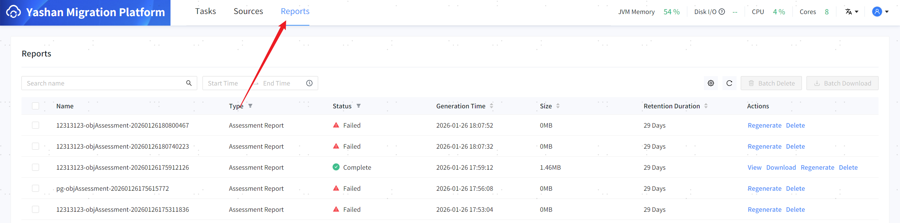
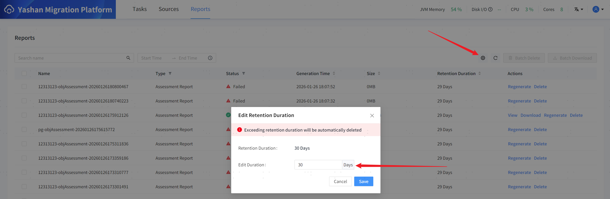

After the task execution is completed, a corresponding report will be automatically generated and added to the report management page for management. You can perform operations such as viewing, downloading, deleting, and filtering.

When there are reports that fail to generate, you can click the operation bar **[ regenerate ]** to regenerate the report.

## Set Save Time

You can open the pop-up by clicking the settings icon in the upper right corner and set the report save time in the pop-up. Reports will be automatically deleted after exceeding the save time.

The maximum save time that can be set is 90 days.

