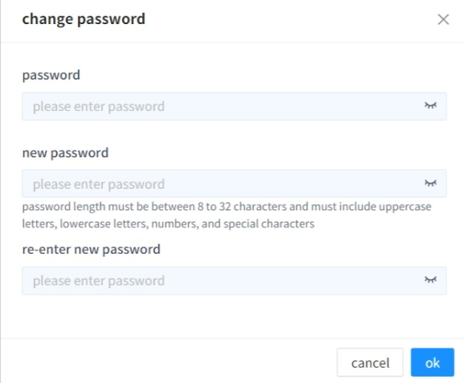
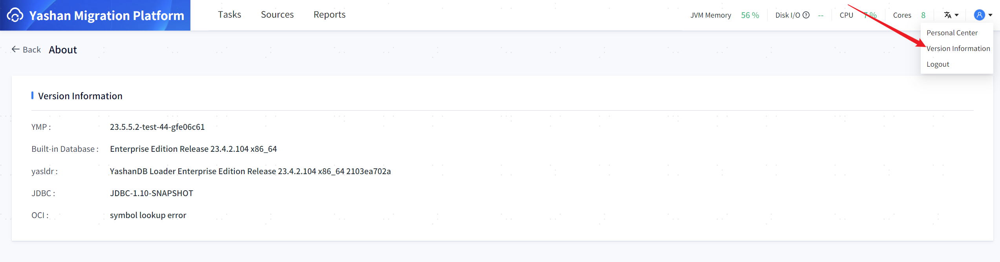

## Login
Log in to YMP with the initial username and password (admin/admin). You must change the password upon first login; once changed, you can log in to the YMP system.

## Reset Password

To reset the password, perform the following operations:

````shell
 # Enter the YMP installation directory
 $ cd /home/ymp/yashan-migrate-platform/
 
 # Reset the password
 # Ensure the YMP business database is in normal operating status when resetting the login user's password
 $ sh bin/ymp.sh password --reset
 
 # Restart YMP
 $ sh bin/ymp.sh restart
````

> **Note**:
>
> If the password has failed five times and does not need to be reset, simply restart YMP and enter the correct password.

## Change Password
Click on the upper right corner **[ personal center ]** to view username, password information, and other basic information.

Click **[ Password Change Icon ]** to modify the user password.

Password restrictions: Length must be between 8 and 32 characters and must include uppercase letters, lowercase letters, numbers, and special characters.



## Version Information
Click on the upper right corner **[ version information ]** to display related version information: YMP version, built-in library version, yasldr version, JDBC version, OCI version.


