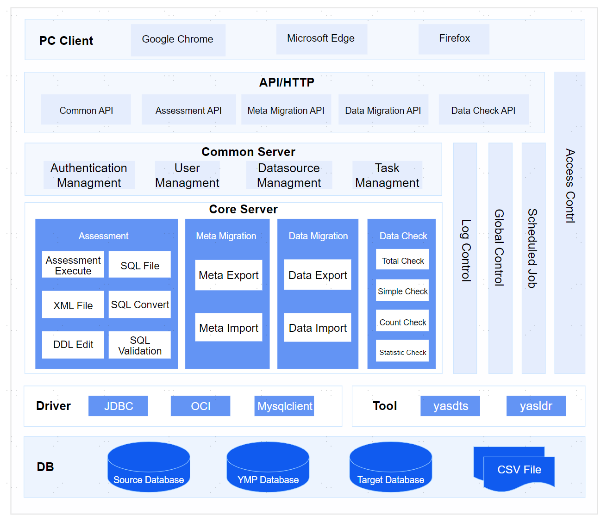

The overall architecture of the YashanDB Migration Platform (YMP) is as follows:

## Core Service Introduction

### Object Assessment

Provides evaluation capabilities for object compatibility between multiple heterogeneous RDBMS and YashanDB. Supports various heterogeneous database sources, SQL files, and XML files as input sources, offering functionalities such as SQL transformation, DDL rewriting, and SQL automated validation.

### Metadata Migration

Offers metadata migration capabilities. Supports flexible selection of migration scope, conflict strategy options for objects in different scenarios, pre-migration risk checks, and real-time display of migration progress and object-level migration results.

### Data Migration

Provides table data migration capabilities. Supports data conflict handling options, utilizing the database's native high-performance import and export abilities, employing multi-table parallel and partitioned table parallel architectures to achieve factory-level high-performance data migration.

### Data Validation

Provides data validation capabilities between multiple heterogeneous RDBMS and YashanDB. Includes full verification and statistical verification functionalities to strongly support data consistency post-migration.