Welcome to the Quick Guide for Data Migration from Oracle to YashanDB. This guide aims to help users complete database migration from Oracle to YashanDB with the simplest process and highest efficiency through clear examples and standardized operation steps, creating a quick-start guide with the shortest path.

Before formally starting the migration operation, first clarify the core concepts involved in this guide:

- **Source**: The system that hosts the data to be migrated, i.e., the Oracle database.
- **Target**: The target system for data migration, i.e., the YashanDB database.
- **Experience Environment**: The scope of preparing the experience environment includes the source-side experience environment, the target-side experience environment, and the YMP system experience environment. The core goal is to guide users in completing the pre-migration preparation work and provide environmental support for subsequent data migration tasks.

## Preparation of the experience environment

### Preparation of the source environment

#### Step 1: Authorization Configuration

Create the YMP_TEST user using a privileged account and grant it the required permissions.

The authorization command for the source Oracle connection user is as follows:

```sql
CREATE USER YMP_TEST IDENTIFIED BY "123456";
GRANT CREATE SESSION TO YMP_TEST;  
GRANT SELECT_CATALOG_ROLE TO YMP_TEST; 
GRANT SELECT ANY TABLE TO YMP_TEST; 
GRANT SELECT ANY SEQUENCE TO YMP_TEST;
```

#### Step 2: Source Data Preparation

To provide a better user experience, we have provided source data reference cases, and subsequent migration work will be uniformly carried out in accordance with the following table.

```sql
CREATE USER YMP_DEMO IDENTIFIED BY "123456";
GRANT DBA TO YMP_DEMO;  
CREATE TABLE YMP_DEMO.TT(id INT PRIMARY key,name VARCHAR(10));
INSERT INTO YMP_DEMO.TT VALUES (1,'aaa');
INSERT INTO YMP_DEMO.TT VALUES (2,'bbb');
INSERT INTO YMP_DEMO.TT VALUES (3,'ccc');
INSERT INTO YMP_DEMO.TT VALUES (4,'ddd');
```

### Preparation of the target environment

Create the YMP_TEST user using a privileged account and grant it the required permissions.

The authorization commands for the target YashanDB connection user are as follows:

```sql
CREATE USER YMP_TEST IDENTIFIED BY "123456";
GRANT DBA TO YMP_TEST;
```

### YMP System Environment Preparation

#### Step 1: Server Configuration Confirmation

The deployment environment configuration must meet at least the minimum requirements. If the configuration does not meet the minimum requirements, although the YMP system can be run by modifying the configuration parameters, problems such as lag and memory overflow may occur during the use of tasks.

|Configuration Item     |Minimum Requirements                             |Description                                                         |
| :----------- | :------------------------------------ | :----------------------------------------------------------- |
| Operating System     | CentOS 7.6 or above, KylinOS V10, RHEL 9.3 |                                                              |
| Processor Architecture  | X86-64、ARM-64   | For ARM-64 architecture, the required JDK version for YMP must be JDK17, which can effectively resolve potential database connection slow issues. |
| CPU Cores     | 4 cores or more                             |                                                              |
| Available Memory    | 8G or more                             | Memory usage varies based on the complexity of the database model;                   |
| Disk Available Space | SSD, size based on the size of the migration table   | It is recommended to be no less than three times the maximum data volume of a single table in the table to be migrated                    |

#### Step 2: Confirm the port

Confirm the ports that need to be used during the operation of YMP:

|YMP Listening |Database Listening |yasom |yasagent |
| ------- | ---------- | ----- | -------- |
| 8090    | 8091       | 8093  | 8094     |

#### Step 3:  Disable Firewall

Run the following command on the server to disable the firewall:

```shell
# Disable firewall
systemctl stop firewalld 

# Disable boot auto-start
systemctl disable firewalld
```

#### Step 4: Create a new YMP user

Create a new user on the server to install and deploy YMP. After the user is created and authorized, all subsequent installation steps must be performed under this user.

Note that the YMP installation path must not contain English periods.

```shell
useradd -d /home/ymp -m ymp
passwd ymp
```

#### Step 5: Server Tools Preparation

 Install the lsof command tool:

```shell
yum install -y lsof
```

#### Step 6: JDK Environment Preparation

When the JDK version of YMP is JDK17, after supporting the download and successful installation of the above-mentioned JDK versions through the official Java path, the following environment variables need to be configured:

```shell
# Take the JDK17 installation path under the ymp user as /usr/tools/jdk17 as an example
# su - ymp 
$ vi ~/.bash_profile

# Add the following content at the end of the file
export JAVA_HOME=/usr/tools/jdk17
export PATH=$JAVA_HOME/bin:$PATH
export CLASSPATH=.:$JAVA_HOME/lib/dt.jar:$JAVA_HOME/lib/tools.jar

# Reload the configuration file
$ source ~/.bash_profile

# Check the JDK version information after successful installation
$ java -version
```

#### Step 7: libaio Environment Preparation

The operation of YMP requires the libaio dynamic library.

```shell
# Check if the libaio dynamic library is installed
rpm -qa | grep libaio

# If no version information is printed, install libaio.
yum install -y libaio
```

#### Step 8: Switch to the YMP user

All subsequent server installation steps starting from this step will be performed by the YMP installation user, so please switch to the YMP user or log in to the server as the YMP user.

The recommended installation path is `/home/ymp`, please ensure this directory is empty when installing YMP.

```shell
chown ymp:ymp yashandb-xx.xx-linux-x86_64.tar.gz

su - ymp
```

#### Step 9: Upload the YMP installation package

Upload the YMP installation package to the /home/ymp directory and then unzip it:

```shell
# Switch to the YMP installation directory
$ cd /home/ymp/
$ unzip yashan-migrate-platform-xx.x.x.x-linux-xxx.zip
```

#### Step 10: Execute the installation command

If you want to complete the entire data migration process smoothly, we strongly recommend that you install the built-in database specified by the command and ensure that the version of the assessment database is consistent with the version of the target database you plan to migrate to. **Moreover, it is not recommended to use the built-in database and the assessment database as target databases.**

```shell
# Enter the installation directory
$ cd /home/ymp/yashan-migrate-platform/

# Execute the installation command, where --db specifies the built-in database
$ sh bin/ymp.sh install --db /home/ymp/yashandb-xx.x.x.x-linux-xxx.tar.gz
```

## Start migrating

### Step 1: Log in to YMP

After deployment, you can access the YMP page via `http://IP:PORT/`, where the default value of PORT is 8090.

You need to reset your login password when logging in for the first time. The initial account name and password are (admin/admin).

Enter the YMP interface.

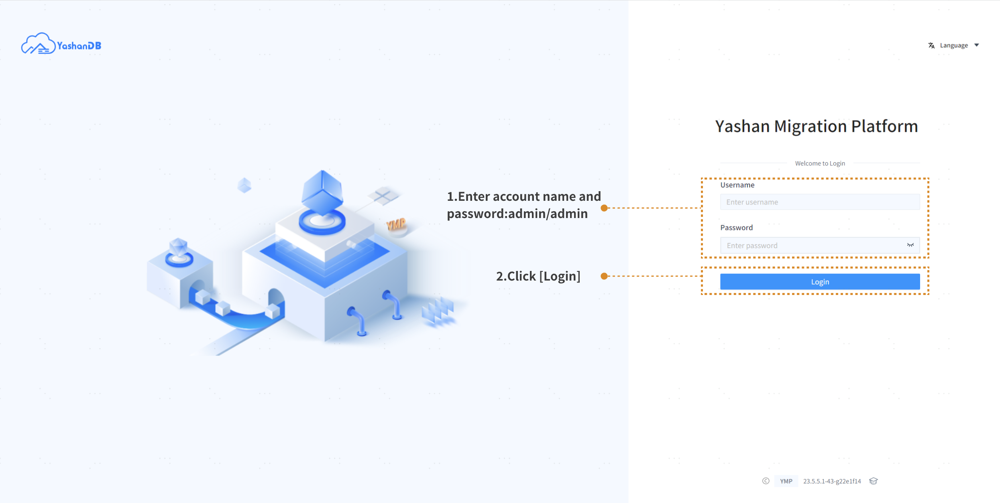

Reset password on first login:

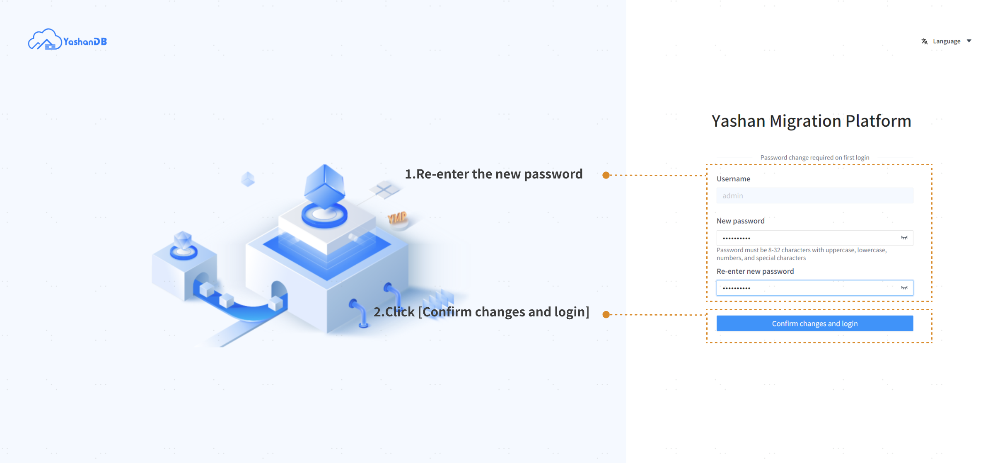

### Step 2: Add data sources

Before creating a task, you need to add the source database information first:

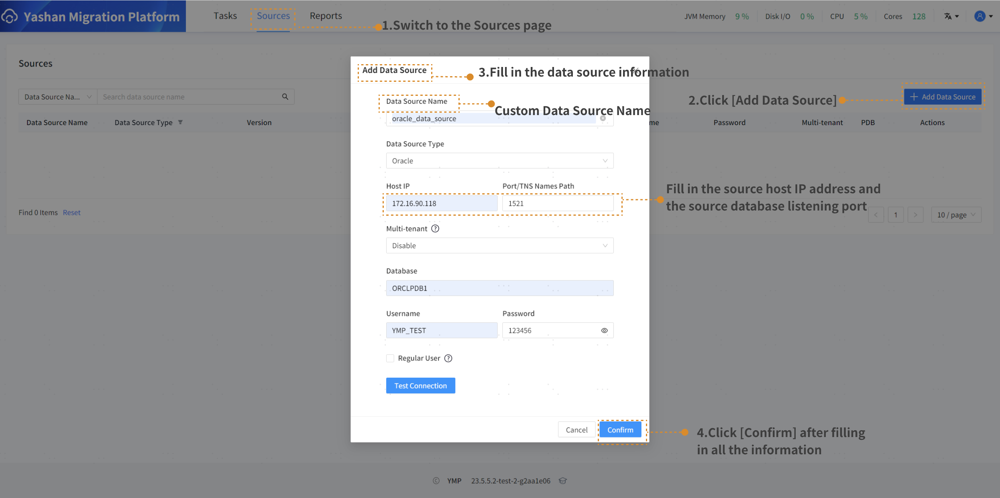

### Step 3: Create a task

Enter the task creation interface to fill in the task configuration information and add the target database. After completion, click **[Next: Continue Configuration]**.

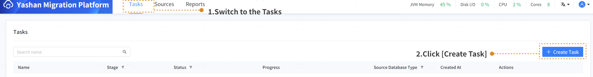

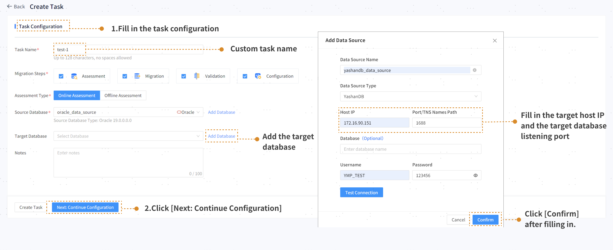

### Step 4: Assessment Configuration

After selecting the type of assessment objects, the assessment schemas, and the advanced options, click **[Next: Migration Assessment]**:

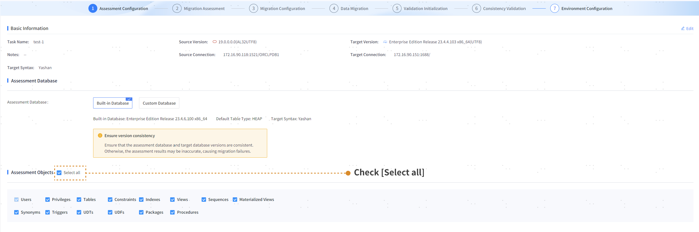

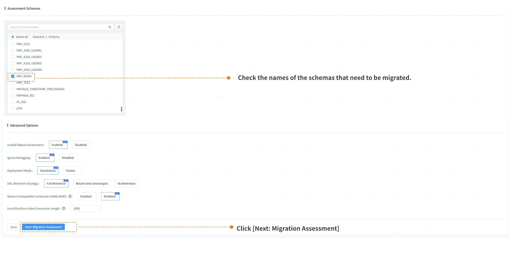

### Step 5：Migration Assessment

According to the assessed result page, if the assessment result is 100%, you can proceed to the next step of migration configuration:

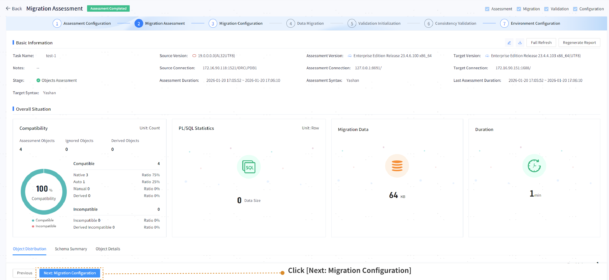

### Step 6: Migrate Configuration

The user connecting to the source database needs to be granted the permissions required by the migration platform, and the user connecting to the target YashanDB database needs to be granted DBA permissions.

2. Select the steps that need to be migrated:

   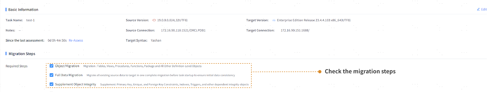

4. Select the objects to be migrated (those ignored by default will not be migrated):

   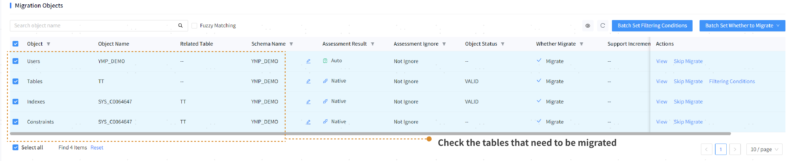

6. Perform migration initialization configuration and advanced configuration:

   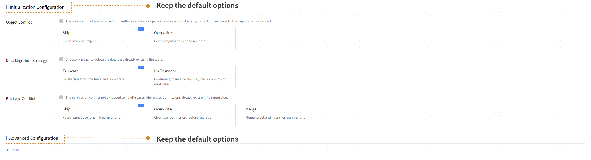

8. Select tablespace initialization and role initialization.

   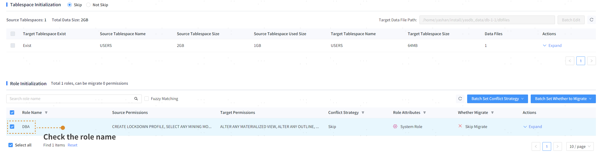

10. Check the inspection items to perform a pre-check, then click **[Next: Data Migration]** after the check is completed.

    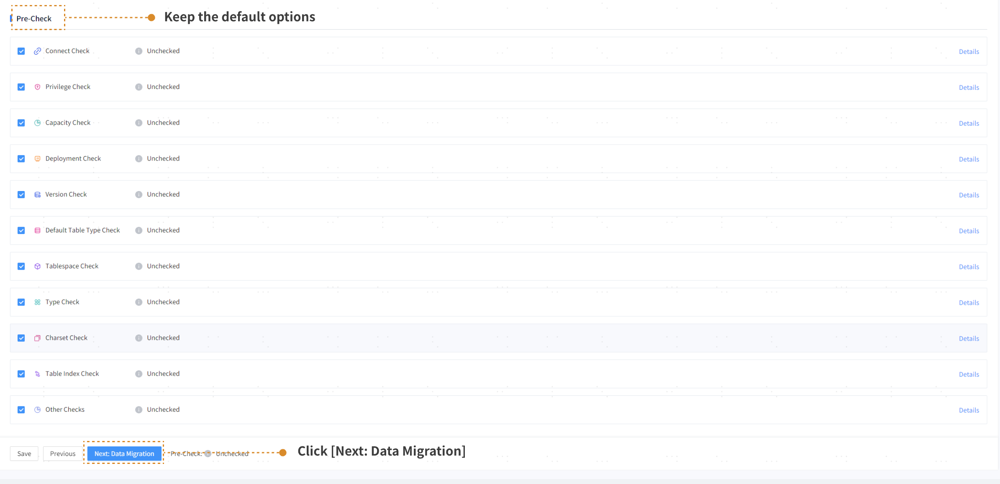

### Step 7: Data Migration

Jump to the migration dynamic interface, where you can view and download task logs, and after the migration is completed, you can download the migration report.

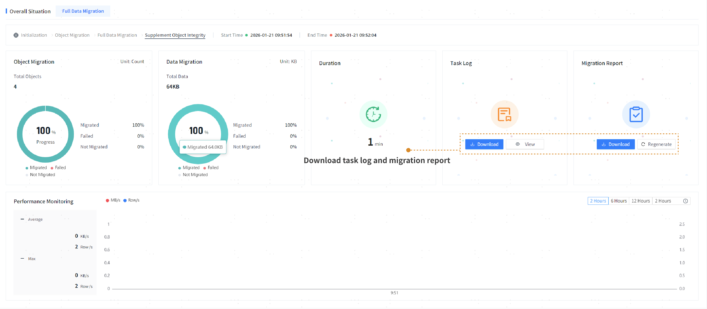

You can view the details in the object list. After confirming that the migration is successful, click **[Next: Validation Initialization]** to enter the validation initialization.

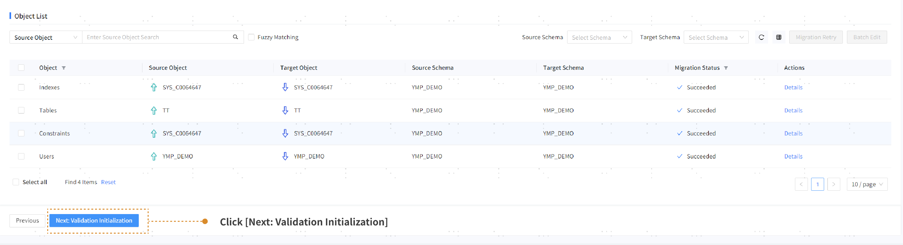

### Step 8: Validation Initialization

Validate object inheritance data migration. By default, the tables with successful data migration are Validated, and the other tables are not Validated.

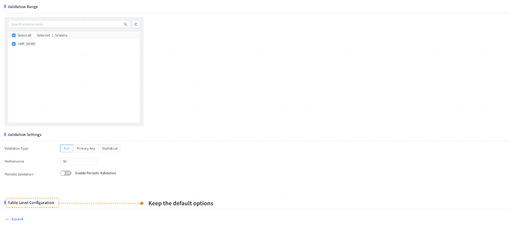

Perform a full data consistency Validation on the tables of the source database and the target database. After the configuration is completed, click **[Next:Consistency Validation]**.

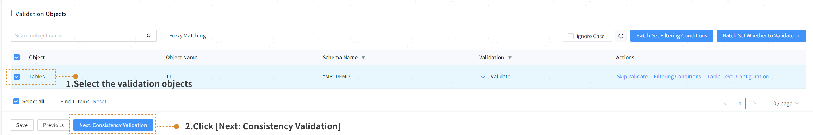

### Step 9: Consistency Validation 

Display the overall operation status, check the validation progress and validation overview, and download the task operation logs and validation reports.

After the validation is completed, the results of each row in the table can be viewed.

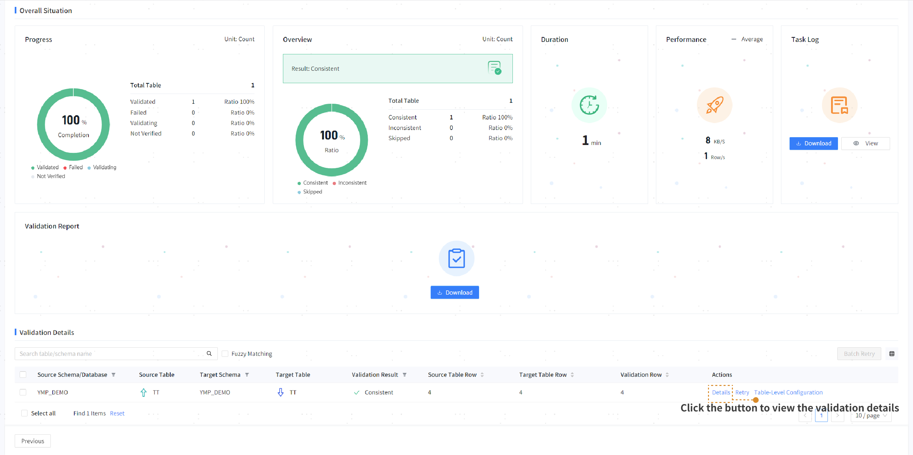

## Validate the success of data migration

After the migration task is completed, enter the following code to directly check the migrated source table on the target database.

```sql
SELECT * FROM  YMP_DEMO.TT;
```

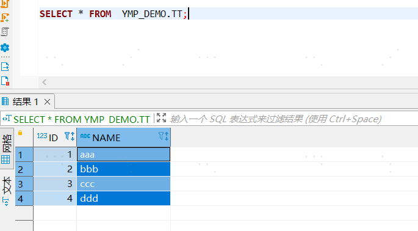

At this point, a simple and quick task process comes to an end.