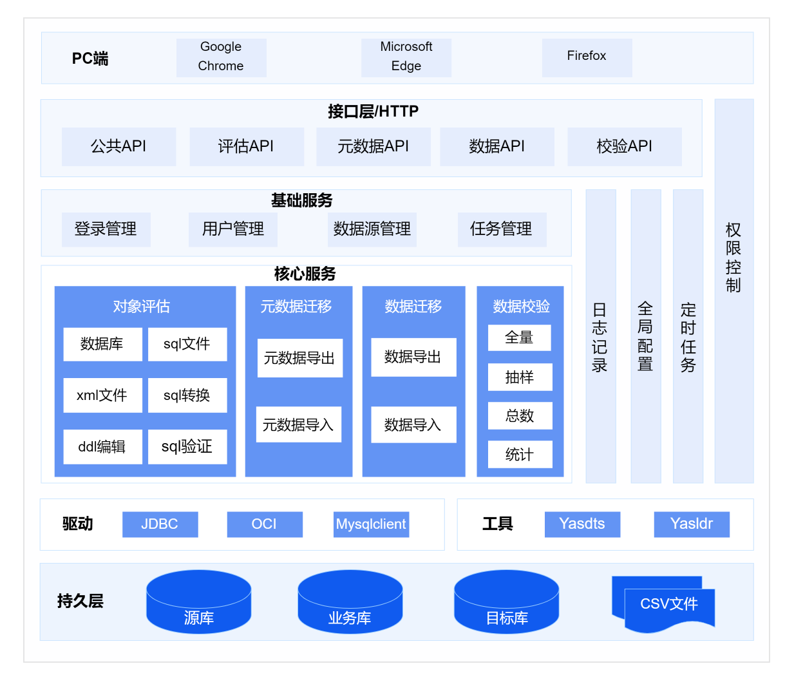

崖山迁移平台（YashanDB Migration Platform，YMP）的总体架构如下：

## 核心服务介绍

### 对象评估

提供多源异构RDBMS与YashanDB之间对象兼容的评估能力。支持多种异构数据库源、SQL文件、XML文件作为输入源，提供SQL转换、DDL改写和SQL自动验证等功能。

### 元数据迁移

提供元数据迁移能力。支持对迁移范围的灵活选择，支持不同情景下的对象冲突策略选择，迁移前风险检查和实时展示迁移进度和对象级迁移结果。

### 数据迁移

提供表数据迁移能力。支持数据冲突处理选择，基于数据库原生高性能导入导出能力，采用多表并行、分表并行架构，实现原厂级高性能数据迁移。

### 数据校验

提供多源异构RDBMS与YashanDB之间的数据校验能力。包括全量校验和统计校验功能，满足迁移后数据一致性的强力支持。
