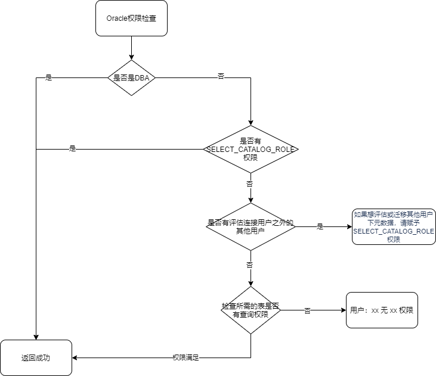

##### 1. MySQL作为源端评估或迁移时，创建数据源或任务进行中出现报错：message from server: "Host 'xxx.xxx.xxx.xxx' is blocked because of many connection errors; unblock with 'mysqladmin flush-hosts'"

出现该问题的原因为MySQL收到了来自同一个IP的多次因错误导致的连接中断，请在解决完出现的问题后，可以通过执行以下语句清理禁用IP的缓存：`flush hosts`。

也可以通过调大MySQL数据库的`max_connect_errors`参数，调整错误链接数的最大阈值。  

##### 2. 在下一步：开始迁移评估，或者下一步：数据迁移的时候，报错：“schema [名称]在当前评估数据库/目标端数据库（[ip]:[port]）上，被xx任务[评估/迁移]占用”

例如：schema SSS在当前评估数据库（`192.168.8.8:1688`）上，被TEST任务迁移占用。  
出现该报错提示的原因为YMP判重规则：一个schema，在一个YashanDB数据库（以ip+port判重）上，同时只允许被一个任务的评估或迁移占用一次。用户需要更换其他不受影响的评估或者迁移库后重试。

##### 3. 在评估迁移过程中遇到YAS-02025报错，报错信息为：“no free space in virtual memory pool”

登录报错的YashanDB，执行`alter system set VM_BUFFER_SIZE=NG scope=spfile`（N依据实际配置）。

重启YashanDB让配置生效，其中默认内置库可执行`sh ymp.sh restart`重启YMP来重启。重启YashanDB前注意确保YMP没有正在评估或迁移的相关任务。

##### 4. 在评估迁移过程中遇到YAS-00103报错，报错信息为：“no free block in memory pool sql main pool part 0”

登录报错的YashanDB，执行`alter system set SQL_POOL_SIZE=NG scope=SPFILE`（N依据实际配置）。

重启YashanDB让配置生效，其中默认内置库可执行`sh ymp.sh restart`重启YMP来重启。重启YashanDB前注意确保YMP没有正在评估或迁移的相关任务。

##### 5. 在升级过程中遇到报错信息为：“tar (child): xxx: Cannot open: No such file or directory”

未指定--db参数时，清理环境后指定路径进行更新。

已指定路径情况下查看对应路径下安装包或文件夹是否存在。

##### 6. 在评估配置页面单击【下一步：开始迁移评估】，或者不评估在迁移配置页面选择完迁移对象单击【确定范围】时，弹窗报错：”用户: xx 无 xx 权限“或者“如果想评估或迁移其他用户下元数据，请赋予SELECT\_CATALOG\_ROLE权限”

单击【下一步：开始迁移评估】时，或者不评估选择完迁移对象单击【确定范围】时，YMP会进行连接用户的权限检查，如果没有相关权限，会报出相关权限缺失，您需要对该用户赋予相关权限。对于Oracle的连接用户的权限检查顺序，可参考如下：

##### 7. DM做源时，评估、迁移出现报错：“无效的页”、“回滚记录版本太旧”、“Undo record version too old”，校验出现：“达梦无效页错误重试次数已达上限”的报错信息。

DM数据库视图信息变化，导致DM数据库查询该视图出现故障。属于DM数据库本身问题，可通过任务重试进行规避。

##### 8. YMP在使用过程中，出现连接内置库（外置库）报错：YasException:io fail:Read timed out。
YMP使用MyBatis-Plus与数据库交互持久化自身的业务数据，如果遇到Read timed out错误，通常是由于网络连接问题或数据库服务器响应过慢导致的。  

遇到该问题，我们可以适当增加数据库连接的超时时间和读取超时时间。 目前YMP使用HikariCP连接池连接内置库，如果遇到连接超时问题，可以通过修改conf/application.properties中增加配置，来避免Read timed out的问题。  
spring.datasource.hikari.connection-timeout=30000（从连接池获取连接的超时时间，单位ms，默认30000，适当增加）。  
spring.datasource.hikari.max-lifetime=1800000（连接的最大生命周期，超时后会被释放。单位ms，默认1800000，适当增加）。  

同时，连接内置库（外置库）的url上添加connectTimeout属性，单位是s，默认10s，修改spring.datasource.url配置参考：  
spring.datasource.url=jdbc:yasdb://127.0.0.1:8091/yashan?connectTimeout=600

##### 9. 安装部署完成后，YMP界面操作非常慢，例如，最基础的登录接口响应耗时都很长。

目前遇到过的可能原因：服务器寻址慢，YMP使用JDBC连接内置库时，getLocalHost内部方法寻找具体IP地址耗时过长。

确认步骤：登录YMP所在服务器，执行hostname -i命令测试返回耗时。

可尝试规避方案：向YMP服务器/etc/hosts文件中添加登录端设备的IP和设备名映射关系。

