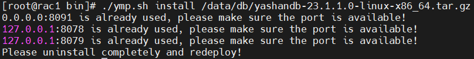
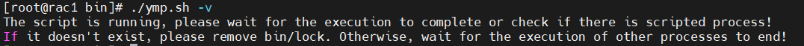

##### 1. 重新部署，不保留之前的所有数据

1. 执行`sh bin/ymp.sh stop && sh bin/ymp.sh uninstall -f`。
2. 执行以上操作后重新部署YMP即可。

##### 2. 重新部署，且需保留之前数据，请联系我们的技术支持

##### 3. 内置库端口被占用，产生端口冲突，错误如图

  

请修改 application.properties 下 spring.datasource.url 与 db.properties 下 YASDB_PORT 的端口，并确保一致。

##### 4. ymp.sh进程被 *kill -9* 强制停止后再次调用ymp.sh脚本失败，报错如下

根据提示删除 *bin/* 目录下 *lock* 文件。
