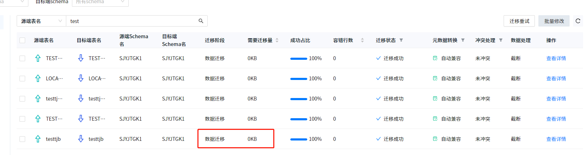

##### 1. 使用达梦普通用户进行数据迁移，需要迁移量展示不准确，与实际偏差较大。

使用达梦普通用户迁移时，数据量查询使用USER_SEGMENTS查询，该视图查出的数据量不会实时刷新，数据插入后，由该视图查出的表数据量可能仍为0，因此相关指标展示可能有误。

##### 2. 使用达梦普通用户，达梦版本信息展示不准确，显示UNKNOWN。

达梦版本信息需要从V$VERSION视图查询，部分达梦版本的普通用户无该视图查询权限，YMP将对这种情况进行拦截并展示为UNKNOWN。

##### 3. 使用达梦普通用户，YMP评估、下载评估报告、迁移、校验性能相比非普通用户，有一定下降。

评估、下载评估报告、迁移、校验均需要使用USER_SEGMENTS视图进行查询，该视图查询性能相比DBA_SEGMENTS相差较多。

参考：使用相同条件查询，DBA_SEGMENTS需要200ms左右，USER_SEGMENTS需要13s左右。

##### 4. 使用达梦普通用户，终止迁移任务偶尔需要等待较久时间。

终止迁移任务时，达梦JDBC会执行SP_CANCEL_SESSION_OPERATION()，关闭已建立的会话，普通用户没有该函数的执行权限，因此无法关闭正在查询的会话，只能等相关查询执行完毕才终止任务。有部分查询速度较慢（如使用了USER_SEGMENTS视图的查询），若此时终止迁移任务则需要等待较久时间。
