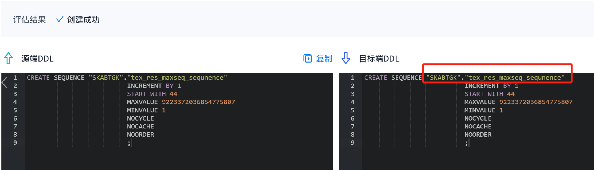
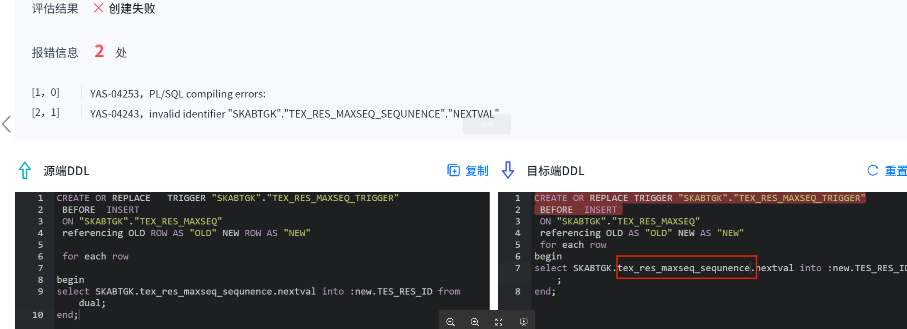
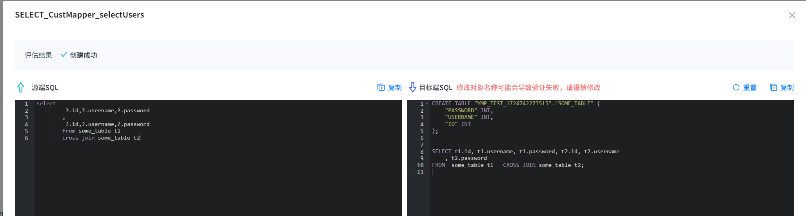
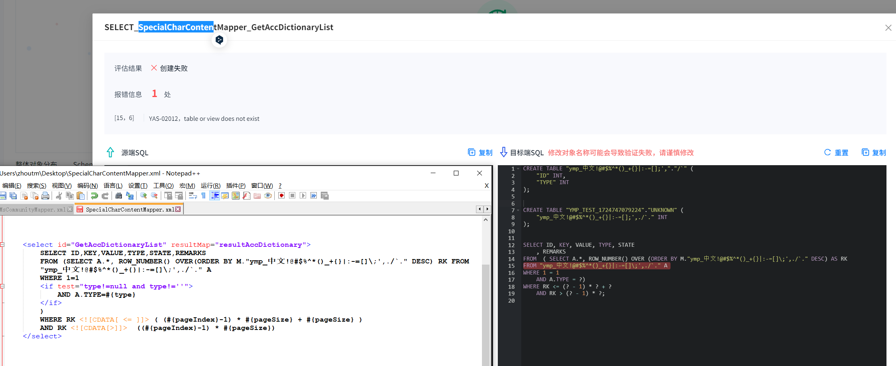
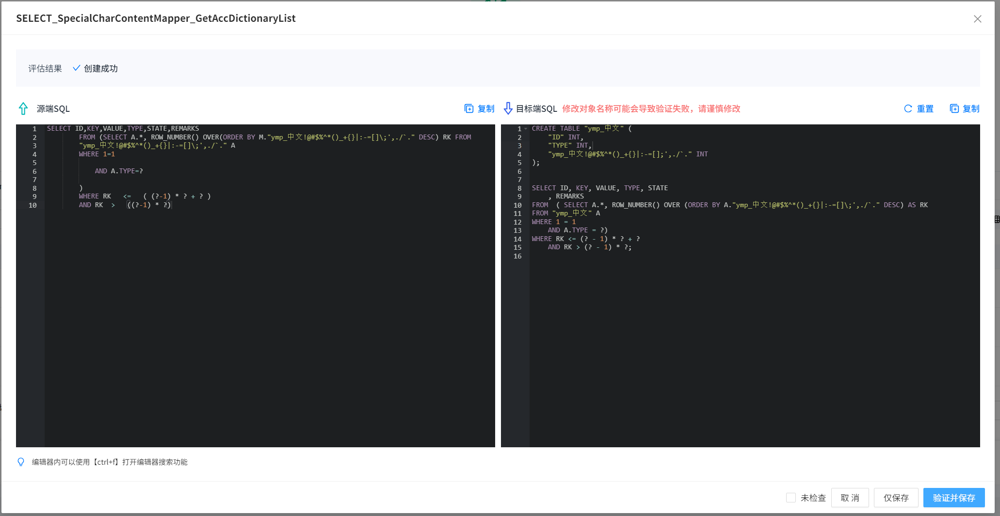
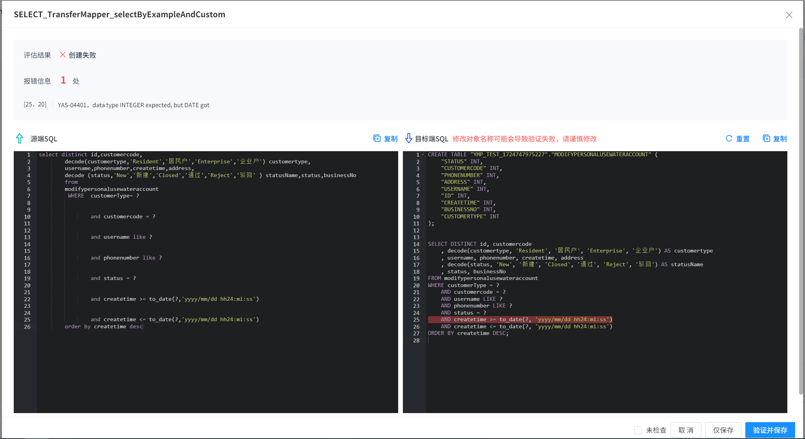
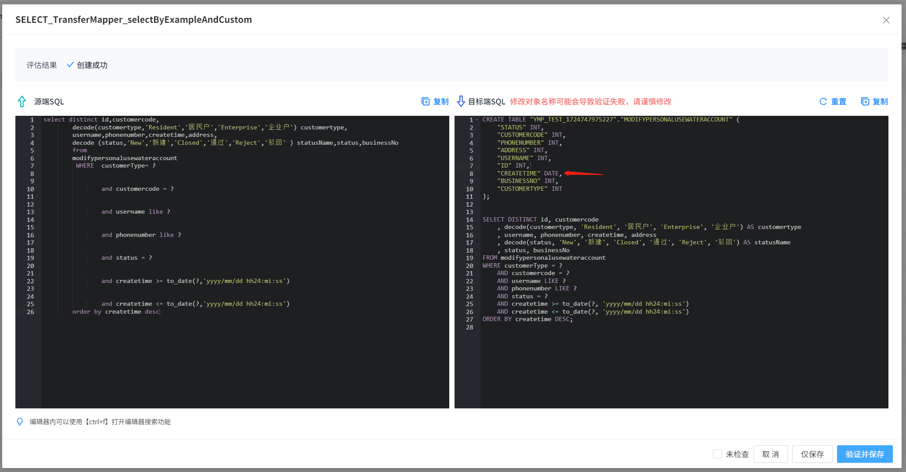
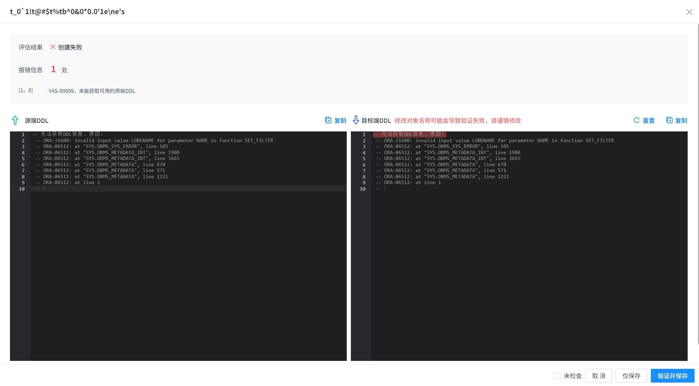
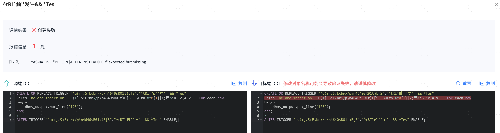

##### 1. 评估时部分对象未在评估范围之内

物化视图 ： 还在创建过程中，等待其写入视图或者手动执行（`ALTER SYSTEM FLUSH BUFFER_CACHE;` 不建议，耗时过长）。  
索引 ：LOB类型索引本身为LOB类型列自动生成，不在评估范围内。

##### 2. 评估结果约束报错信息为：“YAS-02206 specified index does not exist or cannot be used to enforce the constraint”

检查索引是否存在，如果索引存在则查看约束使用列是否与索引一致，如果数量不一致则需要根据业务需要对索引或约束的列修改使其保持一致。

##### 3. 评估阶段故障和解决方式
|  故障原因| 表现形式| 解决方法|
|---------------|-------------|------------------------|
| YMP进程异常中断     | 工具界面打不开     | 重启YMP → 重新评估           |
| 源库进程异常中断      | 工具报错timeout | 任务失败 → 重新评估            |
| 内/外置库进程异常中断   | 工具界面全部不可用   | 重启数据库 → 重启YMP → 重新评估     |
| 内/外置库数据故障无法重启 | 界面所有数据丢失    | 重新部署安装YMP → 重新新建任务开始评估 |

##### 4. 索引状态为UNUSABLE，主键状态为ENABLE，评估时先创建索引，再创建主键，则主键无法成功，导致不兼容。

该问题主要原因为索引被标记为UNUSABLE，但是主键状态仍为ENABLE，主键依赖该索引，因此无法成功创建。  
如果维持索引状态为UNUSABLE，则会无法对表内主键列进行任何插入删除更新等操作。  
解决方法：找到主键依赖的索引，将其状态改为USABLE，重新全量刷新报告即可。   
如果该索引状态确认要设置为UNUSABLE，则可以后续迁移完成之后再次修改索引状态为UNUSABLE。

##### 5. YMP不支持对PLSQL做任何语法、大小写转换，对于MySQL/DM，PLSQL内有小写对象名且没有双引号时，评估会失败报错找不到该对象。




这种情况下，需要用户手动给PLSQL中小写对象名字添加双引号。

##### 6. 携带LOCAL(PARTITION xxx TABLESPACE "xxx")的索引评估转换后LOCAL里的信息全部丢失。

其受数据库限制，做数据迁移时容易受数据影响导致分区数和索引DDL定义的分区数不一致，迁移索引无法成功，因此将全部LOCAL信息在转换时移除。

<span id="problem11" name="problem11" class="yaslink"></span>

##### 7. Mybatis Mapper XML文件评估结果中，使用refid的引用SQL没有自动进行参数替换，见下图。
受限于Mybatis解析能力，在解析SQL之前有对$符号做替换#，对于传入的参数，未自动映射，用户可手动修改目标端SQL，以达到评估兼容性目的。

例如：



<span id="problem12" name="problem12" class="yaslink"></span>

##### 8. Mybatis Mapper XML文件评估结果中，因为SQL自身问题（SQL写错，中文逗号等）评估不兼容，修改DDL后验证或者全量刷新报告时，提示”YAS-02012，table or view does not exist“。


SQL自身有问题（SQL写错，中文逗号等），评估前并不能解析到对应的表名，在刷新时或者验证也不会再去改动目标端SQL，用户可以在SQL语句前加上建表语句，尽量和真实环境保持一致后进行验证或者刷新评估报告。

##### 9. Mybatis Mapper XML文件评估结果中，即使有了自动生成的建表语句，评估提示中还是有”YAS-02012，table or view does not exist“。


自动生成的schema或者table是根据SQL解析出来的例子，并不保证一定和XML应用的实际表保持一致，如果在评估结果中看到表不存在报错，用户可以手动修改目标端SQL中的建表语句，尽量和真实环境保持一致后进行验证或者刷新评估报告。

例如：


##### 10. Mybatis Mapper XML文件评估结果中，不兼容提示字段和SQL语句中使用的函数、类型不匹配的错误，例如：”YAS-00014 illegal conversion from DATE to INTEGER“、”YAS-00007 no mul method for DATE INTEGER“、”YAS-04401 data type INTEGER expected, but DATE got“等。


原因同问题9，用户可以手动修改目标端SQL中的建表语句的字段类型，尽量和真实环境保持一致后进行验证或者刷新评估报告。

参考：


##### 11. ARM机器下JDK8环境部署的YMP，源端使用Oracle做源评估时，评估进度很慢，使用数据源测试连接时，响应时间也很慢。

当我们排除网络、防火墙问题后，确定只是YMP使用时连接慢的话，可能原因是YMP部署环境的JDK版本太低，和Oracle驱动兼容性问题。  
解决方案：升级环境的JDK到11版本，重启YMP后重新评估。
如果问题还存在，请联系技术人员支持排查。

##### 12. XML类型任务同时执行，部分对象出现SCHEMA不存在的错误原因，如：“YAS-02010，user 'userName' does not exist”。

XML类型任务无法预先解析出其使用的所有相关SCHEMA，因此在执行时会创建不存在的SCHEMA，如果多任务使用相同的SCHEMA则可能受其它任务影响。   
任务删除或重新评估和全量刷新报告时会将SCHEMA删除，因此多任务执行时有可能删除掉其它XML正在使用的SCHEMA。 如果出现该问题，请重新评估。

##### 13. Oracle 9i、Oracle 10g做源评估元数据兼容时，对于对象名包含特殊字符 ' 的对象，评估为不兼容，报错信息如：Unable to obtain DDL information, reason is: ORA-31600: invalid input value LONGNAME for parameter NAME in function SET\_FILTER。


Oracle 9i、Oracle 10g的DBMS_METADATA.GET_DDL()高级包函数，对于特殊字符 ' ，需要做转义替换，从1个'变为4个'，在替换完之后可能会超过该函数的对象名长度限制而报错。
解决方案：其他途径获取DDL后填入目标端DDL再进行全量刷新报告进一步评估。

##### 14. 评估元数据兼容时，获取表DDL失败，报错信息包含：ORA-22922: nonexistent LOB value。
YMP按照批大小（assessment.ddlCount，默认20），并发（assessment.maxThreadCount，默认20）的查询对象的DDL，当一次性返回大量的GET_DDL函数结果时，会出现内部LOB缓存溢出被回收，导致ORA-22922报错。
规避方案：手动调整并发度assessment.maxThreadCount和批大小assessment.ddlCount，减小对源库压力。参数详见相关[参数说明](../参考说明/参数说明)。

##### 15. YMP在评估对象兼容性时任务报错：“GC overhead limit exceeded”。GC overhead limit exceeded 是 Java 虚拟机（JVM）抛出的一种 OutOfMemoryError，表示垃圾回收（GC）花费了太多时间（超过 98%），但只回收了很少的内存（少于 2%）。  
评估时出现该报错提示，意味着评估时存在着大量的DDL字符串对象还在拆分解析使用，垃圾回收器无法有效释放内存。  
避免方案：

- 给YMP分配更大内存：修改conf/application.properties配置，ymp_memory=4G，可根据机器资源适当增加。
- 降低评估对象的并发度：修改conf/application.properties评估相关配置： 
   - assessment.ddlCount=20 评估任务单个会话获取DDL的数量，可适当降低，减少任务运行时对内存的占用率。 
   - assessment.maxThreadCount=20 评估任务最多同时拥有的会话数，可适当降低，减少任务并发对内存的占用率（注意会影响评估性能）。

##### 16. YMP在评估对象时忽略全部不兼容对象后刷新兼容率没有达到100%。
评估时会对PLSQL对象类型进行并发创建，部分对象虽然不兼容，但是会创建入库，评估会对该类型的对象进行删除操作，其评估结果为不兼容。
在上述类型的对象创建成功和删除成功的中间时间，如果其它依赖它的对象进行了评估创建，如果语法没有问题则会兼容，评估结果为原生兼容或自动兼容。
不兼容的对象全部忽略后全量刷新报告，则依赖不兼容的部分对象会因为依赖关系的变化而不兼容，兼容率下降无法达到100%。
解决方案：再次忽略不兼容对象，全量刷新报告即可。

##### 17. YMP在使用23.4版本的YashanDB外置库评估type类型时报错：“YAS-02013 name is already used by an existing object”
评估时出现该报错提示，可能原因为23.4版本的YashanDB数据库在部署时默认开启回收站功能。
当有type类型对象被表所依赖，删除表时会将表放入回收站而非实际被删除，导致type类型对象删除失败，所以报出该错误。
避免方案：
- 在评估库中执行SQL语句“ALTER SYSTEM SET RECYCLEBIN_ENABLED = OFF”后，再次进行评估。

##### 18. Oracle 11g及以下版本做源评估元数据兼容时，可能会出现获取到的DDL是错误的内容，如下图，会导致评估不兼容。


出现该问题，是因为Oracle 11g版本自带的高级包函数GET_DDL()问题，输出的DDL不对，在高版本中已经修复。
解决方案：可使用YMP提供的手动修改功能将目标端DDL语句修改为正确语句，即可正常评估兼容性。

##### 19. Oracle 9i做源评估元数据兼容时，若触发器的对象名中含有空格，如下图，会导致评估不兼容。


出现该问题，是因为Oracle 9i版本自带的高级包函数GET_DDL()问题，输出的DDL不对，在高版本中已经修复。
解决方案：可使用YMP提供的手动修改功能将目标端DDL语句修改为正确语句，即可正常评估兼容性。

##### 20. Oracle 10g做源评估时，遇到表中有高级数据类型（包括同义词、系统自定义类型，例如XMLTYPE等）在目标端执行报错：YAS-04229，invalid datatype。
问题出现的可能原因为Oracle 10g中，表字段使用到高级函数时，创建后GET_DDL展示的是连接用户下的高级类型，而不是固定SYS下的类型（后续版本已修复）。  
例如使用YMP用户连接创建表：
```sql
CREATE TABLE "XML001"."TEST_XML"("ID"  "XMLTYPE");
```

评估时会获取到GET_DDL展示的是：
```sql
CREATE TABLE "XML001"."TEST_XML"("ID"  "YMP".XMLTYPE");
```

而不是固定的SYS下的类型：
```sql
CREATE TABLE "XML001"."TEST_XML"("ID"  "SYS".XMLTYPE");
```
解决方案：可使用YMP提供的手动修改功能将目标端DDL语句中类型的OWNER改为SYS，即可正常评估兼容性。

##### 21. 在目标端为YashanDB v23.4.6.100及以上版本的迁移任务中，即使有自动生成的建表语句，Mybatis Mapper XML文件评估结果提示“YAS-04323 arguments count must be ……”该如何处理？

问题原因：在目标端为YashanDB v23.4.6.100及以上版本的迁移任务中，若源端数据表中无"VALUE"列（目前仅发现该关键字）但SQL语句中引用了该列，YMP解析SQL自动生成建表语句时会误报YAS-04323（正常场景应为“YAS-04243 invalid identifier XXX”），其错误信息中不包含列名，导致YMP无法进一步解析报错信息并无法自动拼接目标列字段的定义语句。

解决方案：用户可以手动修改目标端SQL中的建表语句，加上“VALUE”字段，尽量和真实环境保持一致后进行验证或者刷新评估报告。
