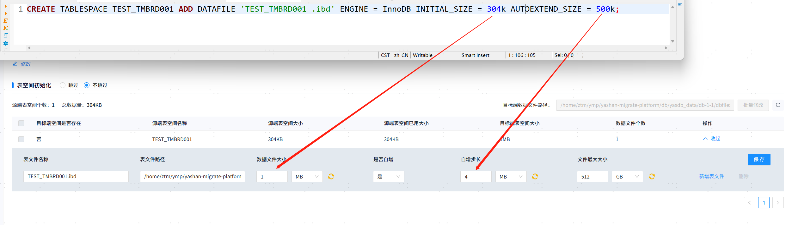
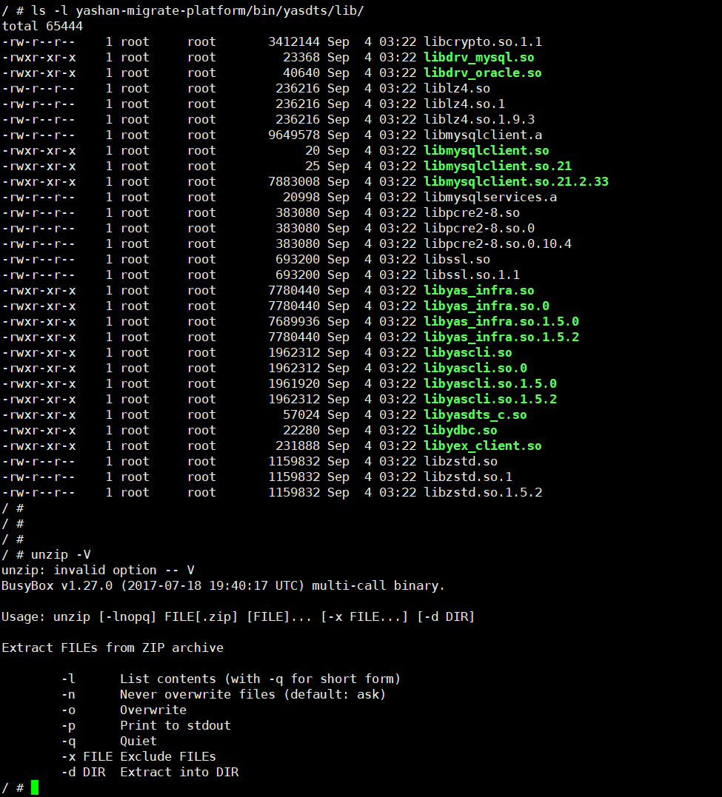
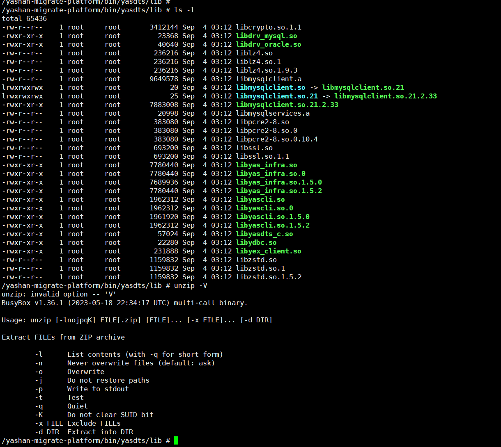
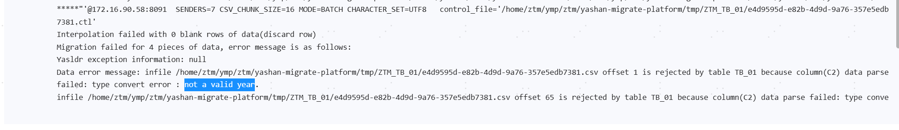

##### 1. 在迁移过程中遇到报错信息为：“YAS-00008 type convert error : literal does not match format string”

目标端数据库需要设置 `alter system set DATE_FORMAT='yyyy-mm-dd hh24:mi:ss' scope=spfile`，并重启目标端数据库。

##### 2. 在迁移过程中遇到报错信息为：“YAS-02011 no free blocks in large pool”

方案一：修改位于conf/application.properties中的配置项：`import.degree_of_parallelism`，默认值为16个并发，需要根据目标数据库使用情况减小并发的值，并重启YMP。  
方案二：目标端数据库调大LARGE_POOL_SIZE到64M，默认16M，执行 `ALTER SYSTEM SET LARGE_POOL_SIZE = 64M SCOPE=spfile`，并重启目标端数据库。

##### 3. Oracle作为源端时，创建表空间数据文件时指定的最大大小为何与YMP界面显示的不一致？如创建表空间数据文件时指定MAXSIZE为100K，但YMP界面却显示104K？

YMP通过视图 `DBA_DATA_FILES` 查询表空间数据文件参数，例如最大大小：`SELECT TABLESPACE_NAME, MAXBYTES FROM DBA_DATA_FILES`，Oracle下该视图的值并不一定与实际执行的SQL语句保持一致，系Oracle规格问题。

##### 4. 元数据迁移阶段一些常见故障场景分类和解决方式

|  故障原因| 表现形式| 解决方法|
|---------------|-----------------------------------|----------------------|
| YMP进程异常中断     | YMP界面打不开                          | 重启YMP → 重新迁移         |
| 源库进程异常中断      | 如果正处于表空间初始化阶段，YMP会timeout，其他阶段无影响 | 任务失败 → 重新迁移          |
| 目标库进程异常中断     | YMP报错timeout                      | 任务失败 → 恢复目标库 → 重新迁移  |
| 内/外置库进程异常中断   | YMP界面全部不可用                        | 重启数据库 → 重启YMP → 重新迁移 |
| 内/外置库数据故障无法重启 | YMP界面所有数据丢失                       | 重新部署安装YMP → 重新新建任务迁移 |

##### 5. 覆盖策略下，如果迁移表被不在迁移范围内但在目标端已存在的其他表的外键关联着，这个表元数据迁移会失败

根本原因在于覆盖表的时候，需要把关联的外键先删掉，在表迁移完成后，再把迁移范围外的这个外键补建回来，如果补建报错，会记录在这个表的详情里失败。可能失败的原因有：  

- 主键变动，名称变化或者类型不匹配，创建外键语句报错。
- 外键所在的表有数据，覆盖后的表已经没有了数据，创建外键的时候，会报错：“YAS-02033 foreign key constraint violated: parent key not found”。

##### 6. 数据迁移阶段一些常见故障场景分类和解决方式

|  故障原因| 表现形式| 解决方法|
|---------------|---------------------|--------------------------------|
| YMP进程异常中断     | YMP界面打不开            | 重启YMP（会删除临时的csv文件） → 重新迁移未成功的表 |
| 源库进程异常中断      | YMP报错timeout，迁移任务失败 | 任务失败 → 重新迁移未成功的表               |
| 目标库进程异常中断     | YMP报错timeout，迁移任务失败 | 任务失败 → 恢复目标库 → 重新迁移未成功的表       |
| 内/外进程异常中断     | YMP界面全部不可用          | 恢复内/外内置库 → 刷新可以看到任务还是继续数据迁移中   |
| 内/外置库数据故障无法重启 | YMP界面所有数据丢失         | 重新部署安装YMP → 重新新建任务迁移           |

##### 7. Oracle作为源端时，创建表空间数据文件不选择自动增长，为何YMP界面显示的**文件最大大小**原始值为0，比**数据文件大小**还小？

YMP通过视图 `DBA_DATA_FILES` 查询表空间数据文件参数，当不选择自增时，Oracle下该视图显示的MAXSIZE为0，系Oracle规格问题。

##### 8. 当在MySQL数据库建立一个表空间时，如`CREATE TABLESPACE TEST\_TMBRD001 ADD DATAFILE 'TEST\_TMBRD001\_defaultFile14037.dbf' ENGINE = InnoDB INITIAL\_SIZE = 306k AUTOEXTEND\_SIZE = 500k;`为什么在表空间迁移一栏显示的参数与建立时不符？

  

这实际上是建立表空间时，MySQL内部对其参数做了合法化调整，工具显示的是MySQL调整后的真实表空间大小，并为其推算出适合YashanDB的表空间初始化参数。  

##### 9. MySQL、达梦数据库的空字符串如''迁移到YashanDB时的表现是什么？

工具会将MySQL、达梦数据库**空字符串迁移到YashanDB数据库时转换为null**，原因是其值在YashanDB是非法值（YashanDB会自动转化空字符串为null），但在MySQL是合法值。

##### 10. MySQL数据库日期、时间类型的全0值（如time类型值为00:00:00）迁移到YashanDB时的表现是什么？

工具会将MySQL、达梦数据库**日期、时间类型全0值迁移到YashanDB时转换为null**，原因是其值在YashanDB是非法值（非有效格里高利日期时间），但在MySQL是合法值（实际上是MySQL部分版本设置了SQL MODE，在插入null时自动转化为全0值）。

> **Note**：
>
> 如果**您选择数据迁移兼容null值选项**（默认不勾选），则会**根据数据冲突情况，智能的删除YashanDB的非空约束，保证数据可以正常迁移**，您不必担心找不回被删除的约束，这些将在**迁移报告中有所体现**，但需要格外注意，工具创建主键在元数据阶段2，此时已经完成了数据迁移，由主键和数据冲突导致的兼容性问题，可能导致主键迁移失败，对迁移失败的主键，将会有相应的报错提示。

##### 11. 为什么我在MySQL、达梦数据库中的`char`、`varchar`字段插入了若干空格，如，迁移后，在YashanDB的表现是`null`、`' '`？

```mysql
CREATE TABLE T(
   A CHAR(10),
   B VARCHAR(10)
);

INSERT INTO T(A,B) VALUES (‘ ’,‘ ’);
```

 对于常见数据库`char`字段等类型中插入字符，会默认使用`' '`补全整行，而`varchar`字段等类型不会；故迁移中工具采取将多余的`' '`去除策略插入YashanDB，则对YashanDB来说认为空字符串`''`即是`null`（见第5点），而`varchar`不做任何处理则表现即为`null`、`' '`。

##### 12. MySQL作为源端时，为什么数据迁移阶段显示的表大小和真实的表大小有很大差距？

工具对MySQL5.7以上的使用共享表空间的表大小，采用查询MySQL的`information_schema.TABLES`的视图来确定，您可以尝试使用`ANALYZE TABLE test_table`的方式刷新统计信息（该操作可能非常耗费资源，建议在业务低峰期使用），根据MySQL官方文档的描述，该视图查询的表大小存在误差，且数据量越多或含LOB列情况，误差越大。

##### 13. 在迁移过程中报错为：“YAS-04857 column ID duplicated” 是为什么？

该问题系yasldr旧版本问题，取 yasldr 新版本即可解决。

##### 14. 在数据迁移及元数据迁移第二阶段终止任务时无法立即终止，较差情况下终止过程可能需要约10min

等待终止完成或者重启YMP后台服务（具体操作：到YMP的安装路径下，执行`sh ymp.sh restart`或`sh ymp.sh restartnodb`）。

##### 15. 元数据迁移，策略为覆盖时，某外键所在表不迁移，该外键迁移失败，报错：“YAS-02051 such a referential constraint already exists in the table”

根据创建外键DDL获知该外键所在表及所在列：

- 若已存在的外键无需重建，则忽略该错误保留现有外键即可。
- 若需要重建该外键，可手动在目标端删除该外键，重新进行迁移即可。目标端外键名查询可通过：`SELECT CONSTRAINT_NAME FROM ALL_CONSTRAINTS WHERE OWNER = 'schema_name' AND TABLE_NAME = 'table_name' AND CONSTRAINT_TYPE IN ('FOREIGN KEY', 'R', 'F')` 获取，删除该外键可通过：`ALTER TABLE schema_name.table_name DROP CONSTRAINT constraint_name` 删除。

##### 16. 在迁移过程中,元数据迁移遇到报错信息为：“YAS-02010 user 'XXX' does not exist”

元数据迁移前，默认会迁移涉及到的用户（YashanDB中名称同SCHEMA），以保证元数据迁移不会报错。  

迁移策略是：如果目标端数据库用户存在则保留，不存在则创建。

迁移中，对象异常信息中报YAS-02010，大概率是因为创建用户时异常，从日志可见具体的异常原因，目前遇到过以下原因导致：

- 创建用户时，报错：“YAS-00103 no free block in dictionary cache”。

遇到该报错，目标端数据库需要设置 `alter system set SHARE_POOL_SIZE= xxx scope=spfile`，并重启目标端数据库。其中xxx需要根据迁移涉及到的用户数来设定，经验值每多创建一个用户，建议增加1.5M的内存配置。  

256M可以创建165个 ~=1.55M。  

300M可以创建207个 ~=1.44M。  

1024M可以创建889个 ~=1.15M。  

2048M可以创建1851个 ~=1.1M。

##### 17. 当模式名或表名带有配置项【导出CSV文件路径特殊字符替换FROM】识别的字符时，由于导入工具限制，YMP会替换此类符号，替换后可能出现相同路径，导致迁移失败，报错信息为：YAS-00313 failed to open file xxx.csv, errno 2, error message "No such file or directory"

规避方案为：对失败表重新迁移即可避免。

##### 18. 当达梦数据库作为数据源时，有概率出现部分表长时间处于迁移中而无法完成时，怎么办？

若根据硬件资源及对应表的数据量判断预估应该在预期时间段内完成迁移的表却迟迟处于迁移中，且对应时间的I/O为0时，可以对数据迁移任务进行立即终止操作后再进行重试。

##### 19. 评估时，使用批量修改（或者查看DDL时单个修改）对象原有的表空间到源端不存在的表空间上后，评估通过后对象在迁移时报错，找不到这个表空间，怎么办？

目前迁移配置界面展示的表空间信息是迁移范围内源端对象涉及到的表空间信息，对于评估手动修改指向的新的表空间，如果超出源端数据库已存在表空间，暂时不支持自动迁移，需迁移前在目标端手动创建后再迁移对象。

##### 20. 大量对象迁移时，下一步：数据迁移失败报错：“YAS-04003 maximum number of open cursors is xxx”，怎么办？

YMP使用默认内置库安装时，会自动调整内置库配置参数：`ALTER SYSTEM SET OPEN_CURSORS=3000 SCOPE=SPFILE; ALTER SYSTEM SET CURSOR_POOL_SIZE=64M SCOPE=SPFILE`。  

自定义内置库安装YMP，需要手动保证自定义的内置库配置满足迁移业务使用，可参考默认内置库配置。OPEN_CURSORS=xxx的值需根据任务中迁移对象个数调整，经验来看，迁移1000个对象，OPEN_CURSORS需要3个左右的游标配置。

##### 21. start.log日志中打印 "### 直接内存不足，导出降速" 时，应如何处理？

出现此警告，表示直接内存池被消耗殆尽，这会导致导出速率下降，但不会导致任务失败。解决方式为：调大`application.properties`中的`ymp_direct_memory`配置项，并重启YMP。此项默认值为2GB，可以保证单个基于JDBC的数据迁移任务拥有足够的直接内存；当同时启动多个基于JDBC的数据迁移任务时，可能会出现直接内存不足的情况。

<span id="problem22" name="problem22" class="yaslink"></span>

##### 22. 迁移过程中，YMP出现响应变得极慢，且日志或迁移失败原因中出现 `java.lang.OutOfMemoryError: GC overhead limit exceeded` 时，应如何处理？

出现此报错，意味着程序的内存耗尽，无法响应正常的业务请求，一般是用户增大了迁移配置页面中[高级配置-性能配置]的参数，提高了可以同时进行数据迁移的表数量导致的。 数据迁移阶段的内存占用参考如下： 
- 如果表内存在大量的大lob列（超过8K），则每张表对内存的占用不超过1.6GB。对于此情况，如果[高级配置-性能配置]的值为4，则`ymp_memory`的值应该配置为7G或更高；
- 如果表内不存在大量的大lob列（超过8K），则每张表对内存的占用不超过1GB。对于此情况，如果[高级配置-性能配置]的值为4，则`ymp_memory`的值也应该配置为4G或更高； 

解决方案：
- 在YMP所在机器的可用内存充裕的情况下，通过调高配置文件中`ymp_memory`的值，并重启YMP来解决此问题；
- 如果YMP所在机器的可用内存并不充裕，可适当减小[高级配置-性能配置]的值来保证迁移成功；

##### 24. DM做源迁移时，查询表空间初始化信息报错：“表空间xxx处于脱机状态”，怎么办？

该提示为DM数据库服务端提示，查询时有处于脱机状态的表空间，可刷新再查询一次，刷新操作见截图：  
  

##### 25. 出现数据迁移失败，报错信息为 `BufferOverflowException` 时，怎么办？

规避方案为：将配置项 `JDBC行内导出的所有LOB字段最大长度` 设置为0，关闭小lob行内导入优化。

##### 26. 迁移任务失败，提示：元数据迁移阶段失败：获取连接池连接异常：Oracle连接池 - Connection is not available, request timed out after xxx ms。

出现该问题是由于元数据迁移线程等待从Oracle源端连接池获取连接超时导致的，规避方案为：  
- 将任务配置项`最大连接等待时间`调大，增加等待连接池获取连接的时间。
- 可以适当调大`数据库查询最大连接数`，增加连接池的数据库连接个数，避免线程等待。

<span id="problem27" name="problem27" class="yaslink"></span>

##### 27. 迁移任务失败，日志中出现报错 `Yasldr异常信息 YAS-02143 invalid username/password, login denied`

出现该问题可能的原因是YMP环境的OPENSSL版本低于1.1.1或YMP环境与目标端环境OPENSSL版本不一致。  

解决方案为：检查和升级YMP环境，使部署环境和目标端数据库部署环境OPENSSL版本是否一致且不低于1.1.1版本。

##### 28. 迁移任务失败，日志中出现报错 `file too short`。

出现该问题可能的原因是安装包解压出错，数据迁移使用的依赖文件软链接失效，请排查环境机器使用的unzip工具版本。  

  

已知的问题是机器上unzip指令由BusyBox工具箱提供，在v.1.27.0版本中的unzip解压有问题，软链接失效。  

解决方案：
- 升级BusyBox的版本，测试v1.36.1版本可行，建议升级到v1.36.1及以上版本。  
- 不使用BusyBox提供unzip工具，自行安装unzip工具使用。  

正常解压的文件如：

  

##### 29. DM做源迁移TIME (2) WITH TIME ZONE类型列带有唯一约束，迁移唯一约束时，有报错：“YAS-02030 unique constraint violated”。

问题的根本原因是yashanDB不支持带时区的时间类型， YMP迁移到yashanDB之后不再带有时区属性，时间数据一样会违反唯一约束，最终导致约束迁移失败。

基于目前数据库兼容情况，建议直接忽略该唯一约束。

##### 30. 数据迁移遇到表DDL中有TO\_DATE()函数时（一般在分区PARTITION中），迁移报错：“YAS-00008 type convert error : literal does not match format string”。

出现该问题是因为YMP数据迁移依赖的Yasldr不支持to_date关键字，导致对含有该关键字的表导入数据时会失败。可以在YMP手动修DDL的方式规避该问题。

##### 31. 单表小数据量的数据迁移时，如果遇到失败或者容错到达阈值后失败，进度展示可能全部失败。

出现该现象是因为YMP数据迁移时以一个批量数据文件为最小单位来统计进度的，一个文件失败，不管有没有成功的行，此文件成功导入的行都不会记入进度。

由于影响较小，用户可忽略进度信息，关注具体的失败原因即可。

##### 32. 元数据或者数据迁移时，对象报错：“YAS-02024 lock wait timeout, wait time 0 milliseconds”。

出现该报错是因为在目标端数据库执行DDL时，获取不到表锁等待后超时报错，常见发生于约束、索引的迁移，数据迁移前disable触发器/外键、truncate table等场景。

目前已知出现表锁的原因是大数据量的表数据迁移之后，数据库存在BACKGROUND会话一段时间在内部进行redo日志的刷盘工作，此时创建约束或者索引，就会出现该错误，YMP迁移检查到该错误提示会间隔2s重试100次，但是并不能保证一定能重试成功。  

遇到该问题，用户可以参考：  
- 调整数据库参数DDL_LOCK_TIMEOUT时间，设为60s或者更高，能够有效延长锁等待时间。  
- 等待一段时间后，使用YMP提供的对象重试迁移功能，再次迁移该对象即可。期间用户可以自行监控数据库会话和锁信息，确认无锁后重试成功率会更高。  

##### 33. Oracle和YashanDB不同字符集数据之间的数据迁移，源端乱码数据迁移到目标端，可能会和源端不一致，原因有哪些？

如果使用DTS导出方式迁移，默认字符集为migration.character_set、migration.national_character_set配置的字符集，如果源端和配置不兼容，可能过程中就会出现：ORA-29275: partial multibyte character，此时修改migration.character_set、migration.national_character_set配置为合适字符集可正常迁移完成。

如果使用JDBC导出方式迁移，由于JDBC做了乱码消除，迁移过程中不会报错。

未识别字符可能会不一致的情况，我们需要分情况来看：

- 如果乱码是源端字符集支持范围内的字符（只是比较特殊或者少见），使用YMP默认的UTF8已经可以最大范围保留和迁移到目标端，此时如果目标端乱码，考虑是目标端字符集支持字符范围太小，识别不了该源端特殊字符。
   解决方案：
   - 我们需要调整目标端字符集，保证能够完全识别源端数据，包括很少使用到的特殊字符。
   - 使用DTS方式，换用合适的字符集migration.character_set、migration.national_character_set配置。
- 如果源端这个字符已经是自身字符集支持范围外的特殊字符，使用jdbc可以不报错迁移过去，但是由于JDBC做了截断处理，出现的不一致问题。
   解决方案：使用DTS方式，换用合适的字符集migration.character_set、migration.national_character_set配置。

##### 34. 预检查时出现报错提示：“OCI版本检查失败：xxx，请检查OCI相关依赖。(OCI version check failed: xxx, please check OCI related dependencies.)”。

问题原因是在使用DTS版本检查时，出现异常报错，迁移预检查不通过，DTS导出方式不可用于数据迁移。  

遇到的问题有：

- 部署环境缺少OCI依赖，或者环境的依赖版本过低，和OCI版本不兼容（可通过ldd确认）。  
   对此，两种规避方法：
   - 升级环境的依赖项。
   - 数据迁移不使用DTS导出方式，换用JDBC导出方式：修改任务配置中【数据迁移导出工具】为jdbc，即可正常数据迁移。

##### 35. YashanDB做源时，元数据迁移出现外键迁移失败，提示“YAS-02013 name is already used by an existing object”。

问题原因是创建外键约束时，同用户下已经存在同名的约束名。元数据迁移时，主键约束一般在外键约束之前迁移，YashanDB获取到的主键约束不带主键名称，在目标端数据库执行时会自动分配一个名称，而外键约束是带着名称的，当前面创建的主键约束名和后面的外键约束名一样时，会出现该错误提示。

解决方案：

- 评估时修改DDL，将外键约束换一个随机名字，再重新迁移。
- 用户可将DDL替换名称后在目标数据库执行（例如使用yasql等客户端工具），执行成功后在迁移结果界面【确认修复】刷新进度。

##### 36. 部分数据类型如BIT、XML、JSON等迁移时可能会报错，提示“java.lang.RuntimeException: java.nio.BufferOverflowException”。

问题原因是迁移默认给每行分配的Buffer缓存是2M，可能会溢出。

解决方案：修改迁移参数migration.rowBuffer，调大该参数即可。

##### 37. PG数据迁移到YashanDB，评估时会将超长的CHAR、BPCHAR类型转换到CLOB，不支持手动修改目标端类型为CHAR或者其他。

问题原因是PG做源超过8000的PBCHAR、CHAR，评估时会自动映射成CLOB，不支持修改为CHAR或者VARCHAR。

数据自动填充空格，超过char、varchar长度，数据迁移会失败：
- 会当作TEXT走行外迁移，改成行内yasldr导入会报错：no line break found in csv block buffer。
- 数据超长还可能报错： string length is xxx, exceeding limit xxx。

##### 38. YashanDB数据迁移到YashanDB，若表中列带有GENERATED ALWAYS列，会导致该表迁移失败。

问题原因是YashanDB中指定为GENERATED ALWAYS的列不支持手动指定数据插入。

解决方案：在评估完成后，手动修改目标端DDL，将其中的GENERATED ALWAYS改为GENERATED BY DEFAULT后再进行数据迁移。

##### 39. 安装在NFS服务挂载的磁盘空间下的YMP服务，数据迁移时遇到表迁移失败，报错可能为cannot create directory 'xxx': Too many links，该怎么办？

问题原因是NFS挂载的路径，删除YMP服务进程还在使用的文件路径会有延时，尽管内部逻辑已经最大可能重试删除，但是还有可能迁移完的数据临时文件夹累积，新的表迁移时创建目录达到LINUX文件目录限制而失败。

解决方案：稍等一段时间后，清空tmp目录下的所有文件和文件夹，迁移界面使用批量迁移重试功能继续迁移即可。

<span id="problem40" name="problem40" class="yaslink"></span>

##### 40. 目标端崖山数据库如果设置了三权分立，数据迁移时无法给用户和角色赋权，迁移失败。

崖山数据库开启了三权分立，连接用户无赋权能力（三权分立下，只有内置的安全管理员（SECURITOR）有赋权能力），迁移过程中，对于用户和角色中的赋权语句会执行失败。

YMP提供两个迁移解决方案：
- 迁移前先关闭目标端三权分立，迁移完成后再开启。
- 注释DDL中权限语句，迁移后使用内置的安全管理员（SECURITOR）手动执行赋权。

##### 41. Oracle做源数据迁移出现报错提示：“ORA-01555: 快照过旧: 回退段号（snapshot too old）”。

目前遇到的问题可能原因有二：

问题一：YMP查询源端数据时使用SELECT*FROM语句，如果连接会话持续时间太长，因为源端数据库的回退段空间不足，导致查询数据时超出了回退段的有效期。
问题二：Oracle源端数据存在坏块，查询命中时定会报错快照过期。

解决方案：

对于问题1.的解决方案：
- 增加源端数据库的回退段空间资源。
- 调整YMP导出查询源端数据的参数，将表数据少量分多次查询，通过缩短每次select查询的持续时间，避免快照过期，一种有效的配置组合：
   1. 调整每个select查询数据量
      非分区表：调大【非分区大表单表数据拆分数】，将非分区表的大表拆成多分。
      分区表：调小【分区表小分区数据量合并导出数据量阈值】和【分区表大分区数据量拆分导出数据量阈值】。
   2. 调整同时查询的连接数 
      调小【单表导出查询并行数】，减少源端同表的并发查询连接，可提高查询效率，避免快照过期。

对于问题2.的解决方案：
1. 检查源端数据库是否存在坏块，若有，需要修复或替换。
2. 找到坏块的过滤条件，使用【设置过滤条件】过滤坏块数据迁移。

##### 42. O2Y中带有TIMESTAMP WITH TIME ZONE、TIMESTAMP WITH LOCAL TIME ZONE类型的表数据迁移失败，报错带有 `not a valid year`。



出现该问题可能的原因是Oracle表数据中有YashanDB支持范围外的数据，Oracle支持年份范围介于-4713和+9999之间，且不为0。 YashanDB支持年份范围介于+1和+9999之间。当出现超范围数据时，无法导入成功。

  

