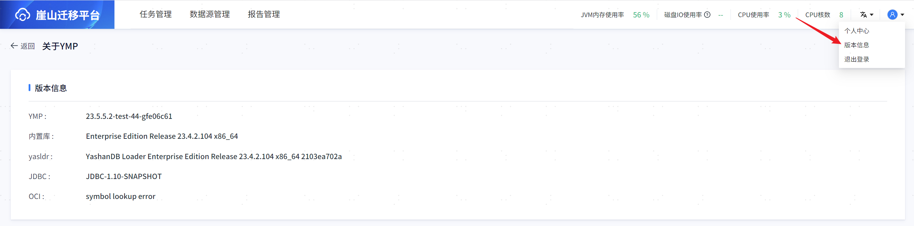

## 登录
登录YMP，初始用户和密码是（admin/admin），首次登录需修改密码，修改完成即可登录YMP系统。

## 重置密码

当需重置密码时，执行如下操作：

````shell
 # 进入YMP安装目录
 $ cd /home/ymp/yashan-migrate-platform/
 
 # 重置密码
 # 对登录用户密码进行重置时，需保证YMP业务库处于正常运行状态
 $ sh bin/ymp.sh password --reset
 
 # 重启YMP
 $ sh bin/ymp.sh restart
````

> **Note**:
>
> 若输入密码已失败五次且不需重置密码，仅需重启YMP后输入正确密码。

## 修改密码
单击右上角【个人中心】即可查看用户名密码信息等基础信息。

单击【密码修改图标】即可修改用户密码。

密码限制为：长度范围8~32个字符，必须包含大小写字母、数字和特殊字符。


## 版本信息
单击右上角【版本信息】，展示相关版本信息：YMP版本、内置库版本、yasldr版本、JDBC版本、OCI版本。


