欢迎使用 Oracle 至 YashanDB 数据迁移快速指南。本指南旨在通过清晰示例与标准化操作步骤，帮助用户以最简流程、最高效率完成从 Oracle 到 YashanDB 的数据库迁移，打造最短路径的上手指南。

在正式开始迁移操作前，首先明确本指南涉及的核心概念：

- **源端**：待迁移数据的承载系统，即Oracle数据库。
- **目标端**：数据迁移的接收系统，即YashanDB数据库。
- **体验环境**：体验环境准备范围包含有源端体验环境、目标端体验环境以及YMP 系统体验环境，核心目标为指导用户完成迁移前置筹备工作，为后续数据迁移任务提供环境支撑。

## 体验环境准备

### 源端环境准备

#### 步骤一  授权配置

使用有赋权权限的用户创建YMP_TEST用户且赋权。

源端Oracle连接用户授权命令如下：

```sql
CREATE USER YMP_TEST IDENTIFIED BY "123456";
GRANT CREATE SESSION TO YMP_TEST;  
GRANT SELECT_CATALOG_ROLE TO YMP_TEST; 
GRANT SELECT ANY TABLE TO YMP_TEST; 
GRANT SELECT ANY SEQUENCE TO YMP_TEST;
```

#### 步骤二 源端数据准备

为带来更佳的用户体验，我们提供了源端数据参考案例，后续迁移工作统一参照下表执行。

```sql
CREATE USER YMP_DEMO IDENTIFIED BY "123456";
GRANT DBA TO YMP_DEMO;  
CREATE TABLE YMP_DEMO.TT(id INT PRIMARY key,name VARCHAR(10));
INSERT INTO YMP_DEMO.TT VALUES (1,'aaa');
INSERT INTO YMP_DEMO.TT VALUES (2,'bbb');
INSERT INTO YMP_DEMO.TT VALUES (3,'ccc');
INSERT INTO YMP_DEMO.TT VALUES (4,'ddd');
```

### 目标端环境准备

使用有赋权权限的用户创建YMP_TEST用户且赋权。

目标端YashanDB连接用户授权命令如下：

```sql
CREATE USER YMP_TEST IDENTIFIED BY "123456";
GRANT DBA TO YMP_TEST;
```

### YMP系统环境准备

#### 步骤一 服务器配置确认

部署环境配置至少满足最低要求。若配置未达最低要求，虽可以修改配置参数运行YMP系统，但在任务使用过程中可能出现卡顿，内存溢出等问题。

| 环境配置项| 最低要求| 说明|
| :----------- | :------------------------------------ | :----------------------------------------------------------- |
| 操作系统     | CentOS 7.6以上、KylinOS V10、RHEL 9.3 |                                                              |
| 处理器架构   | X86-64、ARM-64                        | 处理器架构为ARM-64，YMP所需的JDK版本须为JDK17，能够有效解决可能出现的数据库连接慢问题。 |
| CPU核数      | 4核及以上                             |                                                              |
| 可用内存     | 8G及以上                              | 根据数据库模型复杂度，对内存的使用情况不同                   |
| 磁盘可用空间 | SSD，可用大小根据迁移表大小而定       | 建议不小于待迁移表中的最大单表数据量的3倍                    |

#### 步骤二 端口号确认

对YMP运行过程中需要使用的端口进行确认：

| YMP监听| 数据库监听| yasom| yasagent|
| ------- | ---------- | ----- | -------- |
| 8090    | 8091       | 8093  | 8094     |

#### 步骤三 关闭防火墙

在服务器上执行如下命令关闭防火墙：

```shell
# 关闭防火墙
systemctl stop firewalld 

# 关闭开机自启
systemctl disable firewalld
```

#### 步骤四 新建YMP用户

在服务器新建用户以安装部署YMP，在用户创建和授权后，后续所有安装步骤均在该用户下操作。

注意YMP安装路径不可包含英文句号。

```shell
useradd -d /home/ymp -m ymp
passwd ymp
```

#### 步骤五 服务器工具准备

 安装lsof命令工具：

```shell
yum install -y lsof
```

#### 步骤六 JDK环境准备

当YMP的JDK版本为JDK17时，支持通过Java官方路径下载上述版本的JDK并安装成功后，还需配置如下环境变量：

```shell
# 以ymp用户下JDK17安装路径为/usr/tools/jdk17为例
# su - ymp 
$ vi ~/.bash_profile

# 在文件结尾添加如下内容
export JAVA_HOME=/usr/tools/jdk17
export PATH=$JAVA_HOME/bin:$PATH
export CLASSPATH=.:$JAVA_HOME/lib/dt.jar:$JAVA_HOME/lib/tools.jar

# 重新载入配置文件
$ source ~/.bash_profile

# 安装成功后查看JDK版本信息
$ java -version
```

#### 步骤七 libaio环境准备

YMP运行需要libaio动态库。

```shell
# 查看是否已安装libaio动态库
rpm -qa | grep libaio

# 若未有版本信息打印，安装libaio
yum install -y libaio
```

#### 步骤八 切换至YMP用户

从本步骤开始的后续所有服务端安装步骤，将由YMP安装用户来进行操作，请先切换至YMP用户，或以YMP用户登录至服务器。

推荐安装路径为`/home/ymp`，请确保安装YMP时此目录为空。

```shell
#使用root用户进行操作：修改安装包所属用户及用户组为ymp用户

# 从root用户切换至ymp用户
```

#### 步骤九 上传YMP安装包

上传YMP安装包至/home/ymp目录下然后解压：

```shell
# 切换至YMP安装目录
$ cd /home/ymp/
$ unzip yashan-migrate-platform-xx.x.x.x-linux-xxx.zip
```

#### 步骤十 执行安装命令

若想要完整顺畅跑的完数据迁移全过程，我们强烈建议安装命令指定的内置数据库及评估数据库的版本与您计划迁移的目标数据库版本保持一致，**且不建议将内置数据库及评估数据库作为目标数据库使用**。

```shell
# 进入安装目录
$ cd /home/ymp/yashan-migrate-platform/

# 执行安装命令，这里--db指定的是内置数据库
$ sh bin/ymp.sh install --db /home/ymp/yashandb-xx.x.x.x-linux-xxx.tar.gz
```

## 开始迁移

### 步骤一 登录YMP

部署完成后，可通过`http://IP:PORT/`访问YMP页面，其中PORT默认值为8090。

首次登录时需要重置登录密码，初始账户名和密码为（admin/admin）。

进入YMP界面。

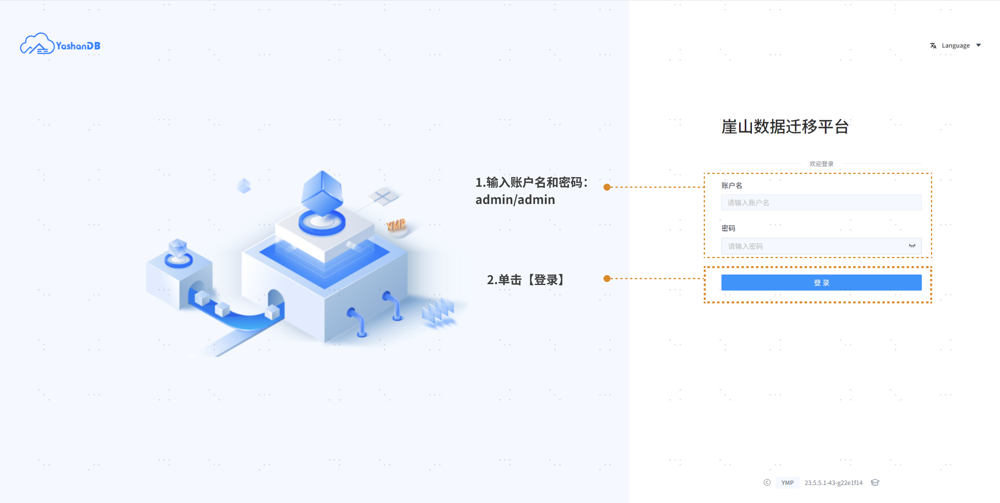

首次登录时重置密码：

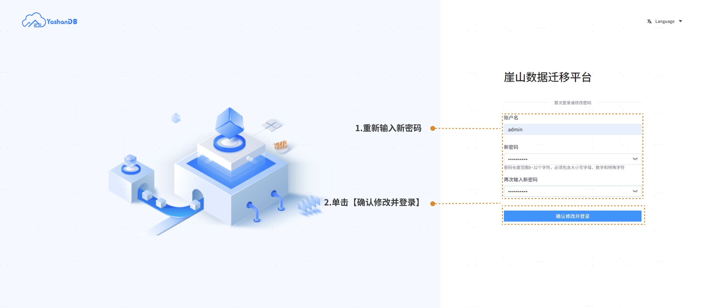

### 步骤二 添加数据源

在创建任务之前，需要先添加源端数据库信息：

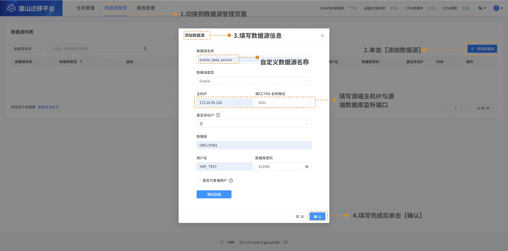

### 步骤三 创建任务

进入创建任务界面填写任务配置信息并添加目标端数据库，完成后单击【下一步：继续配置】：


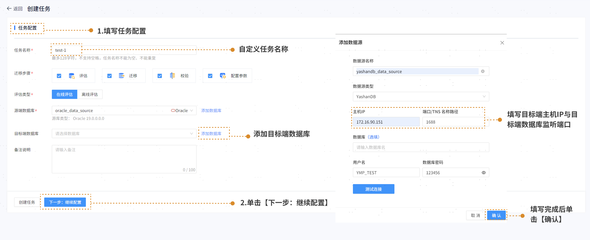

### 步骤四 评估配置

选择需要评估的对象类型、schema范围及高级选项后，单击【下一步：开始迁移评估】：


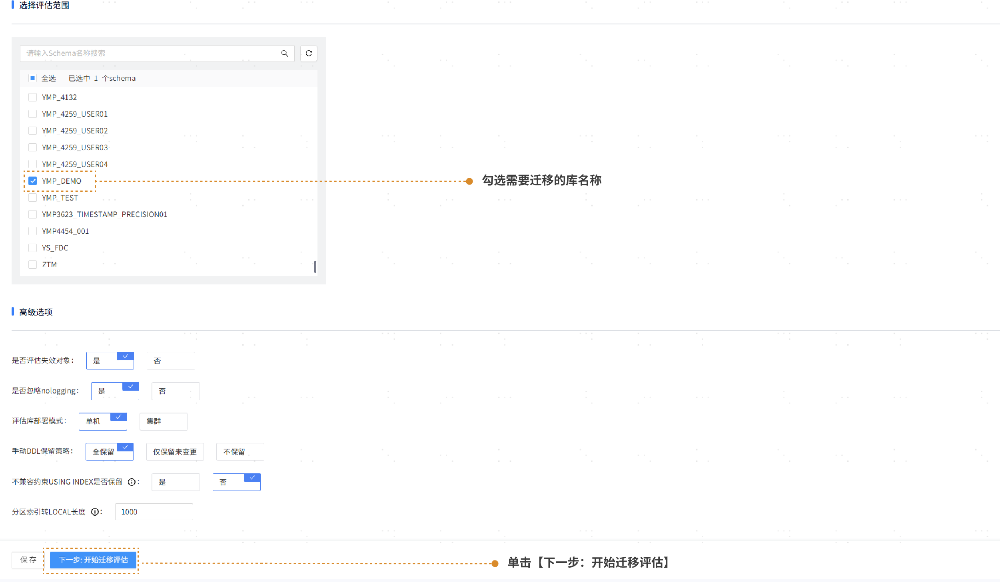

### 步骤五 迁移评估

根据评估后的结果页面，如果评估结果为100%，可进行下一步迁移配置：

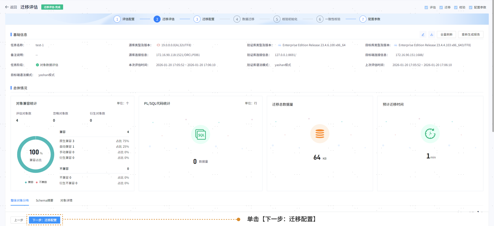

### 步骤六 迁移配置

源端数据库连接用户需要赋予迁移平台所需权限，目标端YashanDB数据库连接用户需要赋予DBA权限。

1. 选择需要迁移的步骤： 

   

3. 选择待迁移对象（默认忽略的不迁移）：

   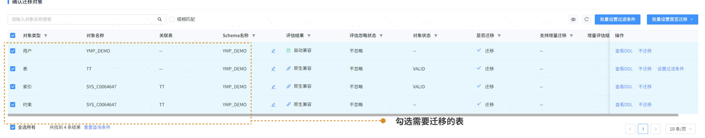

5. 进行迁移初始化配置与高级配置：

   

7. 选择表空间初始化和角色初始化。

   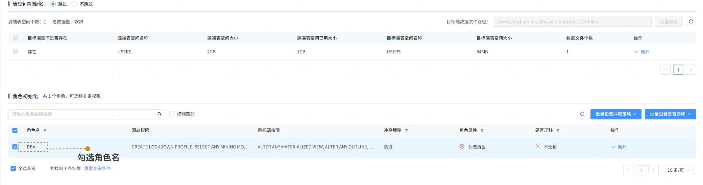

9. 勾选检查项进行预检查，检查后单击【下一步：数据迁移】。

    

### 步骤七 数据迁移

跳转至迁移动态界面，可查看、下载任务日志，迁移完成后可下载迁移报告。

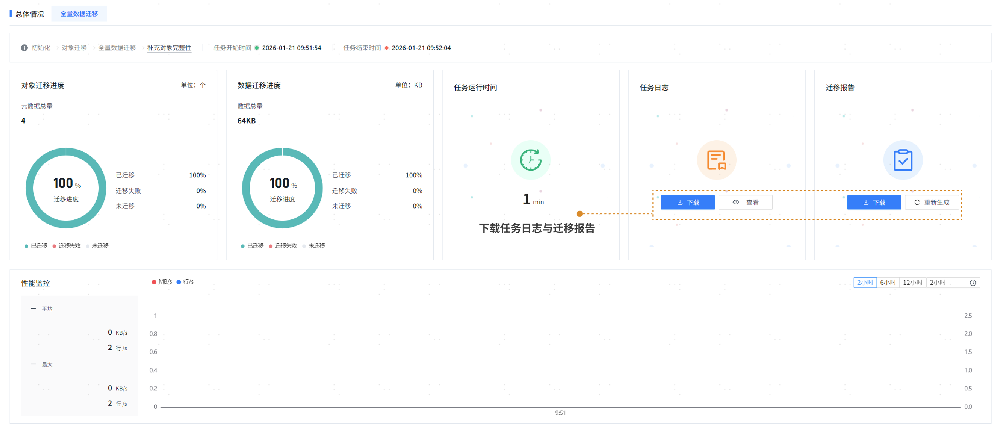

可在对象列表查看详情，确认迁移成功后单击【下一步：校验初始化】， 进入校验初始化。

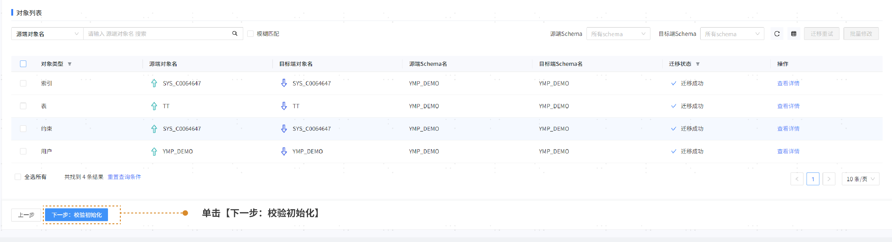

### 步骤八 校验初始化

校验的对象继承数据迁移，默认数据迁移成功表校验，其余表不校验。


对源端数据库和目标端数据库的表进行全量数据的一致性校验，配置完毕后，单击【下一步：开始一致性校验】。


### 步骤九 一致性校验

展示运行总体情况，可查看校验进度、校验概况，并下载任务运行日志和校验报告。

校验完成后，每行表可查看结果。

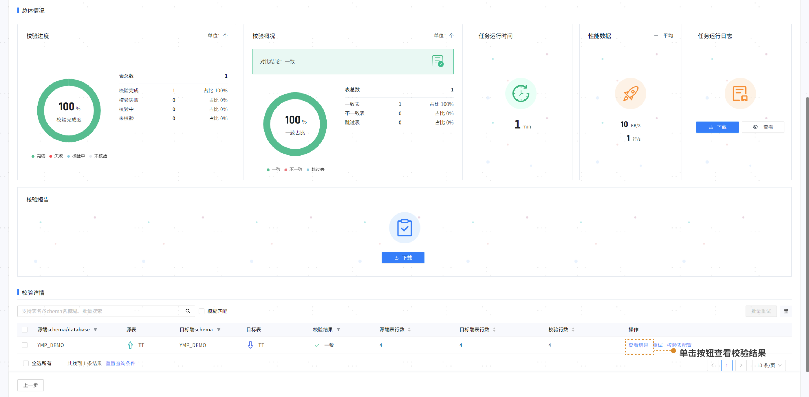

## 验证数据迁移成功

迁移任务完成后，输入以下代码，可直接在目标端查阅迁移后的源端数据表。

```sql
SELECT * FROM  YMP_DEMO.TT;
```


至此，一次简单快速的任务流程结束。
