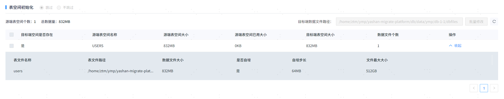

### 迁移目标数据库性能优化

YMP数据迁移会将数据从源端获取的数据迁移到目标端数据库中，数据迁移的性能依赖于迁移源库的查询性能和目标库的执行性能，数据库的配置优化参考各个数据库的性能优化手册。

#### 1.目标端数据库调参优化
数据迁移过程中使用的yasldr数据导入工具，会向目标端数据库持续地发送大量的数据，导致服务端处于高负载的状态下。为提升目标端数据库的处理性能，需要在导入前对目标端数据库的相关参数进行合理的配置。具体可配置的参数如下：

|  目标端YashanDB配置参数| 建议调整说明|  
|------------------------------|---------------------------------------------------------------------------------------------------------------------------------------------------------------------------------------------------------------------------------------------------------------------------------------------------------------------------------------------------------------------------| 
| DATA_BUFFER_SIZE             | 指定数据缓存区的大小。数据缓存区容量越大，导入性能越好，默认值为64M，取值范围为[32M,64T]。                                                                                                                                                                                                                                                                                                                       |                                                
| LARGE_POOL_SIZE              | 调整为参数允许范围内的最大值，若导入过程出现no free blocks in large pool错误，表示该值仍不能满足导入资源要求，解决方案：<br>1. 调整导入表，减少导入heap分区表的分区总个数<br>2. 降低导入时的degree_of_parallelism参数<br>3. 重新导入                                                                                                                                                                                                                   |                                            
| WORK_AREA_STACK_SIZE         | reader线程数 = degree_of_parallelism / (decoder_thread_times + 1)，向上取整<br>sender线程数 = degree_of_parallelism - reader线程数<br>SIZE = 512KB + 126KB * 表个数 * sender线程数。                                                                                                                                                                                                           |        
| WORK_AREA_POOL_SIZE          | MIN_SIZE = 线程数量 * 表数量 * 分区数量 * 256B + reader线程数 * sender线程数 * 1KB。                                                                                                                                                                                                                                                                                                        |               
| VM_BUFFER_SIZE               | 指定SQL标准计算使用的内存大小。当计算中排序、物化、JOIN等涉及的数据量较多时，建议调大此参数，可以增加计算性能。                                                                                                                                                                                                                                                                                                               |               
| SHARE_POOL_SIZE              | 指定共享缓存区使用的内存大小。执行计划缓存区、数据字典缓存区、锁缓存区、游标缓存区、分布式缓存区和Stream Pool共享此区域内存，共享缓存区大小减去锁缓存区大小和游标缓存区大小后再按百分比分配执行计划缓存区、数据字典缓存区和分布式缓存区的大小，Stream Pool初始大小为0，实际使用中会根据业务需求从Share Pool动态申请空间，其最大上限值可根据STREAM_POOL_SIZE参数值确定。该参数仅支持在线扩大，如需缩小该配置请修改配置文件后重启数据库。如果并发业务较多，建议调大此参数。                                                                                                             |               
| REDO_BUFFER_SIZE             | redo刷盘的内存大小，单位为字节，建议使用默认值。该参数和redo文件大小相关，配置不合理可能会导致数据库启动或建库报错。取值范围/格式：[4M,128M]。                                                                                                                                                                                                                                                                                          |               
| MAX_PARALLEL_WORKERS         | 单机行存和分布式并行的worker池的worker数量，同时会消耗对应额度的会话资源配额，详情请查阅MAX_SESSIONS参数。<br/>在分布式部署中，并行线程数会根据SQL语句复杂程度变化。当SQL语句比较复杂，计划生成所需stage数量（计划中的PX SEND数量）超过配置的worker数量时，SQL执行将报错，此时需要调整本参数，提高线程数增强并行能力。具体需要调整的值可以根据当前环境中复杂语句生成计划的stage数量进行预估。<br/>取值范围非固定，受当前MAX_SESSIONS值影响，设置时需注意。YMP建议值512。                                                                                            |               
| DATA_TRANSFORMER_ENABLED     | 是否允许后台自动进行transformer动作。YMP建议值FALSE。                                                                                                                                                                                                                                                                                                                                      |               
| ARCH_CLEAN_IGNORE_MODE       | 指定清理归档文件时的忽略模式，忽略备份表示无论该归档文件是否已备份均会被清理，忽略备库表示无论该归档文件是否已被所有备库获取均会被清理。YMP建议值BACKUP。                                                                                                                                                                                                                                                                                         |               
| ARCH_CLEAN_LOWER_THRESHOLD   | 指定自动清理归档功能的停止条件。该功能一旦被触发会自动删除当前数据库的归档日志，直到现存归档日志和下一个即将产生的归档日志的大小总和不超过该值时才自动停止。该值不能大于ARCH_CLEAN_UPPER_THRESHOLD。设置为0时，表示清理所有可以清理的归档日志。取值范围/格式：[0,32T]，YMP建议值0。                                                                                                                                                                                                             |
| COMPRESSION                  | 指定LSC存储引擎的压缩方式。UNCOMPRESSED表示不进行压缩，LZ4表示采用LZ4算法压缩，ZSTD表示采用ZSTD算法压缩。YMP建议值LZ4。                                                                                                                                                                                                                                                                                             |
| SCOL_DATA_PRELOADERS         | LSC存储引擎使用的后台预读线程个数。YMP建议值6。                                                                                                                                                                                                                                                                                                                                               |
| COLUMNAR_VM_BUFFER_SIZE      | 指定列存计算使用的内存大小。当列存计算中，排序、物化、join等涉及的数据量较多时，建议调大此参数，可以增加计算性能。当LSC表以BULKLOAD模式导入，提示该配置参数不足时，需要调大该配置参数。导数时，为保证导入不因内存不足报错，请至少保证每个服务端导入线程内存最小为300M。其中服务端导入线程数量计算方法为：MIN（DEGREE_OF_PARALLEL，CPU核数 * 4），客户端模式导入时，服务端线程数量为SENDERS参数大小。如多线程导入内存报错，可以调整SESSION_BULKLOAD_MAX_MEM_PERCENT，防止因导入线程间内存争用导致部分线程内存不足报错。<br/>配置COLUMNAR_BUFFER_SIZE或COLUMNAR_DATA_BUFFER_PERCENT后，该配置项将不生效。 |
| COLUMNAR_BUFFER_SIZE         | 当LSC表以BULKLOAD模式导入时，建议调大此参数，默认值为2G，取值范围为[256M,4T]。                                                                                                                                                                                                                                                                                                                        |
| COLUMNAR_DATA_BUFFER_PERCENT | 指定LSC存储引擎使用的数据缓存区占COLUMNAR_BUFFER_SIZE大小，当LSC表以BULKLOAD模式导入时，此参数配置值越大，导入性能越好，此参数配置值越小，可以增加计算性能，默认值为40，取值范围为[1,99]。                                                                                                                                                                                                                                                        |
| SCOL_DATA_BUFFER_SIZE        | 指定LSC存储引擎使用的数据缓存区的大小。缓存区容量越大，数据库整体性能越好。容量过小会产生频繁的数据块换入换出，建议数据缓存区配置至少为1G。配置COLUMNAR_BUFFER_SIZE或COLUMNAR_DATA_BUFFER_PERCENT后，该配置项将不生效。                                                                                                                                                                                                                                    |                                                

在进行大数据量（数据量达到TB级别）的迁移前，需要考虑调整表空间大小和redo空间大小配置：

#### 2.表空间调整

合理的表空间初始配置和扩容配置可以减少数据迁移过程中频繁的调整表空间大小，提升导入性能，在迁移初始化阶段可以看到目标数据库的表空间配置信息：


1. 对于目标端不存在的表空间，可以通过界面合理地配置初始值和扩展文件大小，迁移前会建好表空间。
2. 对于目标端存在的表空间，可以使用客户端工具调整初始化值和文件个数，参考：
````sql
 ALTER TABLESPACE XXX(表空间名) ADD DATAFILE 'yashan2(表空间文件路径)' SIZE 100G AUTOEXTEND ON NEXT 256M MAXSIZE 512G PARALLEL 4;
````

#### 3.REDO空间调整

迁移过程中，如果出现数据导入卡住，可以检查下REDO空间使用情况。
1. 查询目标端数据库当前的redo信息。
````sql
 select * from v$logfile;
````
关注STATUS字段信息，如果只存在少量的INACTIVE状态的LOGFILE文件，可以适当增加LOGFILE文件个数，防止REDO追尾。
2. 根据追尾情况，适当增删LOGFILE文件。
    a. 增加redo组：
    ````sql
     --（可以用 /home/yashandb/yasdb_data/dbfiles/redo5a 这样的全路径替代redo6）
    ALTER DATABASE ADD LOGFILE 'redo6' size 200M;
    ````
    b. 删除redo组：
    ````sql
     -- 删除redo组：
    ALTER DATABASE DROP LOGFILE '/home/yashan/yashandb/yasdb_data/dbfiles/redo5a';
    ````

删除LOGFILE时不能删除正在使用的LOGFILE文件，也可以通过SWITCH命令手动切换当前的LOGFILE：

````sql
 ALTER SYSTEM CHECKPOINT; 
 ALTER SYSTEM SWITCH LOGFILE;
````

### YMP元数据迁移调优配置参数

根据YMP不同的数据迁移方式，调优参考如下：

#### 1.使用JDBC导出 yasldr导入方式迁移数据

|  高级配置项| 默认值| 参数说明|  
|------------------------------|-----------------------------------------|-------------------------------------------------------------------------------------------------------------------------------| 
| 数据迁移前是否将表设为NOLOGGING         | false                                   | 数据迁移前是否将表设为nologging，默认为false。                                                                                                |                                            
| 是否自动优化导出参数                   | false                                   | 控制部分导出参数的自动调整，包括非分区大表单表数据拆分数、分区表、非分区大表单表数据拆分数阈值（包括行数、大小）、LOB大表走分页拆分的最大阈值、分区表小分区数据量合并导出数据量阈值和分区表大分区数据量拆分导出数据量阈值。仅导出方式为jdbc时可用。 |               
| 非分区大表单表数据拆分数                 | 5                                       | 控制非分区的大表的导出拆分粒度，是决定并行查询的最小单位，比如大表拆分设置为1000，会将查询SQL分为1000个条件范围，交给数据查询线程排队执行，并行度由非分区大表单表查询并行数控制。                                |               
| 单表导出查询并行数                    | 5                                       | 控制表数据导出时查询的并行数。                                                                                                               |               
| 非LOB表拆分阈值（行数）                | 10000000                                | 导出时触发大表拆分的行数。                                                                                                                 |                                                
| 非LOB表拆分阈值（大小）                | 5                                       | 导出时触发大表拆分的表大小（G）。                                                                                                             |
| LOB表拆分阈值（行数）                 | 1000000                                 | 导出时触发带lob字段大表拆分的行数。                                                                                                           |                                                
| LOB表拆分阈值（大小）                 | 5                                       | 导出时触发带lob字段大表拆分的表大小（G）。                                                                                                       |                                                
| LOB大表走分页拆分的最大阈值              | 5000000                                 | 如果lob行数小于该阈值，将走OFFSET+LIMIT拆分方式分页，能有效提升数据迁移性能。                                                                                |                                                
| 导出CSV文件数据最大行数                | 5000000                                 | 导出时每个CSV文件的最大行数。                                                                                                              |        
| 导出CSV文件数据最大数据量               | 3072                                    | 导出时每个csv文件的最大大小（M）。                                                                                                           |               
| JDBC导出首次文件大小                 | 256                                     | 设置合适的值可以缩短单表开始导出数据，到开始导入数据之间的时间，提高数据迁移性能。（M）                                                                                  |               
| JDBC行内导出的所有LOB字段最大长度         | 8192                                    | 一行数据中所有lob字段小于指定长度时会优化为行内导入，对于字符类型如clob，统计字符长度，对于二进制类型如blob，统计字节长度。                                                           |                                                
| JDBC行内导出的所有LOB字段最大大小         | 768                                     | 一行数据中所有lob字段总大小（M）小于指定长度时会优化为行内导入，最大值受导入工具行大小限制，不超过1G。                                                                        |                                                
| 分区表小分区数据量合并导出数据量阈值           | 1024                                    | 大量分区，分区数据小的表触发该合并场景下，会将数据量（M）小于该配置的分区数据合并为一个查询从而避免大量小文件产生。                                                                    |               
| 分区表大分区数据量拆分导出数据量阈值           | 2048                                    | 同分区下大数据量表会触发拆分场景下，分区内会继续拆分查询导出。                                                                                               |               
| yasldr导入LoadOptions参数配置      | MODE=BATCH,SENDERS=7,CHARACTER_SET=UTF8 | yasldr命令行参数，可根据需要添加版本支持的yasldr参数，支持范围可见YashanBD文档中的yasldr参数说明。参数以英文逗号分割，例如：CSV_CHUNK_SIZE=128,CSV_LINE_SIZE=126。              |                                                
| yasldr导入LoadStatement参数配置    | DEGREE_OF_PARALLELISM=16                | yasldr的Load Data DML参数，可根据需要添加版本支持的yasldr参数，支持范围可见YashanBD文档中的yasldr参数说明。参数以英文逗号分割，例如：ERRORS=12,DEGREE_OF_PARALLELISM=16。     |                                                
| yasldr分区表使用BASIC模式导入的分区数最小阈值 | 5000                                    | 分区表的分区数超过阈值使用BASIC模式导入。                                                                                                       |                                                

> **Note**:
>
> 【yasldr导入LoadOptions参数配置】以用户配置为准，JDBC导出方式下会自动合理计算yasldr行内lob的相关参数调优，用户尽量避免配置CSV_LINE_SIZE、CSV_CHUNK_SIZE、BATCH_SIZE的配置。

#### 2.使用Dts导出，yasldr导入方式迁移数据

|  高级配置项| 默认值| 参数说明|  
|------------------------------|-----------------------------------------|-------------------------------------------------------------------------------------------------------------------------------| 
| 数据迁移前是否将表设为NOLOGGING         | false                                   | 数据迁移前是否将表设为nologging，默认为false。                                                                                                |                                            
| 是否自动优化导出参数                   | false                                   | 控制部分导出参数的自动调整，包括非分区大表单表数据拆分数、分区表、非分区大表单表数据拆分数阈值（包括行数、大小）、LOB大表走分页拆分的最大阈值、分区表小分区数据量合并导出数据量阈值和分区表大分区数据量拆分导出数据量阈值。仅导出方式为jdbc时可用。 |               
| 非分区大表单表数据拆分数                 | 5                                       | 控制非分区的大表的导出拆分粒度，是决定并行查询的最小单位，比如大表拆分设置为1000，会将查询SQL分为1000个条件范围，交给数据查询线程排队执行，并行度由非分区大表单表查询并行数控制。                                |               
| 单表导出查询并行数                    | 5                                       | 控制表数据导出时查询的并行数。                                                                                                               |               
| 非LOB表拆分阈值（行数）                | 10000000                                | 导出时触发大表拆分的行数。                                                                                                                 |                                                
| 非LOB表拆分阈值（大小）                | 5                                       | 导出时触发大表拆分的表大小（G）。                                                                                                             |
| LOB表拆分阈值（行数）                 | 1000000                                 | 导出时触发带lob字段大表拆分的行数。                                                                                                           |                                                
| LOB表拆分阈值（大小）                 | 5                                       | 导出时触发带lob字段大表拆分的表大小（G）。                                                                                                       |                                                
| LOB大表走分页拆分的最大阈值              | 5000000                                 | 如果lob行数小于该阈值，将走OFFSET+LIMIT拆分方式分页，能有效提升数据迁移性能。                                                                                |                                                
| 导出CSV文件数据最大行数                | 5000000                                 | 导出时每个CSV文件的最大行数。                                                                                                              |        
| 导出CSV文件数据最大数据量               | 3072                                    | 导出时每个csv文件的最大大小（M）。                                                                                                           |               
| 分区表小分区数据量合并导出数据量阈值           | 1024                                    | 大量分区，分区数据小的表触发该合并场景下，会将数据量（M）小于该配置的分区数据合并为一个查询从而避免大量小文件产生。                                                                    |               
| 分区表大分区数据量拆分导出数据量阈值           | 2048                                    | 同分区下大数据量表会触发拆分场景下，分区内会继续拆分查询导出。                                                                                               |               
| yasldr导入LoadOptions参数配置      | MODE=BATCH,SENDERS=7,CHARACTER_SET=UTF8 | yasldr命令行参数，可根据需要添加版本支持的yasldr参数，支持范围可见YashanBD文档中的yasldr参数说明。参数以英文逗号分割，例如：CSV_CHUNK_SIZE=128,CSV_LINE_SIZE=126。              |                                                
| yasldr导入LoadStatement参数配置    | DEGREE_OF_PARALLELISM=16                | yasldr的Load Data DML参数，可根据需要添加版本支持的yasldr参数，支持范围可见YashanBD文档中的yasldr参数说明。参数以英文逗号分割，例如：ERRORS=12,DEGREE_OF_PARALLELISM=16。     |                                                
| yasldr分区表使用BASIC模式导入的分区数最小阈值 | 5000                                    | 分区表的分区数超过阈值使用BASIC模式导入。                                                                                                       |                                                

> **Note**:
>
> 【yasldr导入LoadOptions参数配置】以用户配置为准，DTS导出方式下需要用户考虑行内lob的相关参数调优，手动优化配置BATCH_SIZE等配置。
