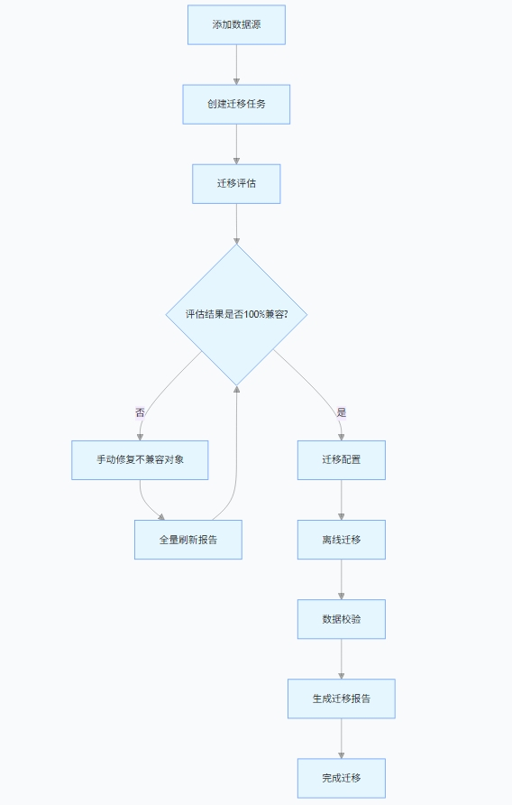

YMP是YashanDB提供的数据库迁移产品，支持异构RDBMS与YashanDB之间进行迁移评估、数据迁移、数据校验。 YMP提供可视化服务，用户只需通过简单的界面操作，即可完成从评估到迁移整个流程的执行与监控，实现低门槛、低成本、高效率的异构数据库迁移。

执行全量迁移的主流程如下：

1. **数据源配置**：YMP支持对数据源进行新增、修改、删除等操作，配置好数据源是创建数据迁移任务的前提。
2. **创建迁移任务**：可按需创建迁移任务。
3. **兼容性评估**：通过对象维度对异构数据库进行兼容性评估，评估过程中会进行一定程度的DDL自动改写。
4. **数据迁移**：进行元数据和数据的迁移。
5. **一致性校验**：数据迁移后，对表中数据一致性进行校验。

目标端参数配置用于用户自行选择源端配置参数项，将其迁移到目标端，并可对参数进行修改调整。

参数配置在YMP中也作为迁移任务的一个阶段触发，需在**创建迁移任务**中进行创建，以加入到上述迁移流程中运行。
